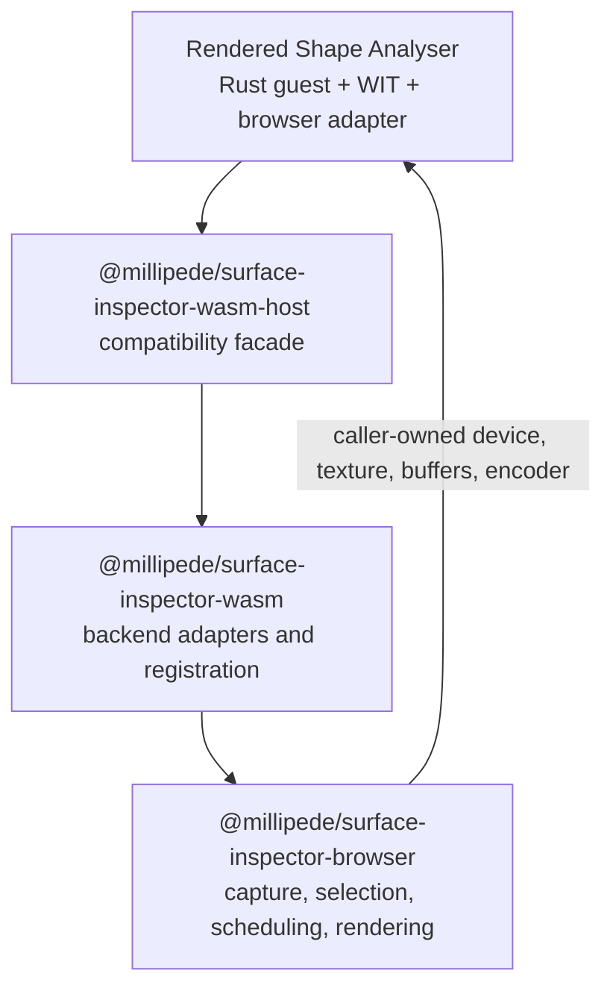
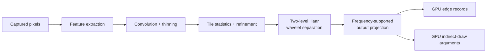

# Rendered Shape Analyser

A Rust WebAssembly Component that discovers rendered structure from pixels and
optionally compares it with browser-provided reference geometry. Its production
outputs stay GPU-resident so Millipede can render and consume them without a
pixel readback round trip.

The repository name is `rendered-shape-analyser`. Compatibility identities
remain unchanged:

- Rust crate and generated artifact basename: `inspector-component`
- Local npm package: `@millipede/inspector-component`
- WIT package: `millipede:inspector`

C0 established the non-GPU Component Model boundary. Millipede's P0 WebGPU
implementation remains the oracle and fallback. P1 adds the component-backed
GPU execution modes described below. These migration labels remain useful
project history and do not replace the public API names.

## What it provides

| Capability / Millipede mode                    | Purpose                                                | Runtime requirement | Execution / command ownership            |
| ---------------------------------------------- | ------------------------------------------------------ | ------------------- | ---------------------------------------- |
| `analysis`                                    | C0 typed, non-GPU analysis boundary                    | Browser Wasm        | Synchronous; no GPU commands             |
| `gpu-analysis` / `component-gpu`             | Stable P1 GPU analysis                                 | WebGPU              | Component finishes and submits           |
| `gpu-analysis-frame` / `component-gpu-frame` | P1 analysis inside a scheduler-owned frame             | WebGPU              | Scheduler alone finishes and submits     |
| `gpu-analysis-async` / `component-gpu-async` | Experimental P1 async summary/readback path             | WebGPU + JSPI       | Component submits and awaits completion  |
| `wasi-0.3`                                    | Isolated async Component Model proof; not a product API | JSPI                | Proof-only; no GPU commands              |

The caller supplies one browser `GPUDevice`, the captured-pixel
`GPUTexture`, and the reference buffer when required. Rust validates the
request, chooses the analysis plan, creates and records the required compute
resources, and returns browser-backed GPU buffer handles.

Visual, border-trace, and edge-discovery outputs remain GPU-resident. Compact
summary readback is diagnostic-only: it must not feed subsequent GPU work or
reconstruct the production overlay.

## Where it fits



This repository owns the component boundary, Rust analysis workloads, generated
browser payload, and authored browser host adapter. Millipede owns capture,
backend selection, device epochs, frame scheduling, submission, publication,
rendering, and UI state.

## Use it

Normal Millipede application code activates the integration layer rather than
calling this low-level package directly:

```ts
await import("@millipede/surface-inspector-wasm/auto");
```

That package registers the available component backends with
`@millipede/surface-inspector-browser`. The intermediate
`@millipede/surface-inspector-wasm-host` package preserves Millipede's
compatibility import path.

A separate host integration can explicitly prepare one capability through this
package:

```ts
import { analysisComponentLoader } from "@millipede/inspector-component";

const prepared = await analysisComponentLoader.prepare();

if (prepared.status === "ready") {
  console.log(prepared.capability.ping("hello"));
}
```

Preparation is explicit and shared by concurrent callers. A ready result means
later `analyzeTree()`, GPU `analyze()`, or frame `encode()` calls perform no
component loading. Unsupported environments and unexpected failures are
different typed outcomes.

For stable, async, and shared-frame examples—including summary and disposal
ownership—see the [component loader guide](component-loader/README.md).

## Analysis pipeline

The active discovery path is a multi-stage WebGPU compute workload:



The shader is assembled from concern-owned WGSL fragments for shared frequency
state, refinement, Haar wavelets, and grouping/output projection. Rust owns the
selected workgroup and dispatch plan. The current seven discovery dispatches
are an intentional compatibility sequence; fusion or replacement remains a
separate measured optimization.

WGSL is the browser/runtime contract. Longer-term shader-generation options are
tracked in the
[portable shader-toolchain investigation](docs/future-directions/portable-shader-toolchain/README.md).

## Contract and ownership

- **WIT is authoritative.** Start at `wit/world.wit`; every maintained
  interface, record, field, and function is documented there.
- **Browser inputs remain browser-owned.** Rust receives resource handles, not
  DOM, CSS, React state, or copied pixel arrays.
- **Outputs transfer explicitly.** Releasing transient component handles does
  not destroy browser buffers transferred to the caller.
- **Shared-frame ownership is strict.** The frame component appends work to a
  borrowed encoder; it never finishes or submits it.
- **Compute support is mandatory.** A backend needs compute shaders, compute
  pipelines, and workgroup dispatch. See the
  [GPU compute execution contract](docs/architecture/gpu-compute-execution-contract.md).
- **P0 stays external.** Millipede's existing browser implementation remains
  the comparison oracle and fallback rather than code duplicated here.

The migration plan and decision history remain in the Millipede repository
under `packages/surface/inspector-browser/docs/`, including
`todo/09-component-boundary-iteration-one.md`,
`architecture/13-component-gpu-p1.md`, and `todo/06-decision-log.md`.

## Repository layout

| Path | Role |
| --- | --- |
| `wit/` | Source-of-truth component interfaces |
| `wkg/`, `xtask/`, `wit/deps/` | WIT dependency policy and generated dependencies |
| `src/analysis/` | Non-GPU analysis and aggregate math |
| `src/edge_discovery/` | Pixel-derived discovery planning, shaders, resources, and recording |
| `src/reference_diagnostics/` | Reference-guided statistics and visual diagnostics |
| `src/gpu_shared/` | Validation, planning, and command recording shared by GPU worlds |
| `src/gpu_analysis*/` | Stable, async, and shared-frame component exports |
| `component-loader/src/` | Authored TypeScript capability loader and browser host |
| `tests/component-boundary/` | Typed unit tests and generated-component integration tests |
| `scripts/build.sh` | Build and verify all component worlds |
| `scripts/sync.sh` | Regenerate browser payloads and rebuild the loader |
| [`docs/tooling/jco-generated-artifact-baseline.md`](docs/tooling/jco-generated-artifact-baseline.md) | Current browser artifact-generation internals and toolchain provenance |
| [`docs/testing/browser-lifetime/`](docs/testing/browser-lifetime/README.md) | Planned Chromium WebGPU lifetime and measurement evidence |

Generated directories such as `target/`, `component-loader/dist/`, and
`pkg/generated/` must not be edited manually.

## Develop and verify

Run commands from the repository root:

```sh
pnpm run build              # build and verify all component worlds
pnpm run wit:fetch          # refresh WIT dependencies
pnpm run wit:check          # verify committed WIT dependencies
pnpm run loader:build       # typecheck and build the authored browser loader
pnpm run test:unit          # host and loader unit tests
pnpm run test:integration   # generated-component boundary tests
pnpm test                   # typecheck and run the complete TypeScript suite
pnpm run sync               # regenerate browser payloads and rebuild the loader
cargo test                  # Rust unit and integration tests
cargo doc --no-deps         # warning-free crate documentation
```

The complete release flow is:

```text
build -> test -> sync -> refresh Millipede's local file dependency
```

`scripts/sync.sh` is the only writer of `pkg/generated/`. Authored loader
imports use extensionless relative paths, and generated-provider access remains
centralized in `component-loader/src/generated.ts`.

## Further documentation

- [Component loader guide](component-loader/README.md)
- [Component capability loading contract](docs/architecture/component-capability-loading-contract.md)
- [GPU compute execution contract](docs/architecture/gpu-compute-execution-contract.md)
- [JCO-generated artifact baseline](docs/tooling/jco-generated-artifact-baseline.md)
- [Browser lifetime evidence plan](docs/testing/browser-lifetime/README.md)
- [Component-boundary test guide](tests/component-boundary/README.md)
- [Portable shader-toolchain investigation](docs/future-directions/portable-shader-toolchain/README.md)
