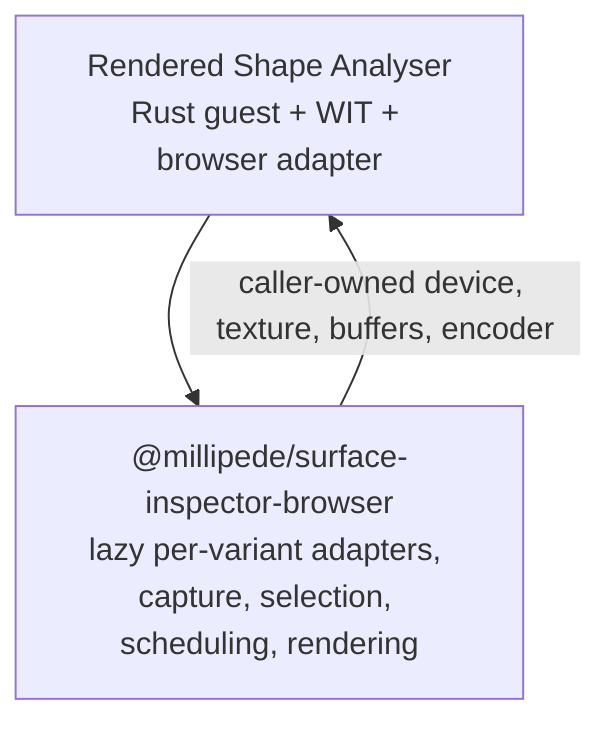
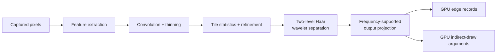

# Rendered Shape Analyser

A Rust WebAssembly Component that discovers rendered structure from pixels and
optionally compares it with browser-provided reference geometry. Its production
outputs stay GPU-resident so Millipede can render and consume them without a
pixel readback round trip.

The repository name is `rendered-shape-analyser`. Established identities
remain unchanged:

- Rust crate and generated artifact basename: `inspector-component`
- Local npm package: `@millipede/inspector-component`
- WIT package: `millipede:inspector`

C0 established the non-GPU Component Model boundary. Millipede's P0 WebGPU
implementation remains the oracle and fallback. P1 adds the component-backed
GPU execution modes described below. These migration labels remain useful
project history and do not replace the public API names.

## Use it

Import the selected runtime capability from its package subpath. The root
package entry exports shared TypeScript types only, so importing it never makes
an execution variant reachable.

```ts
import { analysisComponentLoader } from "@millipede/inspector-component/analysis";

const prepared = await analysisComponentLoader.prepare();
if (prepared.status !== "ready") {
  throw new Error(`analysis component is ${prepared.status}`);
}

const stats = prepared.capability.analyzeTree(
  nodes,
  textureWidth,
  textureHeight,
);
```

Preparation is explicit and shared by concurrent callers. A `ready` result
means later `analyzeTree()`, GPU `analyze()`, or frame `encode()` calls perform
no component loading. Unsupported environments and unexpected failures are
different typed outcomes.

Each runtime subpath owns one module-wide, one-shot loader. Its only lifecycle
operation is `prepare()`: concurrent and later calls return the same Promise
and settled result for that imported module URL. There is no `retry()` or
loader `dispose()`. A navigation or a newly versioned module URL is the reset
boundary; GPU-device generations and their resources have separate owners.

The async loader owns the exact `WebAssembly.Suspending` and
`WebAssembly.promising` support gate. It evaluates both before its provider
imports or evaluates the generated async world and returns `unsupported` when
either is absent; callers do not repeat that probe.

For stable, async, and shared-frame examples—including summary, observer, and
GPU-resource ownership—see the [component loader guide](component-loader/README.md).

Millipede's `@millipede/surface-inspector-browser` package directly owns three
device-local adapter modules for stable, async, and shared-frame analysis.
Selecting a backend lazily imports exactly that adapter; the adapter imports the
matching component subpath, calls its loader's one-shot `prepare()`, and binds
the ready capability to the current GPU-device generation. There is no
`surface-inspector-wasm` wrapper package or mutable backend registry. Retiring
the device adapter and its resources does not reset the module-wide component
loader.

The optional invocation-observer boundary remains part of each adapter API,
but the current application supplies no observer. Millipede's selection/session
generation still must reject stale results from an in-flight preparation or
invocation and clean them up through their real ownership paths. H1 measurement
and C1/V1 real-Chromium request proof remain pending, while P2 still owns the
final discovery/session/resource topology.

## What it provides

| Capability subpath / Millipede mode           | Purpose                                                    | Runtime requirement | Execution / command ownership           |
| --------------------------------------------- | ---------------------------------------------------------- | ------------------- | --------------------------------------- |
| `/analysis`                                   | C0 typed, non-GPU analysis boundary                        | Browser Wasm        | Synchronous; no GPU commands            |
| `/gpu-analysis` / `component-gpu`             | Stable P1 GPU analysis                                     | WebGPU              | Component finishes and submits          |
| `/gpu-analysis-frame` / `component-gpu-frame` | P1 analysis inside a scheduler-owned frame                 | WebGPU              | Scheduler alone finishes and submits    |
| `/gpu-analysis-async` / `component-gpu-async` | Experimental P1 async summary/readback path                | WebGPU + JSPI       | Component submits and awaits completion |
| `/boundary-proofs/wasi-async`                 | Async Component Model proof; not a production analyzer API | JSPI                | Proof-only; no GPU commands             |

The caller supplies one browser `GPUDevice`, the captured-pixel
`GPUTexture`, and the reference buffer when required. Rust validates the
request, chooses the analysis plan, creates and records the required compute
resources, and returns browser-backed GPU buffer handles.

Visual, border-trace, and edge-discovery outputs remain GPU-resident. Compact
summary readback is diagnostic-only: it must not feed subsequent GPU work or
reconstruct the production overlay.

Before ownership transfers, every component-created renderer and summary
buffer is tracked and receives independent best-effort cleanup if projection,
validation, or adaptation fails. Cleanup releases temporary WIT identities but
never destroys caller-owned devices, textures, reference buffers, or borrowed
encoders. After transfer, the browser result, resolver, or scheduler owns the
native resource's terminal action.

`/boundary-proofs/wasi-async` names only the isolated WASI async projection
proof. It does not contain, replace, or disable GPU summary readback: stable,
async, and shared-frame analysis retain their own compact-summary paths.

## Where it fits



This repository owns the component boundary, Rust analysis workloads, generated
browser payload, and authored browser host adapter. Millipede owns capture,
backend selection, device epochs, frame scheduling, submission, publication,
rendering, UI state, and the explicit
`@millipede/surface-inspector-browser/boundary-proofs` integration. Normal
backend selection does not import or execute those proofs.

## Analysis pipeline

The active discovery path is a multi-stage WebGPU compute workload:



The shader is assembled from concern-owned WGSL fragments for shared frequency
state, refinement, Haar wavelets, and grouping/output projection. Rust owns the
selected workgroup and dispatch plan. The current seven discovery dispatches
are an intentional retained sequence; fusion or replacement remains a
separate measured optimization.

WGSL is the browser/runtime contract. Longer-term shader-generation options are
tracked in the
[portable shader-toolchain investigation](docs/future-directions/portable-shader-toolchain/README.md).

## Contract and ownership

- **WIT is authoritative.** Start at `wit/world.wit`; every maintained
  interface, record, field, and function is documented there.
- **Browser inputs remain browser-owned.** Rust receives resource handles, not
  DOM, CSS, React state, or copied pixel arrays.
- **Outputs transfer explicitly.** Releasing transient component handles does
  not destroy browser buffers transferred to the caller.
- **Shared-frame ownership is strict.** The frame component appends work to a
  borrowed encoder; it never finishes or submits it. The current compiled
  shared-frame artifact imports neither command-encoder `finish` nor
  `gpu-queue` access or submission. The upstream bindings can express those
  operations, so Rust ownership, the host guard, and component-boundary tests
  preserve their absence.
- **A thrown frame encode invalidates the frame.** Commands may already have
  been appended to the native borrowed encoder. The scheduler must abandon the
  entire encoder/frame without appending, finishing, or submitting more work;
  cleanup cannot roll back a native command stream.
- **Compute support is mandatory.** A backend needs compute shaders, compute
  pipelines, and workgroup dispatch. See the
  [GPU compute execution contract](docs/architecture/gpu-compute-execution-contract.md).
- **P0 stays external.** Millipede's existing browser implementation remains
  the comparison oracle and fallback rather than code duplicated here.

The migration plan and decision history remain in the Millipede repository
under `packages/surface/inspector-browser/docs/`, including
`todo/09-component-boundary-iteration-one.md`,
`architecture/13-component-gpu-p1.md`, and `todo/06-decision-log.md`.

## Repository layout

| Path                                                                                                 | Role                                                                   |
| ---------------------------------------------------------------------------------------------------- | ---------------------------------------------------------------------- |
| `wit/`                                                                                               | Source-of-truth component interfaces                                   |
| `wkg/`, `xtask/`, `wit/deps/`                                                                        | WIT dependency policy and generated dependencies                       |
| `src/analysis/`                                                                                      | Non-GPU analysis and aggregate math                                    |
| `src/boundary_proofs/wasi_async/`                                                                    | Isolated WASI async boundary-proof implementation                      |
| `src/edge_discovery/`                                                                                | Pixel-derived discovery planning, shaders, resources, and recording    |
| `src/reference_diagnostics/`                                                                         | Reference-guided statistics and visual diagnostics                     |
| `src/gpu_shared/`                                                                                    | Validation, planning, and command recording shared by GPU worlds       |
| `src/gpu_analysis*/`                                                                                 | Stable, async, and shared-frame component exports                      |
| `component-loader/src/`                                                                              | Authored TypeScript capability loaders and browser host                |
| `component-loader/src/providers/`                                                                    | Private production-world generated-provider adapters                   |
| `component-loader/src/boundary-proofs/wasi-async/`                                                   | Isolated proof entry and its generated-provider adapter                |
| `tests/component-boundary/`                                                                          | Typed unit tests and generated-component integration tests             |
| `scripts/build.sh`                                                                                   | Build and verify all component worlds                                  |
| `scripts/sync.sh`                                                                                    | Regenerate browser payloads and rebuild the loader                     |
| [`docs/tooling/jco-generated-artifact-baseline.md`](docs/tooling/jco-generated-artifact-baseline.md) | Current browser artifact-generation internals and toolchain provenance |
| [`docs/testing/browser-lifetime/`](docs/testing/browser-lifetime/README.md)                          | Planned Chromium WebGPU lifetime and measurement evidence              |

Generated directories such as `target/`, `component-loader/dist/`, and
`pkg/generated/` must not be edited manually.

Generated-provider, JCO lowering, and core-Wasm details intentionally live in
the dedicated
[JCO-generated artifact baseline](docs/tooling/jco-generated-artifact-baseline.md),
not in this usage overview.

## Develop and verify

Run commands from the repository root:

```sh
pnpm run build              # build and verify all component worlds
pnpm run wit:fetch          # refresh WIT dependencies
pnpm run wit:check          # verify committed WIT dependencies
pnpm run loader:build       # typecheck and build the authored browser loader
pnpm run test:unit          # host and loader unit tests
pnpm run test:integration   # generated-component boundary tests
pnpm test                   # typecheck and run the complete TypeScript suite
pnpm run sync               # regenerate browser payloads and rebuild the loader
cargo test                  # Rust unit and integration tests
cargo doc --no-deps         # warning-free crate documentation
```

The complete release flow is:

```text
build -> test -> sync -> refresh Millipede's local file dependency
```

`scripts/sync.sh` is the only writer of `pkg/generated/`. Authored loader
imports use extensionless relative paths. Each generated world is reached only
through its matching private adapter; production adapters remain under
`component-loader/src/providers/`, while the WASI proof adapter is colocated
with its boundary-proof entry.

## Further documentation

- [Component loader guide](component-loader/README.md)
- [Component capability loading contract](docs/architecture/component-capability-loading-contract.md)
- [GPU compute execution contract](docs/architecture/gpu-compute-execution-contract.md)
- [JCO-generated artifact baseline](docs/tooling/jco-generated-artifact-baseline.md)
- [Browser lifetime evidence plan](docs/testing/browser-lifetime/README.md)
- [Component-boundary test guide](tests/component-boundary/README.md)
- [Portable shader-toolchain investigation](docs/future-directions/portable-shader-toolchain/README.md)
