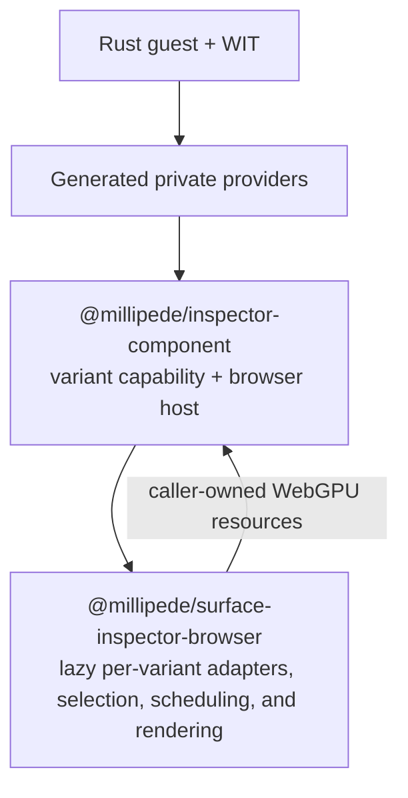

# Component loader

`component-loader/` is the handwritten browser adapter exported by
`@millipede/inspector-component`. It exposes one authored, typed capability per
package subpath and maps component `wasi:webgpu` resources to the caller's
browser `GPUDevice`, `GPUTexture`, `GPUBuffer`, and command encoder.

The loader owns browser loading policy, host imports, resource projection,
result translation, and preparation guards. It does not select Millipede's
analyzer backend, schedule frames, or render analyzer output. Detailed
generated-artifact mechanics are maintained in the
[tooling baseline](../docs/tooling/jco-generated-artifact-baseline.md).

## Use a selected capability

The package root is type-only. Import runtime values from exactly one selected
subpath:

```ts
import { analysisComponentLoader } from "@millipede/inspector-component/analysis";

const prepared = await analysisComponentLoader.prepare();
if (prepared.status !== "ready") {
  throw new Error(`analysis component is ${prepared.status}`);
}

const stats = prepared.capability.analyzeTree(
  nodes,
  textureWidth,
  textureHeight,
);
```

A selected subpath owns one module-wide loader. Its only lifecycle operation is
one-shot `prepare()`; `state` is a read-only observation. Concurrent and later
calls share the same Promise and result. Their public TypeScript contracts are
read-only; they do not rely on runtime freezing. `ready` means the selected
capability is callable and its later operations perform no import, download,
compilation, instantiation, or self-test. `unsupported` and `failed` remain
distinct settled outcomes for that imported module URL.

There is deliberately no `retry()` or loader `dispose()`. Browsers may cache a
failed ESM evaluation for one URL, while the current private provider has no
real component-unload operation. Navigation or a newly versioned module URL is
the reset boundary. GPU-device generations, invocation-local resolvers, pending
summaries, and output buffers retain their own explicit lifetimes.

## Where it fits



C0 established the non-GPU Component Model boundary. The browser package's P0
WebGPU implementation remains the oracle and fallback. P1 adds the
component-backed GPU modes below without moving backend selection or frame
ownership into this loader.

## Millipede adoption

Millipede's `@millipede/surface-inspector-browser` package directly owns one
adapter module for each of stable, async, and shared-frame analysis. Selecting
a backend dynamically imports only that adapter. Each adapter imports exactly
its matching `@millipede/inspector-component` runtime subpath, calls that
loader's one-shot `prepare()`, and retains the ready capability in a
device-generation adapter. There is no mutable backend registry and no
`@millipede/surface-inspector-wasm` wrapper package.

The three adapter implementations remain explicit because their execution
contracts differ: stable owns call-local summary resolution, async relies on
the component's JSPI-returned summary, and shared-frame returns a pending
summary for the scheduler to resolve or dispose. Their optional observer
parameter is also preserved at the adapter boundary; the current application
does not supply one. The explicit browser boundary-proof entry is exported
separately as `@millipede/surface-inspector-browser/boundary-proofs`, and
ordinary backend selection neither imports nor runs it.

Prepared component capabilities are module-wide and survive GPU-device
replacement. Millipede separately owns each device-generation adapter,
summary resolver, output buffer, and pending-summary lifetime; retiring those
device-local resources does not reset or re-prepare the component loader.
The still-pending selection/session generation must suppress stale publication
from in-flight preparation or invocation and dispose any late result through
its real owner. H1 measurement and C1/V1 real-Chromium request inventory remain
pending, and P2 still owns the final discovery/session/resource topology.

## Choose an execution mode

| Package subpath / Millipede mode              | Loader                            | Ready-capability operation                               | Requirement         |
| --------------------------------------------- | --------------------------------- | -------------------------------------------------------- | ------------------- |
| `/analysis`                                   | `analysisComponentLoader`         | `analyzeTree(nodes, width, height)`                      | Browser WebAssembly |
| `/gpu-analysis` / `component-gpu`             | `componentGpuAnalyzerLoader`      | `analyze(input, { summaryResolver, observer? })`         | WebGPU; no JSPI     |
| `/gpu-analysis-frame` / `component-gpu-frame` | `componentGpuFrameAnalyzerLoader` | `encode(input, encoder, { summaryResolver, observer? })` | WebGPU; no JSPI     |
| `/gpu-analysis-async` / `component-gpu-async` | `componentGpuAnalyzerAsyncLoader` | `analyze(input, { observer? })`                          | WebGPU plus JSPI    |
| `/boundary-proofs/wasi-async`                 | `wasiAsyncProofsComponentLoader`  | `proveAsyncFunc()`, `proveFuture()`, or `proveStream()`  | JSPI                |

`/boundary-proofs/wasi-async` is only the isolated WASI async projection
proof. It is not a home for GPU diagnostics and does not remove GPU summary
readback from any analyzer. Stable analysis resolves its call-local compact
summary after submission, async analysis returns the Rust-decoded summary, and
shared-frame analysis returns a pending summary that its scheduler resolves
after submit or disposes when the frame is abandoned.

### Stable GPU analysis

```ts
import { componentGpuAnalyzerLoader } from "@millipede/inspector-component/gpu-analysis";

const prepared = await componentGpuAnalyzerLoader.prepare();
if (prepared.status !== "ready") {
  throw new Error(`stable GPU component is ${prepared.status}`);
}

const output = await prepared.capability.analyze(input, {
  summaryResolver,
});
```

### Async GPU analysis

```ts
import { componentGpuAnalyzerAsyncLoader } from "@millipede/inspector-component/gpu-analysis-async";

async function analyzeAsync() {
  const prepared = await componentGpuAnalyzerAsyncLoader.prepare();
  if (prepared.status === "unsupported") {
    reportUnsupported(prepared.reason);
    return;
  }
  if (prepared.status !== "ready") {
    throw new Error(`async GPU component is ${prepared.status}`);
  }

  return await prepared.capability.analyze(input, { observer });
}
```

### Scheduler-owned frame

Prepare before entering the scheduler's frame callback. The callback performs
only the synchronous ready-capability call:

```ts
import { componentGpuFrameAnalyzerLoader } from "@millipede/inspector-component/gpu-analysis-frame";

const prepared = await componentGpuFrameAnalyzerLoader.prepare();
if (prepared.status !== "ready") {
  throw new Error(`frame GPU component is ${prepared.status}`);
}

const encoded = prepared.capability.encode(input, encoder, {
  summaryResolver,
  observer,
});
```

The scheduler later finishes and submits that same encoder, then calls
`encoded.summary.resolveAfterSubmit(...)`. If the frame is abandoned and can
never be submitted, it calls `encoded.summary.dispose()` instead.

If `encode()` throws, commands may already have been appended to the borrowed
native encoder. The scheduler must abandon that entire encoder/frame and must
not append more commands, finish, or submit it. Invocation cleanup releases
the temporary WIT projection and component-owned buffers; it cannot roll back
the native command stream or make the encoder reusable.

All GPU modes accept caller-owned browser resources from one `GPUDevice`.
Successful results keep visual, border-trace, and edge-discovery buffers and
their indirect-draw arguments GPU-resident. The caller owns those transferred
browser buffers; releasing transient WIT handles does not destroy them.

Stable and frame calls receive a device-local compact-summary resolver in the
options for that exact invocation. There is no module-global resolver to
configure or clear. The async P1 path resolves its summary inside the
component instead.

The async loader owns its platform gate. It checks the exact
`WebAssembly.Suspending` and `WebAssembly.promising` APIs before its provider
imports or evaluates the generated async world. If either is absent,
`prepare()` returns `unsupported`; callers must not perform a second JSPI
probe.

The shared-frame path must be preloaded before the frame callback. Encoding is
synchronous and leaves the borrowed command encoder unfinished and
unsubmitted. After submission the scheduler calls the returned
`summary.resolveAfterSubmit(...)`; on abort it calls `summary.dispose()`. The
pending summary is one-shot. The frame world deliberately omits command-encoder
`finish` and `gpu-queue`; the component can neither finish nor submit the
borrowed encoder.

Before ownership transfers, projection or validation failure independently
attempts cleanup of every component-created renderer and summary buffer. One
throwing cleanup action does not prevent the remaining actions. Temporary WIT
identity release never destroys caller-owned devices, textures, reference
buffers, or borrowed encoders. Successfully returned buffers instead belong to
the browser result, resolver, or scheduler that accepted them.

## Develop the loader

The root `package.json` is the package manifest. Authored source lives in
`component-loader/src/`; `component-loader/dist/` and `pkg/generated/` are
build outputs and must not be edited by hand.

For a complete component change:

```sh
pnpm run build
pnpm test
pnpm run sync
```

For an authored TypeScript-only change after generated output already exists:

```sh
pnpm run loader:build
```

Authored TypeScript uses extensionless relative imports. Private generated
imports are isolated in the matching capability's adapter: production
adapters remain under `src/providers/`, while the WASI proof adapter is
colocated under `src/boundary-proofs/wasi-async/`.

The current generated GPU worlds still map to one canonical
`host/webgpu` entry. Its emitted implementation chunk therefore contains the
shared host plus the current stable, async, and frame method union. The graph
is not yet specialized per world. Splitting those host surfaces requires
separate generated map targets while preserving one authoritative
native-resource registry; that remains P2 final-topology work. C1/V1 then
proves the deployed request isolation in Chromium.

Synchronous browser metadata (`GPUTexture.width`, `GPUTexture.height`, and
`GPUBuffer.size`) stays under `src/host/webgpu/sync/`. Promise-shaped JSPI
operations such as queue completion and error-scope resolution stay under
`src/host/webgpu/async/`. Do not wrap synchronous metadata in promises merely
because one consumer is the async backend.

## Source map

| Source                                  | Responsibility                                                                     |
| --------------------------------------- | ---------------------------------------------------------------------------------- |
| `src/index.ts`                          | Shared type-only package root                                                      |
| `src/analysis.ts`                       | Non-GPU authored capability and `analysisComponentLoader`                          |
| `src/gpu-analysis.ts`                   | Stable authored capability and `componentGpuAnalyzerLoader`                        |
| `src/gpu-analysis-async.ts`             | Async authored capability and `componentGpuAnalyzerAsyncLoader`                    |
| `src/gpu-analysis-frame.ts`             | Synchronous borrowed-frame capability and `componentGpuFrameAnalyzerLoader`        |
| `src/gpu-analysis-async-capability.ts`  | Private JSPI invocation wrapper and observer boundary                              |
| `src/gpu-analysis-frame-capability.ts`  | Private synchronous frame wrapper and mandatory throw/abandon boundary             |
| `src/boundary-proofs/wasi-async/`       | Isolated WASI async-proof entry and generated-provider adapter                     |
| `src/capability-state.ts`               | Pure one-shot preparation states, triggers, and legal transition function          |
| `src/capability.ts`                     | Prepare-only module loader, typed outcomes, and shared Promise ownership           |
| `src/errors.ts`                         | No-throw normalization for provider and observer diagnostics                       |
| `src/support-webassembly.ts`            | Baseline WebAssembly gate for non-JSPI variants                                    |
| `src/support-jspi.ts`                   | Exact JSPI gate used only by async GPU and isolated-proof variants                 |
| `src/providers/*.ts`                    | Private production-world adapters from generated exports to authored capabilities  |
| `src/gpu-analysis-dispatch.ts`          | Variant-neutral request metadata construction                                      |
| `src/gpu-analysis-runtime.ts`           | Stable/async call-local registration, output transfer, and cleanup                 |
| `src/gpu-analysis-observer.ts`          | Optional provider-neutral post-readiness invocation observations                   |
| `src/host/gpu-types.ts`                 | Shared request, result, submission, and summary-resolver contracts                 |
| `src/host/gpu-output-set.ts`            | Canonical renderer-output ownership shape and exhaustive traversal                 |
| `src/host/gpu-output.ts`                | Variant-neutral plan validation and native output translation                      |
| `src/host/gpu-summary-stable.ts`        | Stable-world compact-summary ownership transfer                                    |
| `src/host/gpu-summary-frame.ts`         | Shared-frame pending-summary lifecycle                                             |
| `src/host/webgpu/`                      | Browser implementation and temporary registry for imported `wasi:webgpu` resources |
| `src/host/log.ts`, `src/host/events.ts` | Guest logging and event imports                                                    |

For deeper contracts, see the [project README](../README.md), the
[component-boundary test guide](../tests/component-boundary/README.md), and the
[component capability loading contract](../docs/architecture/component-capability-loading-contract.md).
GPU recording and submission ownership remain defined by the
[GPU compute execution contract](../docs/architecture/gpu-compute-execution-contract.md).
The canonical treatment of generated-provider and core-Wasm mechanics is the
[JCO-generated artifact baseline](../docs/tooling/jco-generated-artifact-baseline.md).
