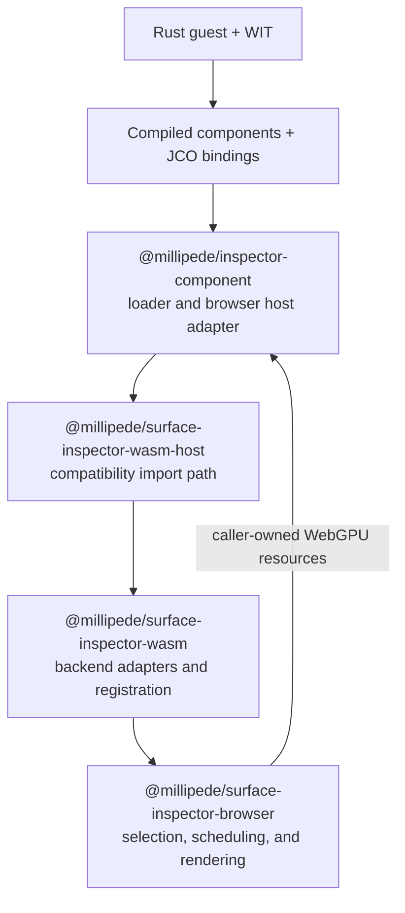

# Component loader

`component-loader/` is the handwritten browser adapter exported by
`@millipede/inspector-component`. It puts the JCO-generated component worlds
behind a stable TypeScript API and maps their `wasi:webgpu` resources to the
caller's browser `GPUDevice`, `GPUTexture`, `GPUBuffer`, and command encoder.

JCO owns `pkg/generated/`; this loader owns browser loading policy, host
imports, resource projection, result translation, and lifecycle guards. It
does not select Millipede's analyzer backend, schedule frames, or render
analyzer output.

## Where it fits



C0 established the non-GPU Component Model boundary. The browser package's P0
WebGPU implementation remains the oracle and fallback. P1 adds the
component-backed GPU modes below without moving backend selection or frame
ownership into this loader.

## Use it from Millipede

Normal Millipede activation dynamically imports the optional WASM integration:

```ts
await import("@millipede/surface-inspector-wasm/auto");
```

That package registers the component backends with
`@millipede/surface-inspector-browser`. The intermediate
`@millipede/surface-inspector-wasm-host` package preserves Millipede's existing
import path while delegating to this package. Application code should use
those layers instead of importing this low-level loader directly.

For another host integration, prepare the selected capability explicitly. A
typed result distinguishes platform support from an unexpected preparation
failure, and `ready` guarantees that later execution performs no component
loading:

```ts
import { analysisComponentLoader } from "@millipede/inspector-component";

const prepared = await analysisComponentLoader.prepare();
if (prepared.status === "ready") {
  const stats = prepared.capability.analyzeTree(
    nodes,
    textureWidth,
    textureHeight,
  );
}
```

Each selected loader exposes `state`, `prepare()`, `retry()`, and `dispose()`.
Concurrent preparation calls share one attempt; failure and unsupported states
remain stable until an explicit retry. The existing `load*()` functions remain
nullable compatibility views over the same attempt. Page-wide singleton
loaders should be disposed only during terminal application teardown until the
later runtime-factory design assigns them a narrower owner. A caller must not
invoke a capability retained from an earlier ready result after disposal; the
current generated provider cannot revoke an escaped JavaScript function.
Active analysis work must settle before that terminal disposal.

## Choose an execution mode

| World / Millipede mode                       | Purpose                                                         | Requirement         | Preparation and execution                                                                                                                                                |
| -------------------------------------------- | --------------------------------------------------------------- | ------------------- | ------------------------------------------------------------------------------------------------------------------------------------------------------------------------ |
| `analysis`                                   | C0 typed non-GPU analysis boundary                              | Browser WebAssembly | Prepare `analysisComponentLoader`; `loadAnalysisComponent()` remains the compatibility view                                                                              |
| `gpu-analysis` / `component-gpu`             | Stable P1 GPU execution                                         | WebGPU; no JSPI     | Prepare `componentGpuAnalyzerLoader`; configure `configureGpuAnalysisSummaryResolver()` and call `runComponentGpuAnalysis()`; the component finishes and submits         |
| `gpu-analysis-frame` / `component-gpu-frame` | P1 analysis in a scheduler-owned frame                          | WebGPU; no JSPI     | Prepare `componentGpuFrameAnalyzerLoader` outside the frame, then call synchronous `encodeComponentGpuFrameAnalysis()`; the browser scheduler alone finishes and submits |
| `gpu-analysis-async` / `component-gpu-async` | Experimental P1 async/readback path                             | WebGPU plus JSPI    | Prepare `componentGpuAnalyzerAsyncLoader`, whose unsupported result replaces ambiguous probe/load failure handling; then call `runComponentGpuAnalysisAsync()`           |
| `wasi-0.3`                                   | Isolated Component Model async proof; not a production analyzer | JSPI                | Prepare `wasiAsyncProofsComponentLoader` only from an explicit diagnostic path; `loadWasiAsyncProofsComponent()` remains the compatibility view                          |

All GPU modes accept caller-owned browser resources from one `GPUDevice`.
Successful results keep visual, border-trace, and edge-discovery buffers and
their indirect-draw arguments GPU-resident. The caller owns those transferred
browser buffers; releasing transient WIT handles does not destroy them.

The stable P1 host configures its compact-summary resolver for the current
device before calling `runComponentGpuAnalysis()` and clears it with `null`
during teardown. The async P1 path resolves that summary inside the component
instead.

The shared-frame path must be preloaded before the frame callback. Encoding is
synchronous and leaves the borrowed command encoder unfinished and
unsubmitted. After submission the scheduler calls the returned
`summary.resolveAfterSubmit(...)`; on abort it calls `summary.dispose()`. The
pending summary is one-shot.

## Develop the loader

The root `package.json` is the package manifest. Authored source lives in
`component-loader/src/`; `component-loader/dist/` and `pkg/generated/` are
build outputs and must not be edited by hand.

For a complete component change:

```sh
pnpm run build
pnpm test
pnpm run sync
```

For an authored TypeScript-only change after generated output already exists:

```sh
pnpm run loader:build
```

Synchronous browser metadata (`GPUTexture.width`, `GPUTexture.height`, and
`GPUBuffer.size`) stays under `src/host/webgpu/sync/`. Promise-shaped JSPI
operations such as queue completion and error-scope resolution stay under
`src/host/webgpu/async/`. Do not wrap synchronous metadata in promises merely
because one consumer is the async backend.

## Source map

| Source                                  | Responsibility                                                                |
| --------------------------------------- | ----------------------------------------------------------------------------- |
| `src/capability-state.ts`               | Pure capability states, transition triggers, and legal transition function    |
| `src/capability.ts`                     | Async preparation controller, provider ownership, retry, and disposal effects |
| `src/index.ts`                          | Public facade, selected capability loaders, and stable/async runners          |
| `src/frame.ts`                          | Explicit preparation and synchronous recording for the borrowed frame encoder |
| `src/generated.ts`                      | Private adapter from the current generated provider to callable capabilities  |
| `src/host/gpu-types.ts`                 | Shared request, result, submission, and summary-resolver contracts            |
| `src/host/gpu.ts`                       | Analyzer-plan validation, output translation, and summary lifecycles          |
| `src/host/webgpu/`                      | Browser implementation of the imported `wasi:webgpu` resources                |
| `src/host/log.ts`, `src/host/events.ts` | Guest logging and event imports                                               |

For deeper contracts, see the [project README](../README.md), the
[component-boundary test guide](../tests/component-boundary/README.md), and the
[component capability loading contract](../docs/architecture/component-capability-loading-contract.md).
GPU recording and submission ownership remain defined by the
[GPU compute execution contract](../docs/architecture/gpu-compute-execution-contract.md).
Current generated-provider and core-Wasm mechanics are documented separately
in the
[JCO-generated artifact baseline](../docs/tooling/jco-generated-artifact-baseline.md).
