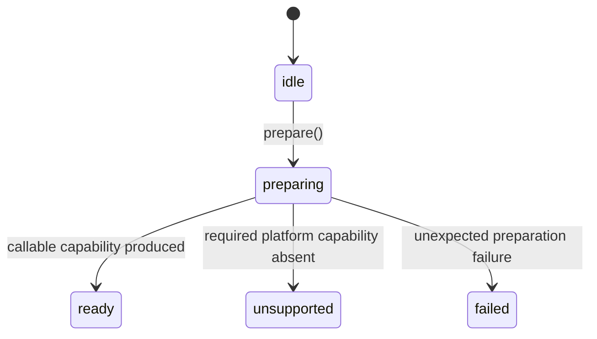

# Component capability loading contract

> - **Status:** Direct local variant capabilities and explicit Millipede
>   consumer adoption implemented
> - **Last reviewed:** 2026-08-11
> - **Applies to:** Browser component loading and capability readiness
> - **Roadmap context:** H1 measurement prerequisite; final topology remains
>   owned by R2-C and P2
> - **Does not authorize:** New production worlds, variants, backends, or final
>   R2-C package/API naming
> - **Related evidence:**
>   [Real-browser WebGPU lifetime testing](../testing/browser-lifetime/README.md)
> - **Compute prerequisite:**
>   [GPU compute execution contract](gpu-compute-execution-contract.md)

## Decision

The loader architecture is independent of the private mechanism used to
instantiate a WebAssembly Component. Generated-provider mechanics are not part
of the public architecture, capability model, measurement model, or long-term
loading contract; their canonical detailed treatment is the
[tooling baseline](../tooling/jco-generated-artifact-baseline.md).

The canonical build artifact is a WebAssembly Component and the public runtime
output is an authored callable capability:

```text
select one component variant
    -> prepare that component through a private implementation
    -> receive a callable capability
    -> begin runtime and GPU measurement
```

Everything before the callable capability is an opaque, untimed prerequisite.

## Implemented loader and consumer adoption

The local loader implements the provider-neutral lifecycle, direct authored
capabilities, and per-world entry isolation. Millipede now adopts that contract
through browser-owned lazy, selected-variant adapters.

| Implemented local contract                                                                              | Implemented Millipede adoption                                                                                      |
| ------------------------------------------------------------------------------------------------------- | ------------------------------------------------------------------------------------------------------------------- |
| The root package entry exports types only                                                               | `surface-inspector-browser` owns three explicit device-local adapter modules                                        |
| `/analysis`, `/gpu-analysis`, `/gpu-analysis-async`, and `/gpu-analysis-frame` isolate runtime families | Selecting a backend dynamically imports only its exact stable, async, or shared-frame adapter                       |
| `providers/*.ts` privately adapt the matching generated world                                           | Each adapter imports the matching component subpath and calls that loader's one-shot `prepare()`                    |
| Typed loaders return `ready`, `unsupported`, or `failed`                                                | Device-generation preparation preserves those outcomes and retires ready adapters independently                     |
| `/diagnostics` is a side-effect-free WASI proof entry separate from analyzer entries                    | The explicit browser `/diagnostics` export remains outside ordinary backend selection                               |
| `ready` provides the post-preparation measurement boundary                                              | Invocation and measurement eligibility begins only after selected preparation reports `ready`                       |
| Stable and frame summary resolvers are invocation-local options                                         | Each call passes its device adapter's resolver; no module-global resolver or mutable backend registry is configured |

This completes direct consumer-loader adoption. It does not select the final
discovery/session/resource topology: R2-C and P2 still own that decision.
The former `surface-inspector-wasm` wrapper package and mutable backend registry
are not part of this design. H1 measurement and C1/V1 real-Chromium request
inventory remain pending; C1/V1 is the authoritative proof that the deployed
selected path does not request unselected JavaScript or Wasm assets.

Each adapter continues to accept the optional component invocation observer so
a future session composition can supply it without changing the component
contract. The current application supplies no observer.

The `/diagnostics` split isolates the explicit WASI async proofs. It does not
separate GPU summary readback from the stable, async, or frame analyzer
capabilities; those variants retain their current summary ownership contracts.

## Responsibility boundary

```text
Millipede selected backend
    | dynamically imports one browser-owned adapter
    v
Selected device adapter
    | imports the exact component subpath and prepares it
    v
Selected variant entry
    | exposes explicit preparation
    v
Private component provider
    | returns callable component exports
    v
Prepared capability
    | used by the selected runtime
    v
GPU preparation, invocation, publication, and cleanup
```

| Owner                      | Responsibility                                                                |
| -------------------------- | ----------------------------------------------------------------------------- |
| Millipede composition      | Select one analyzer variant and lazily load its browser-owned adapter         |
| Millipede device adapter   | Retain one ready capability for a GPU-device generation and retire it locally |
| Selected variant entry     | Expose the preparation operation for that variant                             |
| Private component provider | Instantiate the selected component through the currently supported mechanism  |
| Prepared capability        | Expose callable typed operations with no remaining loading work               |
| GPU runtime and scheduler  | Own device generations, encoding, submission, publication, and retirement     |
| Browser-lifetime harness   | Measure behavior only after component preparation succeeds                    |

The loader does not select GPU scheduling policy, own frame submission, or
decide resource reuse.

## Component instance and logical session boundary

The current GPU capabilities do not require one independently instantiated
component guest per Millipede session. Stable, async, and shared-frame calls
receive their device and GPU inputs explicitly, and the current GPU guests do
not retain authoritative cross-call session state. Per-invocation host resource
identities and summary resolvers therefore do not require per-session component
imports.

The selected boundary is:

```text
one cached capability for the selected component variant
    -> Millipede owns backend selection and device-generation control
    -> each current invocation receives its exact device and resources
    -> a future persistent GPU lifetime uses an explicit WIT session resource
```

Persistent state alone is not a reason to create another component instance.
When persistent pipelines, buffers, bind groups, or GPU-side generation state
are implemented, they should be owned by an explicit WIT resource such as
`discovery-session`. Several logical session resources may coexist behind one
cached component capability, and dropping a session must release the resources
owned by that session. Millipede decides when a logical session is created,
replaced, or dropped; the private provider only adapts the WIT resource
lifecycle to its current runtime.

### Target variant-switch sequence

The following sequence is the selected target for Millipede's future
session/selection controller; the current direct-adapter cutover does not yet
implement it. Switching the selected analyzer should change Millipede's active
runtime session without resetting or unloading either variant's component
capability:

```text
select shared-frame
    -> prepare or reuse the cached shared-frame capability
    -> run with the current Millipede device generation

switch to async
    -> stop scheduling new shared-frame work
    -> retire shared-frame pending, output, and device-session resources
    -> prepare or reuse the cached async capability
    -> leave the shared-frame component capability cached and callable

switch back to shared-frame
    -> reuse the existing ready shared-frame capability
    -> create or rebind only the required device-local session resources
```

An in-flight operation is not cancelled by changing the selection. Millipede's
session or selection generation must reject stale publication and clean up any
late result through its actual output and pending-summary ownership paths. The
capability loader does not gain an active-variant state and is not used to
coordinate switching. When the future `discovery-session` WIT resource exists,
Millipede drops or replaces that logical resource at the same boundary; the
cached component capability remains prepared.

That selection/session generation is not implemented by direct-adapter
cleanup. Retiring an adapter prevents new calls and releases adapter-owned
state, but output buffers, pending frame summaries, WIT projections, and future
device-local sessions still require cleanup through their actual owners.

Explicit per-instance provider construction remains deferred unless a concrete
requirement cannot be represented by logical resources, for example:

- different host import implementations for different sessions;
- unavoidable guest-global state that must be reset by instance replacement;
- hard guest-memory or fault isolation between sessions.

The current architecture has none of those requirements. Provider-specific
instance factories are not unload mechanisms, and discarded instances do not
provide deterministic ESM or WebAssembly reclamation. A future native browser
Component Model provider must preserve the same callable-capability and WIT
session-resource semantics without exposing its instantiation mechanism to
Millipede.

## Minimal lifecycle



These are capability-loader states. They are not GPU-device,
command-submission, or shader-execution states.

The implementation keeps this diagram executable as a pure transition
function in `component-loader/src/capability-state.ts`. That file owns only the
states, transition triggers, and legal transitions. The asynchronous loader
in `component-loader/src/capability.ts` applies those transitions while owning
the single preparation Promise, provider call, result publication, and
best-effort failure reporting.

Each public variant entry owns one module-wide loader. `ready` is entered only
when its sole preparation succeeds. Every concurrent or later `prepare()` call
receives the same Promise and settled result, so normal capability operations
never enter `ready` again.

`unsupported` and `failed` are terminal for that imported module. Retrying the
same browser ESM URL cannot reliably undo cached module evaluation or import
failures, and the current generated provider has no component-unload or reset
operation. A scenario that truly requires a fresh preparation loads a fresh
page or an intentionally new, versioned module URL.

The loader is therefore not disposable. This module lifetime is independent
of Millipede's GPU-device and session lifetimes: Millipede still retires device
generations, pending summaries, transferred outputs, and other browser-owned or
component-owned GPU resources through their actual ownership APIs.

### State-machine vocabulary

```text
method call or provider outcome
    -> transition trigger
    -> pure state-transition record
    -> loader stores nextState
```

| Name                                   | Role                                                                  |
| -------------------------------------- | --------------------------------------------------------------------- |
| `ComponentCapabilityState`             | Current stored preparation value                                      |
| `ComponentCapabilityTransitionTrigger` | Input asking the pure function to evaluate one transition             |
| `ComponentCapabilityStateTransition`   | Returned `previousState`, `nextState`, `trigger`, and `effect` record |
| `ComponentCapabilityTransitionEffect`  | Classification of a changed or unchanged state                        |
| `ComponentCapabilityPrepareResult`     | Read-only outcome retained by the one public `prepare()` operation    |

A transition trigger is not emitted and there is no lifecycle event bus. The
loader creates a trigger from a method call or provider outcome, passes it
to the pure function, and stores the returned `nextState`.

The loader's live `state` describes progress before settlement. Once the
attempt settles, its state and the retained result describe the same terminal
outcome. Repeated `prepare()` calls do not construct new result objects.

### Transition triggers

| Trigger                 | Meaning                                                      |
| ----------------------- | ------------------------------------------------------------ |
| `prepare-requested`     | Start from idle or join/reuse the current attempt or result  |
| `preparation-succeeded` | The active attempt produced a callable capability            |
| `support-unavailable`   | The active attempt proved a required platform feature absent |
| `preparation-failed`    | The active attempt failed unexpectedly                       |

Each pure result has an `effect` of `state-changed` or `state-unchanged`. Only
`state-changed` represents a state entry. In particular, a
`prepare-requested` trigger in `preparing`, `ready`, `unsupported`, or `failed`
is `state-unchanged` and reuses the retained Promise.

`analyze()`, async analysis, and shared-frame `encode()` are deliberately not
transition triggers. They require a ready capability but do not mutate loader
state.

### State meanings

| State         | Meaning                                                                         |
| ------------- | ------------------------------------------------------------------------------- |
| `idle`        | No preparation attempt has started                                              |
| `preparing`   | The private provider is preparing the selected component                        |
| `ready`       | The selected component is callable and no loading remains in its execution path |
| `unsupported` | The environment lacks a required declared capability                            |
| `failed`      | Preparation failed unexpectedly                                                 |

## Variant-specific public capabilities

The root `@millipede/inspector-component` entry exports shared types only.
Runtime code imports exactly one selected subpath:

| Package subpath       | Loader                            | Operation on `ready.capability`                          |
| --------------------- | --------------------------------- | -------------------------------------------------------- |
| `/analysis`           | `analysisComponentLoader`         | `analyzeTree(nodes, textureWidth, textureHeight)`        |
| `/gpu-analysis`       | `componentGpuAnalyzerLoader`      | `analyze(input, { summaryResolver, observer? })`         |
| `/gpu-analysis-async` | `componentGpuAnalyzerAsyncLoader` | `analyze(input, { observer? })`                          |
| `/gpu-analysis-frame` | `componentGpuFrameAnalyzerLoader` | `encode(input, encoder, { summaryResolver, observer? })` |
| `/diagnostics`        | `wasiAsyncProofsComponentLoader`  | Explicit WASI async proof calls                          |

Stable and frame summary resolvers are invocation-local dependencies. They are
never installed in module-global state.

The async loader owns the exact `WebAssembly.Suspending` and
`WebAssembly.promising` gate. It checks both before the provider dynamically
imports or evaluates the generated async world; absence produces
`unsupported`, while a generated-world import or instantiation error produces
`failed`.

The frame capability's `encode()` operation is synchronous. The frame world
omits command-encoder `finish` and `gpu-queue`, and the component never finishes
or submits the borrowed encoder. The browser scheduler alone performs those
operations after `encode()` returns.

## Behavioral guarantees

1. `prepare()` is explicit.
2. All calls on one module-wide loader share the exact same active or settled
   preparation Promise.
3. Calling `prepare()` again after `ready` returns the existing ready result
   and capability without creating a new attempt or state entry.
4. An `unsupported` or `failed` result remains typed and stable for the
   lifetime of that imported module.
5. A fresh page or intentionally versioned module URL is the reset boundary;
   the loader exposes no retry operation.
6. `ready` means that component preparation has completely finished.
7. `analyze()` and shared-frame `encode()` perform no component import,
   download, compilation, instantiation, or self-test.
8. Shared-frame encoding remains synchronous after preparation.
9. Any shared-frame `encode()` failure requires the scheduler to abandon the
   complete encoder and frame; cleanup cannot roll back recorded commands.
10. `unsupported` is distinct from `failed`.
11. A missing deployment artifact, broken import, or instantiation error is
    `failed`, not `unsupported`.
12. Failures are not silently converted into a cached `null`.
13. Importing a variant or diagnostic entrypoint performs no workload.
14. The loader does not expose its private component provider to callers.
15. The public loader exposes only `state` and `prepare()`; GPU and session
    retirement remain the responsibility of their actual owners.
16. `/diagnostics` isolates explicit WASI async proofs, not GPU summary
    readback performed by analyzer capabilities.
17. Before transfer, projection or validation failure independently attempts
    destruction of every component-created renderer and summary buffer; one
    cleanup failure does not prevent the remaining attempts.
18. Temporary WIT identity cleanup never destroys caller-owned devices,
    textures, reference buffers, or borrowed encoders. After transfer, the
    browser result, resolver, or scheduler owns native cleanup.

## Public loader shape

Each exported loader uses the following implemented behavioral shape. Concrete
capability operations are the variant-specific methods listed above:

```ts
type PrepareResult<T> =
  | {
      status: "ready";
      capability: T;
    }
  | {
      status: "unsupported";
      reason: {
        code: string;
        message: string;
      };
    }
  | {
      status: "failed";
      error: Error;
    };

interface SelectedComponent<T> {
  readonly state: "idle" | "preparing" | "ready" | "unsupported" | "failed";
  prepare(): Promise<PrepareResult<T>>;
}
```

The private implementation boundary prepares and returns the authored
capability directly:

```ts
type InstantiateSelectedComponent<T> = () => Promise<T>;
```

The authored provider normalizes generated exports before returning that
capability. Consumers never receive or identify the underlying provider. No
fake private disposer is modeled because the current provider cannot unload an
evaluated ESM module or its component instance. Real GPU cleanup remains on
the device-, session-, invocation-, output-, and pending-summary ownership
paths where destructive work can actually occur.

## Variant isolation

Each local runtime subpath represents one selected capability family, and the
root entry is type-only. Private generated-world imports are split across
`component-loader/src/providers/*.ts`; no singular shared provider adapter
makes every world reachable. Millipede performs consumer-side selection through
three explicit lazy adapter modules in `surface-inspector-browser`; each imports
only its exact component runtime subpath. No wrapper package or mutable backend
registry makes all variants reachable. P2 still owns the final discovery
topology, while C1/V1 owns proof that the deployed Millipede path preserves
request isolation.

The selected runtime path must satisfy:

- only the selected variant entry is requested and evaluated;
- unselected GPU variants are not imported as side effects;
- diagnostic and proof worlds are not requested, evaluated, or instantiated
  in the selected runtime path unless explicitly selected;
- importing the entrypoint does not register or execute a workload;
- component preparation happens only through `prepare()`;
- execution after `ready` performs no additional component loading;
- shared barrels do not eagerly import or evaluate every generated variant;
- development parity builds may contain several entries, but one execution
  selects only one.

Exact request counts are not architectural contracts. The invariant is
selection isolation, not the internal file topology of a particular component
provider.

Future C1/V1 acceptance must load the final deployed consumer in Chromium and
record the browser's actual requests. That evidence proves that the selected
entry loads, no unselected or diagnostic world is requested, and no further
component loading occurs during execution after `ready`. That browser evidence
is the authoritative selection-isolation gate.

## Measurement boundary

Component preparation is not part of H1 or R2-C runtime timing.

```text
prepare selected component
    -> validate callable capability
    -> state = ready
    -> arm measurement
    -> prepare GPU/session resources
    -> invoke or encode
    -> submit, publish, resolve, and clean up
```

No measurement observer event, measurement timestamp, or measurement record is
created for:

- selected component import;
- component download;
- component compilation;
- component instantiation;
- private-provider internals;
- browser-native component-engine internals.

Instrumentation plumbing may have to exist before preparation to satisfy host
imports. It must remain dormant until `ready`: no events, clock reads, IDs, or
measurement allocations.

After `ready`, measurement may cover:

- device-, session-, entry-, and resource-cold preparation;
- compatible warm reuse and replacement;
- native WebGPU object creation, identity, transfer, and destruction;
- component invocation and command recording;
- GPU timestamp-query intervals when available;
- submission, completion, output publication, and summary readiness;
- cleanup, retirement, device loss, and recovery.

The selected provider and its toolchain version remain run provenance. They are
not timing metrics.

## Self-tests and diagnostics

Self-tests are explicit diagnostics, not production bootstrap behavior.

A diagnostic entrypoint must:

1. be side-effect-free when imported;
2. require explicit preparation and an explicit proof operation;
3. use the same prepared-capability boundary as production;
4. report failure instead of swallowing it;
5. never mark a production analyzer ready;
6. remain absent from selected production bundles where C1 requires exclusion.

A normal application activation must not automatically load or run the
browser-safe analysis proof or the WASI async proof. Millipede exposes its
explicit bridge at `@millipede/surface-inspector-browser/diagnostics`; its
ordinary selected-backend imports do not reference that bridge.

## Private provider replacement

The current browser implementation uses a generated private provider. Its
mechanics remain in build documentation, scripts, dependency metadata, and the
[dedicated tooling document](../tooling/jco-generated-artifact-baseline.md).
They do not define this architectural contract.

A future conforming native browser implementation may replace the private
provider:

```text
Today:
    private generated provider
        -> callable component capability

Future:
    native browser component provider
        -> callable component capability
```

Native adoption may change both the private provider and package artifact
delivery. R2-C's `D-ARTIFACT` decision and P2 own that packaging migration.
Variant selection, the public capability contract, GPU execution, ownership
rules, and post-ready measurements remain unchanged.

No provider registry or public generated/native selector is required now.
Native support should replace the private implementation only after the required
worlds, borrowed WebGPU resources, async behavior, and lifetime semantics are
supported and pass the same capability tests.

## Verification gates

| Gate                    | Required evidence                                                        |
| ----------------------- | ------------------------------------------------------------------------ |
| Side-effect-free import | Importing an entry performs no workload or self-test                     |
| Explicit readiness      | `ready` is returned only after callable exports exist                    |
| Single active attempt   | Concurrent preparation calls do not duplicate work                       |
| Settled memoization     | Every later preparation call reuses the same Promise and result          |
| Typed failure           | Unsupported capability and unexpected failure remain distinct            |
| Hot-path purity         | No component loading occurs during `analyze()` or `encode()`             |
| Shared-frame synchrony  | Encoding performs no import or await                                     |
| Frame failure ownership | A throwing `encode()` causes the scheduler to abandon the encoder/frame  |
| Variant isolation       | C1/V1: Chromium requests only the selected deployed runtime variant      |
| Measurement integrity   | No measurement event or clock read occurs before `ready`                 |
| Explicit diagnostics    | Self-tests run only through an explicit diagnostic call                  |
| Provider replaceability | Provider conformance tests depend only on normalized capability behavior |

These tests must not assert the private provider's internal module count or
shim structure. Browser acceptance asserts selection and absence of post-ready
loading, not a provider-specific total request count.

## Non-goals

This contract does not specify or measure:

- private-provider module or shim topology;
- browser-native Component Model lowering;
- component download or compilation latency;
- exact Wasm or JavaScript request counts;
- preloading or provider-specific cache policy;
- generated-binding implementation details;
- GPU pipeline, buffer, or bind-group reuse;
- command encoding, batching, or submission policy;
- the selected R2-C analyzer topology.

## Roadmap relationship

- **H1** remains pending and uses `ready` as the eligibility gate before
  lifetime observation.
- **R2-C** compares post-ready runtime, resource, and submission strategies.
- **P2** finalizes the selected discovery/session/resource topology in
  Millipede; direct loader adoption is already implemented.
- **C1/V1** remain pending and prove deployed runtime-request isolation in
  Chromium end to end.
- Native browser Component Model adoption is a later provider replacement, not
  a prerequisite for H1 or R2-C.

## References

- [Real-browser WebGPU lifetime testing](../testing/browser-lifetime/README.md)
- [GPU compute execution contract](gpu-compute-execution-contract.md)
- [WebAssembly Component Model web-embedding proposal](https://github.com/WebAssembly/component-model/pull/686)
