# Component capability loading contract

> - **Status:** Local lifecycle foundation implemented; consumer migration and
>   final topology pending
> - **Last reviewed:** 2026-08-10
> - **Applies to:** Browser component loading and capability readiness
> - **Roadmap context:** H1 measurement prerequisite; final topology remains
>   owned by R2-C and P2
> - **Does not authorize:** New production worlds, variants, backends, or final
>   R2-C package/API naming
> - **Related evidence:**
>   [Real-browser WebGPU lifetime testing](../testing/browser-lifetime/README.md)
> - **Compute prerequisite:**
>   [GPU compute execution contract](gpu-compute-execution-contract.md)

## Decision

The loader architecture is independent of the mechanism used to instantiate a
WebAssembly Component.

JCO is a temporary browser compatibility implementation. It is not part of the
public architecture, capability model, measurement model, or long-term loading
contract.

The target canonical build artifact is a WebAssembly Component and the
canonical runtime output is a callable capability. The current packaged
browser-consumed payload may still contain compatibility-lowered assets rather
than the original component artifact:

```text
select one component variant
    -> prepare that component through a private implementation
    -> receive a callable capability
    -> begin runtime and GPU measurement
```

Everything before the callable capability is an opaque, untimed prerequisite.

## Compatibility baseline and local foundation

The local loader now implements the provider-neutral lifecycle while preserving
the earlier nullable APIs. Consumer migration and final variant packaging remain
later work.

| Local state                                                              | Remaining limitation                                                 | Final target                                     |
| ------------------------------------------------------------------------ | -------------------------------------------------------------------- | ------------------------------------------------ |
| `generated.ts` alone adapts the current generated provider               | The provider has no meaningful instance-unload operation             | Provider stays private and replaceable           |
| Typed loaders expose preparation, retry, state, and disposal             | Nullable `load*()` functions remain for compatibility                | Consumers use typed preparation                  |
| Explicit retry creates a new logical preparation attempt                 | An evaluated ESM URL may retain a browser-cached rejection           | Retry semantics proven for the selected provider |
| Millipede's compatibility `/auto` path still starts a detached self-test | Production activation still performs unrelated diagnostic work       | Consumer patch removes that side effect          |
| `ready` provides an uncontaminated post-preparation boundary             | Existing Millipede callers do not yet use it as the measurement gate | Measurement begins only after typed `ready`      |

This local foundation does not freeze the R2-C/P2 variant-entry topology or
runtime factory ownership.

## Responsibility boundary

```text
Millipede composition
    | selects one variant
    v
Selected variant entry
    | exposes explicit preparation
    v
Private component provider
    | returns callable component exports
    v
Prepared capability
    | used by the selected runtime
    v
GPU preparation, invocation, publication, and cleanup
```

| Owner                      | Responsibility                                                               |
| -------------------------- | ---------------------------------------------------------------------------- |
| Millipede composition      | Select one analyzer variant                                                  |
| Selected variant entry     | Expose the preparation operation for that variant                            |
| Private component provider | Instantiate the selected component through the currently supported mechanism |
| Prepared capability        | Expose callable typed operations with no remaining loading work              |
| GPU runtime and scheduler  | Own device generations, encoding, submission, publication, and retirement    |
| Browser-lifetime harness   | Measure behavior only after component preparation succeeds                   |

The loader does not select GPU scheduling policy, own frame submission, or
decide resource reuse.

## Minimal lifecycle

```mermaid
stateDiagram-v2
    [*] --> idle
    idle --> preparing: prepare() or retry()
    idle --> disposed: dispose()
    preparing --> ready: callable capability produced
    preparing --> unsupported: required platform capability absent
    preparing --> failed: unexpected preparation failure
    preparing --> disposed: dispose; quarantine late completion
    unsupported --> preparing: explicit retry after environment change
    failed --> preparing: explicit retry
    unsupported --> disposed: dispose()
    failed --> disposed: dispose()
    ready --> disposed: dispose()
    disposed --> [*]
```



These are capability-loader states. They are not GPU-device,
command-submission, or shader-execution states.

The implementation keeps this diagram executable as a pure transition
function in `component-loader/src/capability-state.ts`. That file owns only the
states, transition triggers, and legal transitions. The asynchronous controller
in `component-loader/src/capability.ts` applies those transitions while owning
single-flight promises, provider calls, result publication, and cleanup.

`ready` is entered only when an active preparation succeeds, and at most once
during one loader lifetime. Calling `prepare()` again, calling `retry()` while
already ready, or invoking normal capability operations reuses the same ready
state and capability; none of those operations enters `ready` a second time.
A loader that has not yet become ready gets another opportunity only through
an explicit retry after `unsupported` or `failed`; a separately constructed
loader has its own lifecycle.

### State-machine vocabulary

```text
method call or provider outcome
    -> transition trigger
    -> pure state-transition record
    -> controller stores nextState
```

| Name                                   | Role                                                                  |
| -------------------------------------- | --------------------------------------------------------------------- |
| `ComponentCapabilityState`             | Current stored lifecycle value                                        |
| `ComponentCapabilityTransitionTrigger` | Input asking the pure function to evaluate one transition             |
| `ComponentCapabilityStateTransition`   | Returned `previousState`, `nextState`, `trigger`, and `effect` record |
| `ComponentCapabilityTransitionEffect`  | Classification of changed, unchanged, or late preparation handling    |
| `ComponentCapabilityPrepareResult`     | Frozen outcome of one public `prepare()` or `retry()` call            |

A transition trigger is not emitted and there is no lifecycle event bus. The
controller creates a trigger from a method call or provider outcome, passes it
to the pure function, and stores the returned `nextState`.

The loader's live `state` and a preparation result's `status` are deliberately
different. For example, a previously returned result remains
`{ status: "ready", capability }` after the loader later moves to
`state === "disposed"`; the result records what that call returned, while the
loader state records what may happen now.

### Transition triggers

| Trigger                 | Meaning                                                         |
| ----------------------- | --------------------------------------------------------------- |
| `prepare-requested`     | Start from idle or join/reuse the current attempt or result     |
| `retry-requested`       | Start again only from idle, unsupported, or failed              |
| `preparation-succeeded` | The active attempt produced a callable capability               |
| `support-unavailable`   | The active attempt proved a required platform feature absent    |
| `preparation-failed`    | The active attempt failed unexpectedly                          |
| `dispose-requested`     | Retire from any live state; disposed then absorbs late outcomes |

Each pure result has an `effect` of `state-changed`, `state-unchanged`, or
`late-preparation`. Only `state-changed` represents a state entry. In
particular, `ready + prepare-requested` and `ready + retry-requested` are
`state-unchanged`; a preparation settlement arriving after disposal is
`late-preparation` and cannot publish a capability.

`analyze()`, async analysis, and shared-frame `encode()` are deliberately not
transition triggers. They require a ready capability but do not mutate loader
state.

### State meanings

| State         | Meaning                                                                         |
| ------------- | ------------------------------------------------------------------------------- |
| `idle`        | No preparation attempt has started                                              |
| `preparing`   | The private provider is preparing the selected component                        |
| `ready`       | The selected component is callable and no loading remains in its execution path |
| `unsupported` | The environment lacks a required declared capability                            |
| `failed`      | Preparation failed unexpectedly                                                 |
| `disposed`    | Retired; callers stop using previously returned capabilities                    |

## Behavioral guarantees

1. `prepare()` is explicit.
2. Concurrent calls on one loader share the same active preparation attempt.
3. Calling `prepare()` again after `ready` returns the existing ready result
   and capability without creating a new attempt.
4. An `unsupported` or `failed` result remains typed and stable until an
   explicit retry or disposal.
5. Disposal during preparation prevents a late result from being published;
   any capability produced afterward is cleaned up by its owner.
6. `ready` means that component preparation has completely finished.
7. `analyze()` and shared-frame `encode()` perform no component import,
   download, compilation, instantiation, registration scan, or self-test.
8. Shared-frame encoding remains synchronous after preparation.
9. `unsupported` is distinct from `failed`.
10. A missing deployment artifact, broken import, or instantiation error is
    `failed`, not `unsupported`.
11. Failures are not silently converted into a permanently cached `null`.
12. Retry, when supported, is explicit and creates a new preparation attempt.
13. Disposal is idempotent from every state. Repeated calls after disposal
    return the same completed result and repeat no destructive work.
14. Importing a variant or diagnostic entrypoint performs no workload.
15. The loader does not expose its private component provider to callers.
16. Callers must stop using a capability after its loader is disposed. The
    current provider cannot revoke an already escaped JavaScript function
    reference, so this rule is an ownership contract rather than a claim of
    runtime revocation.
17. Callers quiesce active component invocations before disposal. This loader
    retires preparation and provider ownership; it does not cancel an
    `analyze()` or borrowed-frame `encode()` already in progress.

## Illustrative API shape

The final public spelling remains owned by R2-C and P2. The smallest meaningful
behavioral shape is:

```ts
type PrepareResult<T> =
  | {
      status: "ready";
      capability: T;
    }
  | {
      status: "unsupported";
      reason: {
        code: string;
        message: string;
      };
    }
  | {
      status: "failed";
      error: Error;
    }
  | {
      status: "disposed";
    };

interface SelectedComponent<T> {
  readonly state:
    | "idle"
    | "preparing"
    | "ready"
    | "unsupported"
    | "failed"
    | "disposed";
  prepare(): Promise<PrepareResult<T>>;
  retry(): Promise<PrepareResult<T>>;
  dispose(): Promise<void>;
}
```

The private implementation boundary remains small while retaining an explicit
provider-cleanup operation:

```ts
interface PrivatePreparedComponent<T> {
  capability: T;
  dispose(): Promise<void>;
}

type InstantiateSelectedComponent<T> = () => Promise<
  PrivatePreparedComponent<T>
>;
```

The authored loader normalizes the returned exports into the selected
capability and retains the private disposer for failure, late completion, and
normal retirement. A provider with no explicit teardown implements a no-op
disposer. Consumers never receive or identify the underlying provider.

The current generated provider uses a no-op private disposer because evaluated
ESM and its component instance cannot be unloaded through the generated API.
Disposal still retires the authored loader and prevents late publication. A
future provider may supply real instance cleanup without changing the public
lifecycle.

## Target variant isolation

P2 and C1 must make each production entrypoint represent one selected
capability family. The current root entry keeps all authored variants
build-reachable but dynamically prepares only the selected generated world.
That is runtime preparation isolation, not final entrypoint or deployment
isolation.

The selected runtime path must satisfy:

- only the selected variant entry is requested and evaluated;
- unselected GPU variants are not imported as side effects;
- diagnostic and proof worlds are not requested, evaluated, or instantiated
  in the selected runtime path unless explicitly selected;
- importing the entrypoint does not register or execute a workload;
- component preparation happens only through `prepare()`;
- execution after `ready` performs no additional component loading;
- shared barrels do not eagerly import or evaluate every generated variant;
- development parity builds may contain several entries, but one execution
  selects only one.

Exact request counts are not architectural contracts. The invariant is
selection isolation, not the internal file topology of a particular component
provider.

Build-time exclusion and runtime selection are different claims:

| Claim                                            | Required proof                                      |
| ------------------------------------------------ | --------------------------------------------------- |
| Unselected variant is not requested at runtime   | Browser request inventory                           |
| Unselected variant is absent from the deployment | Build graph and emitted-asset inspection            |
| No hidden loading occurs during execution        | Network denial or request observation after `ready` |

## Measurement boundary

Component preparation is not part of H1 or R2-C runtime timing.

```text
prepare selected component
    -> validate callable capability
    -> state = ready
    -> arm measurement
    -> prepare GPU/session resources
    -> invoke or encode
    -> submit, publish, resolve, and clean up
```

No measurement observer event, measurement timestamp, or measurement record is
created for:

- selected component import;
- component download;
- component compilation;
- component instantiation;
- compatibility-provider internals;
- browser-native component-engine internals.

Instrumentation plumbing may have to exist before preparation to satisfy host
imports. It must remain dormant until `ready`: no events, clock reads, IDs, or
measurement allocations.

After `ready`, measurement may cover:

- device-, session-, entry-, and resource-cold preparation;
- compatible warm reuse and replacement;
- native WebGPU object creation, identity, transfer, and destruction;
- component invocation and command recording;
- GPU timestamp-query intervals when available;
- submission, completion, output publication, and summary readiness;
- cleanup, retirement, device loss, and recovery.

The selected provider and its toolchain version remain run provenance. They are
not timing metrics.

## Self-tests and diagnostics

Self-tests are explicit diagnostics, not production bootstrap behavior.

A diagnostic entrypoint must:

1. be side-effect-free when imported;
2. export an explicit operation such as `runSelfTest()`;
3. use the same prepared-capability boundary as production;
4. report failure instead of swallowing it;
5. never mark a production analyzer ready;
6. remain absent from selected production bundles where C1 requires exclusion.

A normal application activation must not automatically load or run the
browser-safe analysis proof or the WASI async proof.

## Current compatibility and future native support

The current browser implementation still requires a compatibility provider.
Today that provider is generated through JCO.

That fact remains in build documentation, scripts, dependency metadata, and
implementation-specific tests. It does not define this architectural contract.

A future conforming native browser implementation may replace the private
provider:

```text
Today:
    private compatibility provider
        -> callable component capability

Future:
    native browser component provider
        -> callable component capability
```

Native adoption may change both the private provider and the package's artifact
delivery because today's packaged browser-consumed payload does not ship the
original component as its executable browser entry. R2-C's `D-ARTIFACT`
decision and P2 own that packaging migration. Variant selection, the public
capability contract, GPU execution, ownership rules, and post-ready
measurements remain unchanged.

No provider registry or public JCO/native selector is required now. Native
support should replace the compatibility implementation only after the required
worlds, borrowed WebGPU resources, async behavior, and lifetime semantics are
supported and pass the same capability tests.

## Verification gates

| Gate                    | Required evidence                                                        |
| ----------------------- | ------------------------------------------------------------------------ |
| Side-effect-free import | Importing an entry performs no workload or self-test                     |
| Explicit readiness      | `ready` is returned only after callable exports exist                    |
| Single active attempt   | Concurrent preparation calls do not duplicate work                       |
| Typed failure           | Unsupported capability and unexpected failure remain distinct            |
| Hot-path purity         | No component loading occurs during `analyze()` or `encode()`             |
| Shared-frame synchrony  | Encoding performs no import or await                                     |
| Variant isolation       | P2/C1: only the selected variant appears in the runtime request graph    |
| Measurement integrity   | No measurement event or clock read occurs before `ready`                 |
| Explicit diagnostics    | Self-tests run only through an explicit diagnostic call                  |
| Provider replaceability | Provider conformance tests depend only on normalized capability behavior |
| Idempotent cleanup      | Repeated disposal does not repeat destructive effects                    |

These tests must not assert the compatibility provider's internal module count,
shim structure, or network-request count.

## Non-goals

This contract does not specify or measure:

- JCO core-module or shim topology;
- browser-native Component Model lowering;
- component download or compilation latency;
- exact Wasm or JavaScript request counts;
- preloading or provider-specific cache policy;
- generated-binding implementation details;
- GPU pipeline, buffer, or bind-group reuse;
- command encoding, batching, or submission policy;
- final public package, world, factory, or method names;
- the selected R2-C analyzer topology.

## Roadmap relationship

- **H1** uses `ready` as the eligibility gate before lifetime observation.
- **R2-C** compares post-ready runtime, resource, and submission strategies.
- **P2** implements the selected component adapters and loader topology.
- **C1** proves production bundle and runtime-request isolation.
- Native browser Component Model adoption is a later provider replacement, not
  a prerequisite for H1 or R2-C.

## References

- [Real-browser WebGPU lifetime testing](../testing/browser-lifetime/README.md)
- [GPU compute execution contract](gpu-compute-execution-contract.md)
- [WebAssembly Component Model web-embedding proposal](https://github.com/WebAssembly/component-model/pull/686)
