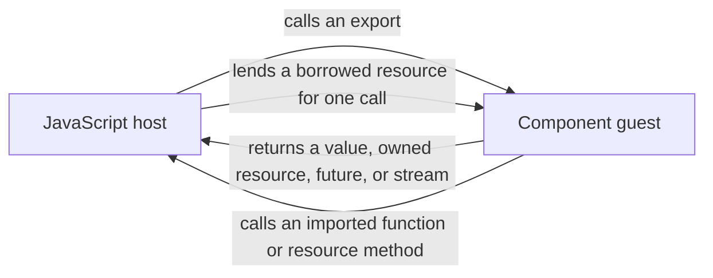

# Component-host communication patterns

> - **Status:** Architecture reference
> - **Last reviewed:** 2026-08-12
> - **Applies to:** WIT calls, host binding, resources, observation, and async
>   results
> - **Does not authorize:** A new callback interface, component world, or
>   browser-global event bridge
> - **Related:** [Component capability loading](component-capability-loading-contract.md)
>   and [JCO-generated artifacts](../tooling/jco-generated-artifact-baseline.md)

## Purpose

Use this document to choose the smallest typed communication shape that fits a
capability.

Three rules guide that choice:

1. Start with direction: who calls whom?
2. Define lifetime and ownership independently of the call shape.
3. Prefer a direct result or invocation-scoped capability over shared
   notification infrastructure.

At the WIT boundary there is no first-class JavaScript-style callback value.
Callback behavior is represented through directional building blocks:

- an imported host function;
- a method on an imported host resource;
- a returned resource;
- a future; or
- a stream.

## Mental model



Keep two facts separate:

1. Every WIT function or resource method has one provider and one caller.
2. A two-way relationship is composed from those directional operations.

WIT does not introduce one magical two-way callback object.

Use the following numbered catalog from direct, call-scoped forms toward
retained, asynchronous, and composed forms. These are alternatives that can be
combined, not mandatory implementation steps.

| Pattern | Requirement                        | Preferred representation                         | Lifetime                         |
| ------: | ---------------------------------- | ------------------------------------------------ | -------------------------------- |
|       1 | Return a terminal result           | Direct exported return                           | One invocation                   |
|       2 | Observe host-side operation phases | JavaScript capability wrapper                    | One invocation                   |
|       3 | Call a stateless host service      | Imported function                                | Host binding                     |
|       4 | Call one particular host object    | `borrow<host-resource>` parameter                | One invocation                   |
|       5 | Retain state across calls          | Owned/session resource                           | Resource lifetime                |
|       6 | Produce one deferred result        | `future<T>`                                      | Until settlement or cancellation |
|       7 | Produce incremental results        | `stream<T>`                                      | Until completion or cancellation |
|       8 | Maintain a two-way protocol        | Composed imports, exports, resources, or streams | Protocol lifetime                |

## 1. Return data directly

- **Use when:** The caller needs the operation's terminal result.
- **Interaction:** The host calls a guest export; its result flows back to the
  host.
- **Lifetime:** One invocation.
- **Repository status:** Preferred default.

A direct typed return keeps ordering, failure, and ownership aligned with the
call. Do not duplicate the same information through a serialized notification
channel.

## 2. Observe an operation in JavaScript

- **Use when:** JavaScript must observe the authored operation around the WIT
  call.
- **Interaction:** A JavaScript wrapper invokes the observer around the
  authored operation.
- **Lifetime:** One authored invocation.
- **Repository status:** Current.

`ComponentGpuAnalysisObserver` reports this lifecycle:

1. `started` before the prepared authored operation;
2. `returned` after the capability completes; or
3. `threw` after a caught operation error.

A guest-called observer cannot reliably observe its own export return, a later
trap, result lifting failure, or host adaptation failure. Those phases belong
to the authored JavaScript wrapper.

`ComponentGpuSummaryResolver` is likewise host-only and invocation-local.

| Variant | Resolver timing                  | Notes                                     |
| ------- | -------------------------------- | ----------------------------------------- |
| Stable  | After the synchronous WIT result | Resolves the invocation-local summary     |
| Frame   | After scheduler submission       | Retained temporarily by a pending summary |
| Async   | None                             | Rust decodes and returns the summary      |

These wrappers observe one authored invocation; they do not create a WIT
callback contract.

## 3. Import a stateless host service

- **Use when:** The guest needs a narrow service without object identity or
  retained state.
- **Interaction:** The guest calls an imported host function.
- **Lifetime:** The configured host binding.
- **Repository status:** Current.

| Interface  | Purpose                             | Runtime host call? |
| ---------- | ----------------------------------- | ------------------ |
| `host-log` | Guest-to-host logging               | Yes                |
| `host-gpu` | Shared WIT request and result types | No                 |

`host-gpu` currently supplies types only. The callable WebGPU resource methods
come from `wasi:webgpu`.

## 4. Borrow a host resource for one synchronous call

- **Use when:** The guest must call a particular host-owned object without
  taking ownership.
- **Interaction:** The host lends the handle; the guest invokes its methods.
- **Lifetime:** The enclosing synchronous call.
- **Repository status:** Current for frame WebGPU resources; illustrative for
  an observer.

The frame path demonstrates the borrow lifecycle:

1. JavaScript registers the browser-owned encoder, device, texture, and buffer.
2. JCO creates temporary WIT borrows for those registered objects.
3. Rust receives references valid only during synchronous `encode()`.
4. JavaScript releases the temporary WIT identities after the call.

Ending the WIT borrow does not destroy the backing browser object.

The same mechanism could provide a per-call observer without `window`:

```wit
interface invocation-observer {
  variant notification {
    progress(u32),
    checkpoint(string),
  }

  resource observer {
    emit: func(value: notification);
  }
}

interface work {
  use invocation-observer.{observer};

  record work-result {
    completed: bool,
  }

  run: func(observer: borrow<observer>) -> work-result;
}

world operation-with-observer {
  import invocation-observer;
  export work;
}
```

The illustration has four important properties:

1. The host can pass a different observer object to every call.
2. The guest can invoke it synchronously during `run()`.
3. The guest cannot retain the borrow after `run()` returns.
4. The current frame WIT `encode()` has no observer.

> **Constraint:** Borrowing restricts ownership and lifetime, not which methods
> exist. A borrowed interface must expose only the operations the guest is
> allowed to call.

## 5. Use owned resources for retained state

- **Use when:** A capability must survive the call that creates or transfers
  it.
- **Interaction:** Caller and provider are determined independently for every
  resource method.
- **Lifetime:** Until explicit drop or another contract-defined end.
- **Repository status:** Available design; not introduced by this document.

An owned or session resource requires explicit rules for:

1. handle transfer;
2. permitted retention;
3. deterministic drop; and
4. cleanup after partial failure.

For a persistent two-way relationship, the host can transfer an owned handle
to a host-implemented observer while the guest returns a guest-implemented
session resource:

| Resource | Implemented by | Methods invoked by | Role                        |
| -------- | -------------- | ------------------ | --------------------------- |
| Observer | Host           | Guest              | Guest-to-host notifications |
| Session  | Guest          | Host               | Host-to-guest commands      |

The composition works in three steps:

1. The host supplies the observer capability.
2. The guest returns the session capability.
3. The two directional handles form one bidirectional session.

Implementation ownership and current handle ownership are different concepts.
Handle ownership follows the transfers defined by the concrete contract.

## 6. Return one asynchronous result with a future

- **Use when:** The guest produces exactly one deferred result.
- **Interaction:** The guest produces one value; the host consumes it.
- **Lifetime:** Until settlement or cancellation.
- **Repository status:** Isolated Preview 3 and JSPI proof at
  `@millipede/inspector-component/boundary-proofs/wasi-async`.

`future<T>` represents one eventual value. Its concrete contract must define
settlement, failure, cancellation, and disposal of a value that arrives after
the consumer no longer accepts it.

## 7. Return incremental results with a stream

- **Use when:** The guest produces zero or more typed values over time.
- **Interaction:** One side produces values; the other consumes them.
- **Lifetime:** Until completion, failure, or cancellation.
- **Repository status:** Isolated Preview 3 and JSPI proof at
  `@millipede/inspector-component/boundary-proofs/wasi-async`.

`stream<T>` supplies protocol-defined completion, cancellation, and
backpressure. Generated JavaScript exposes an async-iteration shape rather
than a separate application-specific cancellation API.

Choose the longer-lived shape deliberately:

1. Prefer a stream for asynchronous progress or a sequence of notifications.
2. Use an owned resource when retained identity and callable methods are part
   of the contract.
3. Never retain a borrowed resource beyond its enclosing call.

## 8. Compose a bidirectional protocol

- **Use when:** Both sides must initiate operations or produce values.
- **Interaction:** Multiple explicit directional operations are composed.
- **Lifetime:** Defined by the composed protocol.
- **Repository status:** Design pattern; not one special WIT primitive.

### Synchronous reverse call

A synchronous exchange can nest calls in this order:

1. The host calls a guest export.
2. The guest calls an imported host function or borrowed host resource.
3. The host operation returns to the guest.
4. The guest export returns its typed result to the host.

### Asynchronous duplex streams

```wit
connect: func(commands: stream<command>) -> stream<event>;
```

| Stream     | Producer | Consumer |
| ---------- | -------- | -------- |
| `commands` | Host     | Guest    |
| `event`    | Guest    | Host     |

The connection is bidirectional, while each stream remains directional.

### Reverse call versus re-entrancy

| Situation                                                             | Meaning             |
| --------------------------------------------------------------------- | ------------------- |
| Guest calls a host import                                             | Nested reverse call |
| Host calls the same guest instance before the original export returns | Re-entrancy         |

Re-entrancy requires an explicit, tested contract covering both runtime
support and guest-state safety.

## Binding scope and encapsulation

Treat shape and binding as separate decisions:

1. WIT describes the communication shape.
2. JCO binding determines which host implementation supplies an import.

Current generated output statically imports ESM host modules selected by
transpilation mappings. This fits shared logging and WebGPU registries, but is
not a per-component callback factory.

JCO can instead expose explicit instantiation with a supplied imports object
when transpilation selects `--instantiation async` or `--instantiation sync`:

```ts
const component = await instantiate(loadCoreModule, {
  "example:package/invocation-observer": {
    Observer: HostObserverForThisInstance,
  },
});
```

Use this when component instances need different host implementations or
isolated guest-global state. It is unnecessary for passing a different
resource object to each call and is not an unload mechanism.

From narrowest to broadest scope:

| Mechanism                      | Scope              | Selected per              | Main caveat                |
| ------------------------------ | ------------------ | ------------------------- | -------------------------- |
| `borrow<resource>` argument    | Invocation         | Object passed to the call | Cannot outlive the call    |
| Explicit instantiation imports | Component instance | `instantiate()` call      | Not an unload mechanism    |
| Static ESM import mapping      | Generated module   | Transpilation mapping     | Shared implementation      |
| Module-local subscriber        | JavaScript module  | Module state              | Shared mutable state       |
| `window` event                 | Browser realm      | Event name                | Ambient and stringly typed |

Shared-state cautions:

1. A module-local subscriber avoids `window` but is not capability-scoped.
2. A browser-global bridge loses component and invocation ownership behind
   string event names and serialized payloads.

Reserve DOM events for deliberate page-wide APIs, never typed operation
results.

## Lifetime and teardown

Communication shape alone does not define teardown. Evaluate every concrete
capability variant against its own characteristics:

1. direction and caller/provider roles;
2. borrowed or owned handle semantics;
3. invocation, resource, instance, module, and native-object lifetimes;
4. binding scope;
5. synchronous or asynchronous execution;
6. retention beyond the initiating call;
7. completion, cancellation, drop, and failure signals; and
8. effects on backing native resources.

The concrete contract and its tests must answer:

1. Which lifetime or lifetimes are ending?
2. Who owns each capability at that point?
3. Who initiates and who observes the end?
4. How is the end expressed for this variant?
5. What happens to in-flight work?
6. What happens to late calls, results, or notifications?
7. How are partial failure, repeated teardown, and ordering handled?

Do not copy teardown assumptions between variants merely because they share a
WIT type or a general communication pattern.

## Safety rules

1. Contain failures from best-effort imported callbacks unless failure is part
   of the operation contract.
2. Define ordering, call count, and re-entrancy.
3. Never retain a borrowed handle beyond the enclosing call.
4. Give owned resources explicit transfer, drop, and failure-cleanup rules.
5. Give futures and streams explicit completion and cancellation behavior.
6. Never make product correctness depend on browser-global event delivery.

## JCO examples and further variants

JCO's documentation, examples, and conformance components cover more variants
than this repository currently uses:

### Resources

- host-implemented imported resources;
- guest-implemented exported resources;
- owned and borrowed handles;
- constructors, static methods, and deterministic disposal; and
- handles transferred through synchronous or asynchronous results.

### Async and concurrency

- futures and streams containing records, variants, resources, futures, or
  streams;
- stream parameters and results composed into two-way async protocols; and
- concurrent completion, cancellation, and task ordering.

### Binding

- explicit synchronous or asynchronous instantiation; and
- caller-supplied import implementations.

Some combinations remain deliberately unsupported. Treat the generated
declarations for the selected JCO version as authoritative: examples show
available designs but do not make every design appropriate for this library.

- [Instantiation-mode transpilation](https://github.com/bytecodealliance/jco/blob/main/docs/src/transpiling.md)
- [Imported resource example](https://github.com/bytecodealliance/jco/tree/main/examples/components/ts-resource-import)
- [Exported resource example](https://github.com/bytecodealliance/jco/tree/main/examples/components/ts-resource-export)
- [Async stream example](https://github.com/bytecodealliance/jco/tree/main/examples/transpile/p3-stream-chat)
- [WIT resource ownership](https://github.com/bytecodealliance/jco/blob/main/docs/src/wit-type-representations.md)
- [Future, stream, resource, and concurrency fixtures](https://github.com/bytecodealliance/jco/blob/main/crates/test-components/wit/all.wit)
