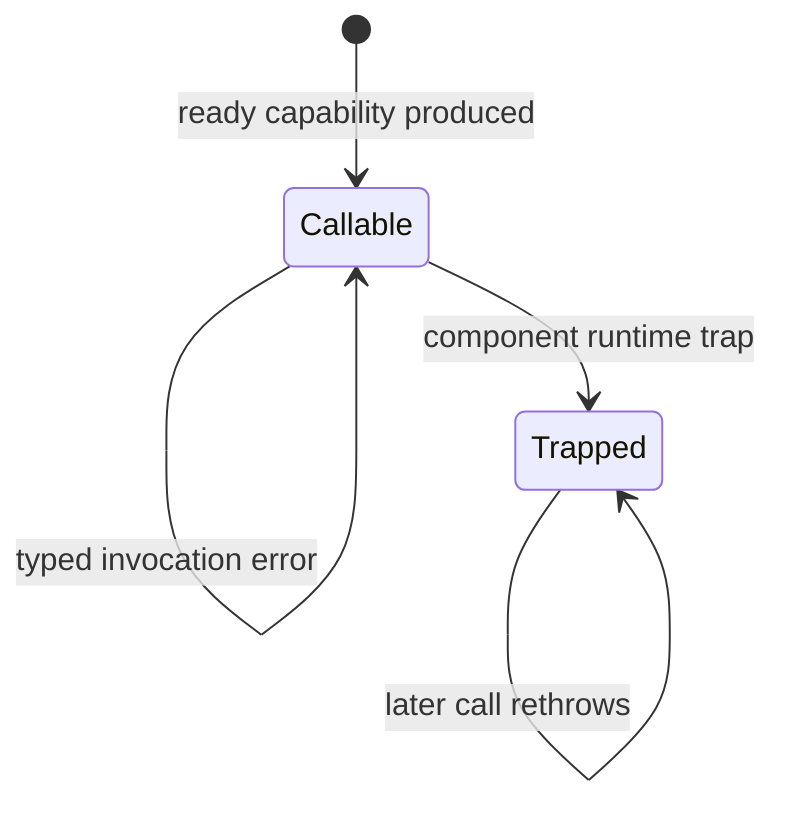

# Component instance failure and recovery

> - **Status:** Follow-up architecture investigation
> - **Last reviewed:** 2026-08-17
> - **Applies to:** Failures after a component capability has prepared
> - **Current implementation:** Recoverable preflight errors leave the prepared
>   instance callable; an unexpected component trap is terminal for that
>   instance, and the current loader cannot replace it
> - **Does not authorize:** Automatic invocation retry, a JCO instantiation-mode
>   migration, Worker deployment, cache-busting imports, or new fallback policy
> - **Related:**
>   [Component capability loading contract](component-capability-loading-contract.md#minimal-lifecycle),
>   [component-host communication patterns](component-host-communication-patterns.md#binding-scope-and-encapsulation),
>   [JCO-generated artifact baseline](../tooling/jco-generated-artifact-baseline.md),
>   and
>   [browser-lifetime resource strategy](../testing/browser-lifetime/resource-reuse-and-submission-strategy.md)

## Purpose

The capability loader currently answers one preparation question: did the
selected component become ready, unsupported, or failed? Once preparation
returns `ready`, invocation failures introduce a separate question: is that
prepared component instance still callable?

This document records that post-ready problem, the choice of preflight-failure
policy, and the possible long-term recovery boundaries. It records the current
tagged-outcome implementation without treating that design as mechanically
required by a JCO upgrade. It deliberately makes no choice among the long-term
instance-replacement options. In particular, it does not change the current
loader state machine, generated provider mode, GPU scheduling, or Millipede
fallback behavior.

## Choosing the preflight failure policy

The JCO 1.29 upgrade exposed two separate decisions that must not be
conflated:

1. How should a destructive test contain an intentionally trapped component
   instance?
2. Should malformed preflight input be a recoverable component API outcome or
   a fatal invariant violation?

The upgrade mechanically changed the consequence of a trap in both tests and
production, but it did not answer the second policy question. The immediate
suite failure came from the existing generated-boundary validation test, which
called the private generated worlds with a deliberately zero-byte truth
buffer. The old Rust path panicked, and the test expected a
`WebAssembly.RuntimeError`. Once JCO began disabling a component instance after
such a trap, that successful negative test could poison the module instance
shared with later positive tests.

That fixture is not representative of Millipede's normal authored call path.
Millipede's ground-truth writer allocates enough storage for its encoded node
count, and the authored component adapter derives declared dimensions from the
same texture passed to the component. This evidence leans toward an invariant
violation, but it does not alone decide the public component contract.

The policy question is therefore explicit:

> Are malformed requests supported, recoverable inputs, or impossible
> integration-contract violations?

The available strategies have different boundaries and costs:

| Strategy                              | Boundary and behavior                                                                                       | Benefit                                                                                               | Cost or prerequisite                                                                                                  |
| ------------------------------------- | ----------------------------------------------------------------------------------------------------------- | ----------------------------------------------------------------------------------------------------- | --------------------------------------------------------------------------------------------------------------------- |
| Isolate the deliberate trap test      | Keep success-only WIT and Rust panics; run the destructive generated-boundary proof in a fresh test process | Smallest focused JCO upgrade and an honest proof of terminal trap behavior                            | A real invalid production call still disables that generated world until an external reset boundary                   |
| Validate in authored TypeScript       | Reject malformed input before entering the generated component                                              | Preserves success-only WIT and protects every supported package consumer                              | Duplicates Rust/layout rules and does not protect direct generated-binding callers                                    |
| Return a top-level WIT `result<T, E>` | Rust returns idiomatic `Result`; JCO exposes the bare success value and throws or rejects the error         | Avoids a positive-path outcome wrapper and composes naturally in Rust                                 | Sync and async thrown values differ, and the large async JSPI result path requires a dedicated Node and browser proof |
| Return an explicit tagged WIT outcome | Every world returns `success` or `validation-error`; authored TypeScript unwraps the success case           | Gives stable, async, and frame the same explicit shape and keeps direct generated callers recoverable | Changes every raw success return and requires the broadest WIT, Rust, adapter, and test update                        |
| Replace trapped instances privately   | Keep true traps terminal, but retire and instantiate a new provider instance for later work                 | Provides real in-page recovery from unexpected traps                                                  | Requires a new provider factory/health architecture and is not a dependency-only change                               |

The selection rule is:

1. Choose an isolated trap proof when malformed input is formally an invariant
   violation and losing that generated world is the intended response.
2. Choose authored TypeScript validation when only supported package consumers
   need protection and duplicated preflight rules are acceptable.
3. Choose a WIT error channel when Rust must remain the authoritative boundary
   and direct generated callers must recover on the same instance. Prefer a
   top-level `result` only after its async JSPI shape passes the required proof;
   otherwise use an explicit outcome when one uniform cross-world shape is more
   important than keeping raw success returns unchanged.
4. Choose private re-instantiation only when recovery from genuine runtime
   traps is a product requirement, not as a workaround for a negative test.

The current implementation deliberately selects the explicit tagged outcome.
Its guarantee is stronger than Millipede currently requires: any rejected
preflight request, including one made directly through generated bindings,
leaves the same component instance callable for a later valid request. This is
a policy choice, not a claim that JCO 1.29 required the broader ABI change.
Unexpected runtime traps remain terminal and are handled by the separate
retirement and replacement discussion below.

Every strategy remains subordinate to the preserved loader contract below.
Selecting a different preflight policy must not add invocation states, retry,
recovery, or disposal to `ComponentCapabilityState`.

## Preserved loader contract

This follow-up is subordinate to the existing
[minimal lifecycle](component-capability-loading-contract.md#minimal-lifecycle)
and
[behavioral guarantees](component-capability-loading-contract.md#behavioral-guarantees).
It does not reopen those decisions:

1. `ComponentCapabilityState` remains exactly `idle | preparing | ready |
unsupported | failed`.
2. Only preparation requests and outcomes are loader transition triggers.
   Stable analysis, async analysis, and shared-frame encoding never re-enter or
   mutate loader state.
3. Invocation-local success or failure remains an operation outcome, not a
   recoverable, retrying, trapped, or disposed loader state.
4. The public loader continues to expose only read-only `state` and one-shot
   `prepare()`; it gains no `retry()`, `recover()`, or `dispose()` operation.
5. Selection, device generations, invocation cleanup, output ownership, and
   device-local adapter retirement remain with Millipede and their actual
   resource owners.

Any future instance-health or replacement mechanism described below must be a
separate private provider/instance concern or a Millipede-owned runtime concern.
It must not silently extend the public preparation state machine.

## Failure classes

A returned error and a component trap are different architectural events.

| Event                                              | Boundary representation                                                          | Instance after the call           | Current consequence                                                |
| -------------------------------------------------- | -------------------------------------------------------------------------------- | --------------------------------- | ------------------------------------------------------------------ |
| Unsupported platform                               | Typed preparation result                                                         | No instance is exposed            | Loader settles as `unsupported`                                    |
| Preparation failure                                | Typed preparation result                                                         | No callable capability is exposed | Loader settles as `failed`                                         |
| Caller-correctable preflight failure               | WIT `validation-error` outcome, adapted to `ComponentGpuAnalysisValidationError` | Callable                          | Only that invocation fails                                         |
| Unexpected component trap                          | `WebAssembly.RuntimeError` escaping component execution                          | Terminally trapped                | Later calls through that generated instance rethrow                |
| Device loss, validation, readback, or host failure | Depends on where and how it occurs                                               | Must be classified explicitly     | Must not be assumed recoverable or terminal from its message alone |

The current preflight categories—invalid request metadata, texture mismatch,
and an undersized truth buffer—return normally before GPU planning, allocation,
recording, or submission. Their authored JavaScript error is an invocation API
choice; it is not a WebAssembly trap. The same prepared instance may therefore
serve a later valid request.

An unexpected Rust panic, Wasm `unreachable`, invalid canonical resource use,
or other runtime trap is different. The current JCO provider records the first
`WebAssembly.RuntimeError`, rejects re-entry, and rethrows the recorded error
from later exports. Repeating `prepare()` does not help because the module-wide
loader returns the same settled capability.

This diagram is a conceptual private instance-health axis only. `Callable` and
`Trapped` are not public loader states, and there is intentionally no transition
from `Trapped` back into loader preparation. Today the public loader retains its
settled `ready` preparation result after a post-ready trap; callers must not
reinterpret that observation as a dynamic instance-health signal. No separate
instance-health owner or replacement factory is implemented. Navigation or an
intentionally new deployed module URL creates a different module and loader
outside this diagram.

## Retirement is not one cleanup operation

Several lifetimes meet at a failed invocation and must not be collapsed into a
generic `dispose()`:

| Lifetime                         | Required response to failure                                                            |
| -------------------------------- | --------------------------------------------------------------------------------------- |
| Invocation-local WIT projections | Release every temporary identity through the existing `finally` paths                   |
| Borrowed caller resources        | Never destroy the caller's device, texture, truth buffer, or frame encoder              |
| Component-created GPU outputs    | Destroy or transfer them according to the point at which ownership changed              |
| Shared-frame encoder             | Abandon the whole frame after any throwing encode path; never retry on the same encoder |
| Logical WIT session resource     | Drop it through its eventual explicit resource contract                                 |
| Trapped component instance       | Stop scheduling new calls through that instance                                         |
| Evaluated ESM module             | Remains cached for its module URL under the current provider model                      |
| Native WebGPU objects            | Reclaim through their actual browser ownership APIs, not through component retirement   |

Releasing a WIT resource handle does not unload a component instance. Dropping
a JavaScript reference does not evict an evaluated ESM module. Neither action
is equivalent to `GPUBuffer.destroy()` or GPU-device retirement.

A trap may occur after host-visible effects or GPU command recording. Recovery
must therefore start with a new request and, for shared-frame execution, a new
frame and encoder. Automatically replaying the failed invocation would risk
duplicating submissions, leaking transferred outputs, or appending to an
encoder whose state is no longer known.

## Current safe boundary

The current provider uses default static ESM integration. Each selected public
subpath owns one module-wide loader, and each generated module owns one
instantiated component world. There is no supported instance unload, reset, or
same-URL retry operation.

Until another architecture is selected, a terminal trap has this safe policy:

1. Abandon the active invocation according to its GPU ownership rules.
2. Do not issue another call through the trapped capability.
3. Surface the terminal failure to the owning runtime or application.
4. Use a page navigation or an intentionally new deployed module URL when a
   genuinely fresh instance is required.

Steps 2 and 3 describe the required retirement policy, not current completed
implementation. The existing loader does not detect post-ready traps or publish
instance health because those concerns are outside its preparation contract.
These steps do not authorize a new loader transition: retirement belongs to a
future private instance owner or the Millipede runtime that owns the selected
device-local adapter.

## Long-term options

### 1. Quarantine the instance and use the existing reset boundary

The smallest safety improvement would let a private invocation/instance owner
detect a terminal trap, atomically retire that capability, and let the owning
Millipede runtime reject future scheduling without repeatedly entering the
provider. The public loader would remain settled and unchanged. Recovery would
remain navigation or an intentionally versioned deployment URL.

This option does not replace the instance, but it prevents repeated calls into
known-terminal state. Product fallback requires a separate decision: compare
modes must not silently accept their oracle, and shared-frame recovery must
begin on a fresh frame.

### 2. Explicit component instantiation

JCO can generate an explicit `instantiate()` API with synchronous or
asynchronous instantiation mode. A private provider could then own a factory,
retire a trapped instance, and create a new instance for a later request.

That factory and its instance-health bookkeeping would remain behind the
prepared capability boundary. It must not add public loader retry/recovery
states or make ordinary invocations re-enter `prepare()`.

This is the most direct route to in-page replacement, but it changes the
provider architecture rather than merely adding `dispose()`:

- host imports must be supplied to each instance without duplicating the
  authoritative WebGPU registry;
- stable, JSPI async, shared-frame, and boundary-proof generation must retain
  their exact mappings and async exports;
- selected-world loading must remain isolated;
- a replacement must not retry the failed invocation automatically; and
- releasing the old JavaScript wrapper still does not prove deterministic
  Wasm memory or native resource reclamation.

A prototype should begin with the isolated boundary-proof world before any GPU
provider migration.

### 3. Worker or separate-realm isolation

Terminating a dedicated Worker or realm provides a strong JavaScript module and
Wasm-instance reset boundary. It can also contain failures that would otherwise
leave cached main-realm modules terminal.

This is not automatically compatible with the current GPU design. The host
services and relevant WebGPU objects would need to live in, or be legally
transferred to, that realm. In particular, the browser scheduler's borrowed
shared-frame encoder cannot simply be moved behind a Worker boundary. Worker
isolation is therefore a possible future execution topology, not a generic
instance-drop mechanism for today's three GPU variants.

### 4. Native Component Model provider

A future browser-native Component Model runtime may expose explicit instance
construction and lifecycle control. The authored capability boundary should be
able to adopt such a provider without changing Millipede's selected capability
API, but it must still preserve the same error classification, resource
ownership, selected-world isolation, and no-same-invocation-retry rules.

## Comparison

| Option                                                 | In-page replacement | Deterministic realm reset     | Main cost                                            |
| ------------------------------------------------------ | ------------------- | ----------------------------- | ---------------------------------------------------- |
| Quarantine and require navigation/versioned deployment | No                  | Navigation only               | Coarse recovery and product-level fallback decision  |
| Explicit JCO instantiation                             | Yes                 | No                            | Provider, import, JSPI, and host-identity refactor   |
| Worker or separate realm                               | Yes                 | Yes when the realm terminates | GPU placement, transfer, and scheduler compatibility |
| Future native provider                                 | Provider-dependent  | Provider-dependent            | Availability and a new parity audit                  |

## Investigation order

1. Audit every failure site and classify it as caller-correctable,
   device-generation-scoped, output/readback-scoped, or terminal invariant
   failure.
2. Add an isolated deliberate-trap proof that demonstrates terminal re-entry
   behavior without poisoning the production GPU-world tests.
3. Define a private provider/instance-health signal, explicitly outside
   `ComponentCapabilityState`, and prove that only one terminal retirement is
   published.
4. Define cleanup and product fallback for stable, async, and shared-frame
   independently; never infer one policy from another variant.
5. Prototype explicit instantiation on the boundary-proof world and verify
   fresh-instance recovery, host-module identity, JSPI behavior, and package
   layout.
6. Compare that prototype with navigation and Worker/realm boundaries before
   authorizing a production provider change.

## Acceptance requirements for any replacement design

Any implemented recovery design must prove all of the following:

1. Typed preflight failure followed by valid work succeeds on the same instance.
2. A deliberate runtime trap makes the affected instance terminal.
3. No later request is scheduled through a known-trapped instance.
4. A replacement instance, when supported, is created only for a later clean
   request and not as automatic replay of the failed call.
5. Shared-frame failure abandons the old encoder and resumes only on a fresh
   frame and encoder.
6. Temporary projections and component-owned outputs are cleaned without
   destroying caller-owned resources.
7. Every replacement uses the one authoritative host WebGPU registry and does
   not split native resource identity across module copies.
8. Preparing or replacing one variant does not import another variant's
   JavaScript or Wasm payload.
9. Stable, JSPI async, frame, and boundary-proof behavior retain their existing
   ownership and async contracts.

## Upstream context

The behavior that exposed this design gap arrived through
[`@bytecodealliance/jco` 1.29.0](https://github.com/bytecodealliance/jco/releases/tag/jco-v1.29.0),
which selected
[`jco-transpile` 0.8.0](https://github.com/bytecodealliance/jco/releases/tag/jco-transpile-v0.8.0)
and `js-component-bindgen` 2.4.0. That bindgen release added detection and
disablement after a component trap. JCO's
[trap documentation](https://github.com/bytecodealliance/jco/blob/jco-transpile-v0.8.0/docs/src/advanced/detecting-traps.md)
describes the resulting terminal instance behavior.

The version is provenance, not the architecture contract. The durable provider
fact is that a real component trap is terminal for the affected instance. This
implementation separately chooses to classify the named preflight failures as
normal returned outcomes; that classification is the policy decision recorded
above, not behavior imposed by the JCO version.
