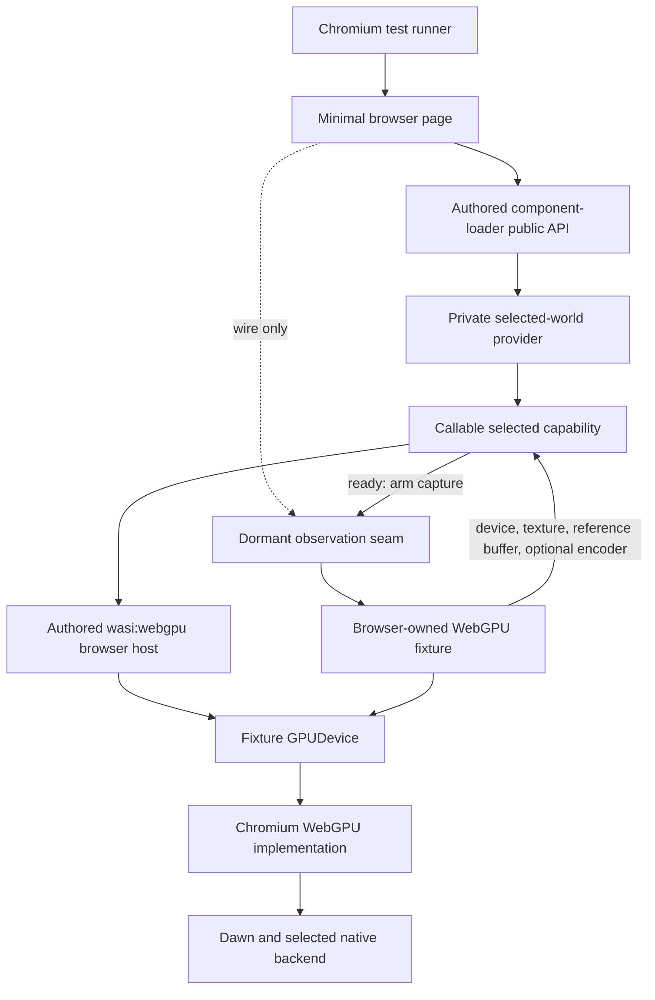
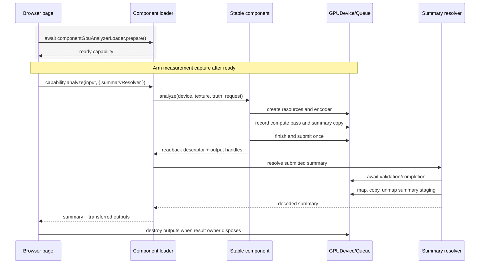
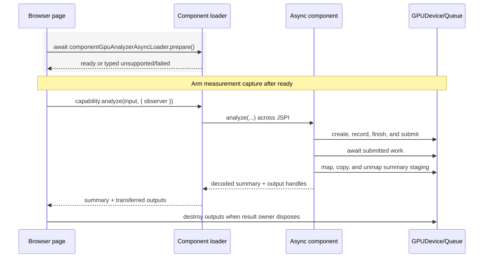

# Browser-lifetime architecture and code reuse

> - **Status:** Planned architecture
> - **Last reviewed:** 2026-08-11
> - **Depends on:** Existing authored loader and generated component worlds
> - **Does not authorize:** A public lifetime resource, new backend, or copied
>   WebGPU host
> - **Parent:** [Real-browser WebGPU lifetime testing](README.md)
> - **Policy:**
>   [Assertion and measurement policy](assertion-and-measurement-policy.md)
> - **Delivery sequence:** [Scenario evolution](scenario-evolution.md)
> - **Capability contract:**
>   [Component capability loading contract](../../architecture/component-capability-loading-contract.md)

## Purpose

This document defines the runtime boundary exercised by the real-browser
lifetime harness. It describes the smallest valid browser-owned fixture, the
production code that must be reused, the lifecycle differences that remain
variant-specific, and the abstractions that must not be invented before they
are needed.

The architecture exists to prevent two opposite failures:

1. A harness so synthetic that it bypasses the prepared component capability
   or authored WebGPU host whose lifetime behavior must be proven.
2. A second implementation of the analyser, scheduler, or resource registry
   that can drift away from production while continuing to pass its own tests.

## Architectural decisions

| Decision                                             | Consequence                                                                                                                       |
| ---------------------------------------------------- | --------------------------------------------------------------------------------------------------------------------------------- |
| The harness lives in this repository                 | H1 implementation and evidence can be reviewed with the component and browser host without changing Millipede production packages |
| The page imports one built runtime subpath           | It exercises the selected authored capability, provider, import mappings, and host modules that consumers receive                 |
| Raw WebGPU inputs are browser-owned                  | The harness controls input lifetime without copying Millipede capture, state, or rendering systems                                |
| Internal workload resources remain component-created | The harness does not reproduce Rust buffer, shader, pipeline, bind-group, or command construction                                 |
| One minimal fixture is shared by all GPU variants    | Stable, async, and frame results cannot diverge because their texture or reference input differs                                  |
| Each variant keeps an explicit lifecycle sequence    | Encoder, submission, summary, and abort ownership remain reviewable                                                               |
| A callable capability gates every measured run       | Component-provider preparation remains an opaque, untimed prerequisite                                                            |
| The current provider remains private                 | Its implementation cannot define harness metrics, events, or permanent abstractions                                               |
| Structural counts begin as observations              | The current mixed workload does not become the permanent lifetime contract                                                        |
| Millipede is a later black-box acceptance target     | The isolated proof remains attributable and reproducible                                                                          |
| Native `wgpu` is a separate future evidence path     | Browser Component Model evidence is not confused with native backend portability                                                  |

## Runtime layers under test



Every solid execution edge in this graph uses the real selected runtime path.
The harness must not replace `component-loader`, the selected component, or the
authored WebGPU host with a test double in the real-browser profile. The
selected private provider remains part of the exercised build, but its internal
topology and preparation work are provenance rather than measurement authority.

Observer code may be wired before component preparation so it can later see the
real objects. It must remain dormant until the selected component is callable:
no measurement capture, events, counters, clock reads, or run identifiers are
permitted before the `ready` boundary.

## Keep boundary proofs and WebGPU entrypoints separate

The package exports several independent component worlds. They are not one
generic “component call,” and their prerequisites must not bleed into each
other.

| World                        | Package subpath               | Loader                            | Ready-capability operation                               | WebGPU | JSPI | Browser-lifetime role                 |
| ---------------------------- | ----------------------------- | --------------------------------- | -------------------------------------------------------- | -----: | ---: | ------------------------------------- |
| `gpu-analysis`               | `/gpu-analysis`               | `componentGpuAnalyzerLoader`      | `analyze(input, { summaryResolver, observer? })`         |    Yes |   No | Initial stable lifetime path          |
| `gpu-analysis-frame`         | `/gpu-analysis-frame`         | `componentGpuFrameAnalyzerLoader` | `encode(input, encoder, { summaryResolver, observer? })` |    Yes |   No | Scheduler-owned encoder path          |
| `gpu-analysis-async`         | `/gpu-analysis-async`         | `componentGpuAnalyzerAsyncLoader` | `analyze(input, { observer? })`                          |    Yes |  Yes | Conditional asynchronous path         |
| `boundary-proofs/wasi-async` | `/boundary-proofs/wasi-async` | `wasiAsyncProofsComponentLoader`  | Explicit proof operation                                 |     No |  Yes | Outside GPU-lifetime scope            |

The isolated WASI async proof can confirm a JSPI projection but cannot
establish GPU ownership or destruction. The `/boundary-proofs/wasi-async`
split isolates those WASI proofs; it does not separate GPU-to-CPU summary
readback from the stable, async, or frame analyzer capabilities. Millipede
reaches this proof only through the explicit
`@millipede/surface-inspector-browser/boundary-proofs` entry; ordinary backend
selection does not import it.

## Package and module identity

The page must consume the built selected runtime subpath. The initial stable
scenario imports only:

```ts
import { componentGpuAnalyzerLoader } from "@millipede/inspector-component/gpu-analysis";
```

Async and frame scenarios import their corresponding subpaths in isolated page
or bundle entries. The package root is type-only and is not a runtime facade.
The harness must not import `component-loader/src/*.ts` directly. Mixing an
authored source import with a private provider that imports the built host can
instantiate two independent JavaScript module graphs and resource registries.
A handle registered in one graph would then be invisible in the other,
producing a harness-created false failure.

The implementation therefore must:

1. build and serve the package payload used by consumers;
2. import one public variant subpath rather than private provider modules;
3. resolve each built host module through one canonical browser URL;
4. avoid bundling a private second copy of the host;
5. keep each generated-world import inside its matching private adapter;
6. use a fresh page or browser context when a scenario requires fresh memoized
   component state, instead of adding a production reset API.

Loader single-flight state per selected module is real package behavior and
remains visible to the harness. The module-wide loader is one-shot and exposes
only `state` and `prepare()`. Every call receives the same active or settled
Promise; `unsupported` and `failed` remain settled for that module. A scenario
that needs a new loader attempt reloads the page or uses an intentionally new,
versioned module URL.

A scenario that needs a new GPU-device generation may create and retire that
generation in the same page without resetting the component loader. Millipede
and the harness still dispose device-local sessions, pending summaries,
transferred outputs, and browser-owned resources through their real ownership
contracts. Those resource lifetimes are independent of the non-disposable
component-loader module.

These module-layout facts describe the current provider baseline. The durable
rule is that the page reaches one selected callable capability and one browser
host/registry identity through the public package. The harness does not measure
or assert the provider's internal modules, requests, compilation, or cache
topology.

Future C1/V1 acceptance proves selected loading against the final deployed
consumer by recording Chromium's actual requests: the selected variant must be
requested, unselected and boundary-proof worlds must remain absent, and execution
after `ready` must trigger no further component loading. This browser evidence
is authoritative for the deployed selection boundary. That C1/V1 evidence and
the H1 harness remain pending.

## Prepared-capability gate

Each variant is prepared through its authored public loader before a measured
scenario creates its GPU fixture:

| Variant      | Preparation call                            | Ready means                                                          |
| ------------ | ------------------------------------------- | -------------------------------------------------------------------- |
| Stable       | `componentGpuAnalyzerLoader.prepare()`      | The authored stable `analyze()` capability is callable               |
| Async        | `componentGpuAnalyzerAsyncLoader.prepare()` | The authored async `analyze()` capability is callable                |
| Shared frame | `componentGpuFrameAnalyzerLoader.prepare()` | Synchronous authored `encode()` is callable before an encoder exists |

Every loader returns a typed `ready`, `unsupported`, or `failed` outcome and
retains that same result. There is no public retry or loader-disposal path. The
async loader itself checks the exact `WebAssembly.Suspending` and
`WebAssembly.promising` APIs before its private provider imports or evaluates
the generated async world. The harness must not duplicate that probe or create
a second component-loading mechanism.

The required order is:

```text
wire dormant instrumentation
    → prepare the selected variant
    → verify callable capability
    → record provider/artifact/toolchain provenance
    → arm one measurement run
    → create adapter, device, fixture inputs, and measured resources
    → execute the selected lifecycle
```

Preparing the component emits no measurement event and reads no measurement
clock. If preparation is unsupported or fails, no measurement run exists; the
harness reports a qualified preparation outcome instead.

## Existing code that must be reused

### Public component loader

The page imports the package's authored public API rather than importing the
private provider output throughout the test:

- `/gpu-analysis`, `componentGpuAnalyzerLoader`, and ready-capability
  `analyze(input, { summaryResolver, observer? })` for stable execution;
- `/gpu-analysis-async`, `componentGpuAnalyzerAsyncLoader`, and
  ready-capability `analyze(input, { observer? })` for the JSPI variant;
- `/gpu-analysis-frame`, `componentGpuFrameAnalyzerLoader`, and synchronous
  ready-capability `encode(input, encoder, { summaryResolver, observer? })` for
  shared-frame execution.

This preserves the same handle registration, result translation, and cleanup
scope used by a direct package consumer.

### Generated module adapter

Each generated world has one authored private adapter. Production adapters
remain under `component-loader/src/providers/`; the WASI proof adapter is
colocated under `component-loader/src/boundary-proofs/wasi-async/`. Browser
test files must not introduce their own scattered imports into generated
package internals.

A private H1 proof artifact may require one test-only generated entrypoint
later. That entrypoint must remain isolated, unpublished, and mapped to the
same authored browser host. It must not become a second production adapter.

### Authored WebGPU host

`component-loader/src/host/webgpu/` remains the implementation of imported
`wasi:webgpu` resources. The browser harness observes its effects through real
WebGPU objects; it does not recreate resource classes, registries, descriptor
translation, encoder ownership checks, mapping behavior, or queue behavior.

### Existing neutral fixture data

Small constants or records may be reused when they describe input facts rather
than a complete mixed-workload workflow. Current mixed-workload plans, summary
sizes, and ten-dispatch expectations remain owned by the component-boundary
suite and are not automatically lifetime contracts.

## Browser-owned fixture boundary

One common fixture owns every raw browser resource supplied to the component:

```ts
interface BrowserGpuFixture {
  readonly adapter: GPUAdapter;
  readonly device: GPUDevice;
  readonly texture: GPUTexture;
  readonly truthBuffer: GPUBuffer;
  readonly input: ComponentGpuAnalysisInput;

  createFrameEncoder(label: string): GPUCommandEncoder;
  dispose(): void;
}
```

This interface is illustrative design, not a required first-file abstraction.
The initial implementation may keep it local to `page.ts`. It should be
extracted only when a second variant or fixture makes the boundary useful.

The fixture owns:

1. Adapter selection.
2. Device creation.
3. Device-loss and uncaptured-error observation.
4. Captured-texture creation and pixel upload.
5. Reference-buffer creation and upload.
6. Common request metadata.
7. Scheduler encoders created for shared-frame scenarios.
8. Final destruction of browser-owned texture and reference-buffer resources.

The fixture does not own:

- component-created intermediate buffers;
- component-created renderer outputs before transfer;
- summary buffers before their variant-specific transfer;
- component-module loading or provider reset;
- component-owned stable or async encoders;
- pipelines or bind groups created by guest-imported device calls.

## Ownership handoff matrix

| Resource                              | Created by                      | Owner during execution                                | Owner after success                                            | Final cleanup owner                              |
| ------------------------------------- | ------------------------------- | ----------------------------------------------------- | -------------------------------------------------------------- | ------------------------------------------------ |
| Adapter                               | Browser fixture                 | Browser fixture                                       | Browser fixture                                                | No explicit destruction API                      |
| Device                                | Browser fixture                 | Browser fixture                                       | Browser fixture                                                | Browser fixture                                  |
| Captured texture                      | Browser fixture                 | Browser fixture; borrowed by component                | Browser fixture                                                | Browser fixture                                  |
| Reference buffer                      | Browser fixture                 | Browser fixture; borrowed by component                | Browser fixture                                                | Browser fixture                                  |
| Shared-frame encoder                  | Browser scheduler fixture       | Browser scheduler; temporarily projected to component | Browser scheduler                                              | Browser scheduler abandons or finishes/submits   |
| Component intermediate                | Component host on guest request | Component invocation or private session               | Not transferred                                                | Component/session policy selected after evidence |
| Visual, border, and discovery outputs | Component host on guest request | Component until validated extraction                  | Browser result                                                 | Common result cleanup                            |
| Stable summary buffers                | Component host on guest request | Invocation adapter until resolver handoff             | Call-local browser resolver                                    | Call-local stable resolver                       |
| Async summary buffers                 | Component host on guest request | Async guest/host path                                 | No native buffers returned after decode                        | Async path after map/copy/unmap                  |
| Frame summary buffers                 | Component host on guest request | Pending-summary object                                | Resolver after submitted transfer, or pending summary on abort | Resolver or pending-summary disposal             |

The current successful GPU results contain six browser buffers: a record and
indirect-argument buffer for each visual, border-trace, and discovery output.
They must be released through one shared caller-owned cleanup helper. The
harness must not infer native ownership from the continued presence or absence
of a transient Component Model wrapper.

## Smallest initial real workload

The initial fixture should be deliberately small while still executing the
real component shaders and resource path.

### Proposed texture

| Property | Initial value                                                    | Reason                                                                     |
| -------- | ---------------------------------------------------------------- | -------------------------------------------------------------------------- |
| Width    | 8 texels                                                         | Exactly one current 8-wide workgroup/tile                                  |
| Height   | 8 texels                                                         | Exactly one current 8-high workgroup/tile                                  |
| Format   | `rgba8unorm`                                                     | Core sampled float texture format without an optional feature              |
| Usage    | `TEXTURE_BINDING \| COPY_DST`                                    | Sampled by the component and populated by the fixture                      |
| Pixels   | Columns 0–3 `[0, 0, 0, 255]`; columns 4–7 `[255, 255, 255, 255]` | Small opaque non-uniform input that exercises real reads and edge evidence |

The 8×8 choice is a proposed starting fixture, not a public analyser limit or
permanent regression requirement. Partial workgroups and larger captures are
added later as separate semantic scenarios.

### Proposed reference buffer

The current GPU worlds require at least one reference record. A
one-node fixture needs 48 bytes:

| Byte range | Type  | Initial value                     |
| ---------- | ----- | --------------------------------- |
| `0..4`     | `u32` | Header `count = 1`                |
| `4..8`     | `u32` | Deterministic upload sequence `1` |
| `8..12`    | `u32` | Texture width `8`                 |
| `12..16`   | `u32` | Texture height `8`                |
| `16..20`   | `f32` | Bound `x = 0`                     |
| `20..24`   | `f32` | Bound `y = 0`                     |
| `24..28`   | `f32` | Bound `width = 8`                 |
| `28..32`   | `f32` | Bound `height = 8`                |
| `32..36`   | `u32` | Root depth `1`                    |
| `36..40`   | `u32` | Parent sentinel `0xffffffff`      |
| `40..44`   | `u32` | Flags `0`                         |
| `44..48`   | `u32` | One fixed fixture name hash       |

The buffer uses `STORAGE | COPY_DST`. The fixture writes a node covering the
small texture and sets a root-parent sentinel. This is a real valid diagnostic
input, not an oversized placeholder used only to pass host validation.

A single local helper writes these fields through `DataView` in little-endian
order. It is fixture construction, not a copy of Millipede's capture and
ground-truth systems. The helper should receive focused byte-offset coverage
and be reused unchanged by every variant.

The corresponding public input is exactly:

```ts
const input: ComponentGpuAnalysisInput = {
  entryId: "browser-lifetime/minimal-v1",
  displayName: "BrowserLifetimeMinimalV1",
  device,
  texture,
  truthBuffer,
  nodeCount: 1,
};
```

Texture dimensions are not duplicated in this input; the loader reads
`texture.width` and `texture.height`. The fixture must assert that the uploaded
header `count` equals `input.nodeCount`. Current boundary validation verifies
the buffer capacity implied by `nodeCount`, while the WGSL loop reads
`truth.header.count`; a mismatched header could otherwise execute a different
record count from the public request.

### Deterministic compute canary

For the proposed opaque 8×8 texture with four black columns, four white
columns, and one full-texture reference node, the current diagnostic summary
has a deliberately narrow expected result:

| Summary field   | Expected value | Derivation                                                                    |
| --------------- | -------------: | ----------------------------------------------------------------------------- |
| `texelCount`    |             64 | Every texel belongs to the full-texture node                                  |
| `inkCount`      |             32 | Black texels are below the current near-white threshold; white texels are not |
| `luminanceSum`  |             32 | Thirty-two white texels contribute luminance 1; black contributes 0           |
| `meanLuminance` |            0.5 | `32 / 64`                                                                     |

Before public decoding, the three raw little-endian `u32` words are
`[64, 32, 32000]`. The public decoder divides the luminance word by 1000.

This canary proves that the uploaded texture, reference record, real compute
pipeline, submission, summary copy, mapping, and decoding participated in the
call. It belongs to the versioned minimal fixture, not the general lifetime
architecture.

It does not prove edge-discovery geometry, border-trace quality, indirect
rendering, or production visual equivalence. It also does not validate the
header sequence/dimensions or the node's parent, flags, and name hash: those
fields are either metadata or consumed by different output lanes. Those facts
remain owned by focused layout/algorithm tests and later consumer acceptance.

### Why not begin with the 200×100 GPU boundary fixture

The retained component-boundary GPU workload uses a 200×100 texture and six
reference records. It brings diagnostic-summary, discovery, and
larger-workload assumptions that are not required to prove the first browser
lifetime boundary.

The browser harness may add it later as realistic full-workload acceptance.
It should not make that fixture the foundation for every lifetime experiment.

## Raw WebGPU observer self-check

After the selected capability is ready, the runner may perform a tiny
observer-only self-check before starting a measured component scenario:

```text
fixture creates one labeled raw buffer
    → observer records creation
fixture destroys that buffer
    → observer records destruction
```

This verifies instrumentation and label/identity tracking. It is not H1
component evidence because no component capability or authored WebGPU host
participates.

The self-check uses its own diagnostic phase and result. Its records are closed
before the measured run is armed, so it cannot satisfy or contaminate a
component lifecycle assertion accidentally.

## Stable lifecycle



The stable driver owns only the test-specific resolver and invocation. Common
fixture creation, validation observation, result cleanup, and result reporting
remain shared.

The resolver must clean up the two summary buffers it receives according to
the production resolver contract. The harness must not treat successful return
from the synchronous guest export as proof of completed GPU execution; the
resolver's completion and mapping boundary supplies that evidence.

The smallest resolver implementation:

1. verifies that the returned plan declares three summary words and a 12-byte
   node stride;
2. derives expected bytes from `nodeCount * plan.summaryNodeStrideBytes` and
   matches the supplied byte length;
3. awaits both `submission.commandValidation` and `submission.validation`;
4. rejects a non-null error with the matching phase name;
5. waits for submitted work where required by the production boundary;
6. maps only `summaryBuffers.summaryByteLength` from the staging buffer;
7. copies mapped bytes before unmapping;
8. decodes the three words with `DataView.getUint32(offset, true)`;
9. unmaps and destroys the summary and staging buffers in a `finally` path.

The exact same resolver function is passed to shared-frame execution. Async
does not use it; preserving the real JSPI mapping and Rust-side decode is part
of that variant's evidence.

The resolver is a call-local dependency. Stable scenarios with different
devices or resolver behavior cannot overwrite one another through module-global
state. The harness still serializes scenarios unless concurrency is the named
subject because they otherwise share observation and fixture ownership.

## Async lifecycle



The loader checks `WebAssembly.Suspending` and `WebAssembly.promising` before
the provider imports or evaluates the generated async world. Their absence is
an unsupported capability result, not a test failure, unless a specific
environment promises JSPI support.
Output ownership must be checked after the awaited call rather than
generalized from stable behavior.

## Shared-frame lifecycle

```mermaid
sequenceDiagram
  participant Page as Browser scheduler fixture
  participant Loader as Frame loader
  participant Guest as Frame component
  participant Encoder as Scheduler encoder
  participant Queue as GPUQueue

  rect rgb(245, 245, 245)
    Page->>Loader: await componentGpuFrameAnalyzerLoader.prepare()
    Loader-->>Page: ready capability
  end
  Note over Page,Queue: Arm measurement capture after ready
  Page->>Encoder: device.createCommandEncoder()
  Page->>Loader: capability.encode(input, encoder, { summaryResolver })
  Loader->>Guest: encode(borrowed encoder, ...)
  Guest->>Encoder: begin/end compute pass and append summary copy
  Guest-->>Loader: pending summary + output handles
  Loader-->>Page: return synchronously; encoder remains unfinished
  Page->>Encoder: finish once
  Page->>Queue: submit once
  Page->>Loader: pendingSummary.resolveAfterSubmit(...)
  Loader-->>Page: decoded summary
```

The shared-frame driver is the scheduler for this isolated test. It must prove
that the component does not finish or submit the borrowed encoder and that
commands remain valid after the component export and transient wrappers have
returned. The frame world omits command-encoder `finish` and `gpu-queue`; those
operations are not available to the component in this execution variant.

The abort branch is different:

```text
encode into scheduler-owned encoder
    → decide not to submit
    → abandon every future use of that encoder
    → dispose pending summary
    → release transferred outputs through their browser owner
    → perform only cleanup proven safe after abandonment
```

The harness must never destroy a buffer while it remains referenced by an
encoder that might still be submitted.

The same abandonment rule applies when `encode()` throws. The scheduler must
not append more commands, finish, or submit that encoder; projection cleanup
can release component-owned outputs but cannot roll back native commands that
were already recorded.

## Common variant boundary

When more than one variant exists, a small driver may normalize only the
differences needed by shared orchestration:

```ts
type BrowserVariantPreparation =
  | { status: "ready" }
  | {
      status: "unsupported";
      reason: { code: string; message: string };
    }
  | { status: "failed"; error: Error };

interface BrowserVariantDriver {
  readonly id: "stable" | "async" | "shared-frame";

  prepare(): Promise<BrowserVariantPreparation>;
  execute(fixture: BrowserGpuFixture): Promise<BrowserVariantExecution>;
  settle(execution: BrowserVariantExecution): Promise<void>;
  abort?(execution: BrowserVariantExecution): Promise<void>;
}
```

This is a harness projection of the loader's
`ComponentCapabilityPrepareResult<T>`. It deliberately removes the ready
capability because the variant driver owns that private callable interface,
but it preserves every settled status and the structured unsupported/failure
evidence.

This is not a requirement to implement an inheritance hierarchy or a universal
execution object in the first version. It is a ceiling on abstraction:

- common input preparation stays common;
- variant ownership stays visible;
- shared cleanup is called from one place;
- no driver reimplements loader internals;
- no shared-frame callback shape is imposed on stable or async;
- no stable completion assumption is imposed on async or shared-frame.

## Resource origin and purpose

Observations must distinguish who created an object and why it exists.

Proposed origin vocabulary:

```ts
type ResourceOrigin = "browser-fixture" | "component-host";

type CurrentOwner =
  | "browser-fixture"
  | "component-invocation"
  | "component-session"
  | "pending-summary"
  | "browser-result"
  | "scheduler"
  | "released";
```

Proposed purpose vocabulary grows only with implemented evidence:

```ts
type ResourcePurpose =
  | "captured-texture"
  | "reference-input"
  | "scheduler-encoder"
  | "diagnostic-summary"
  | "diagnostic-output"
  | "discovery-intermediate"
  | "discovery-output";
```

Labels can help diagnostics, but labels alone are not authoritative ownership
proof. Host lifecycle metadata and object identity must establish origin and
transfer when that infrastructure exists.

Origin is immutable; current ownership may transfer. A component-created
output remains `component-host` in origin after its owner becomes
`browser-result`. “Transferred to browser” is therefore an ownership state,
not an origin.

Each attributable resource record should eventually include:

- a harness-local identity;
- resource kind;
- immutable origin;
- purpose when known;
- current owner;
- device-generation identity;
- invocation or private-session identity;
- creation sequence;
- logical resource-drop count;
- host-registry release count;
- native-destroy count.

The exact TypeScript unions are illustrative. The semantic separation between
origin, purpose, ownership, and lifecycle events is required.

## Proving transferred-output liveness

Checking that a result property still contains a `GPUBuffer` is insufficient.
A destroyed WebGPU resource can remain reachable through its JavaScript
wrapper.

The harness proves liveness through a later valid GPU use that is compatible
with the buffer's existing declared usage:

1. choose the smallest consumer operation that the output already permits;
2. record that operation after the component export and transient wrapper
   release boundary;
3. submit it through the correct owner;
4. wait for validation and the selected completion boundary;
5. dispose only any additional harness-owned proof resource;
6. destroy the transferred output later through common result cleanup.

The harness must not add a new production buffer-usage flag merely to simplify
the test. It must also not copy the full Millipede overlay renderer into the
isolated page. If one output cannot be probed narrowly with its existing usage,
the result records that limitation and a later unchanged-consumer acceptance
scenario may provide the relevant use.

The current usage split matters:

- visual and border record buffers include `COPY_SRC`, so the first harness
  can copy a small fixed range from both into one harness-owned staging buffer;
- the discovery record buffer is `STORAGE` only, so a copy probe would be
  invalid and a later narrow storage-binding consumer is required;
- the three indirect buffers include `INDIRECT`, not `COPY_SRC`, so they need a
  valid indirect or storage consumer rather than a readback shortcut.

The first phase may therefore prove the two currently copyable record outputs
and report discovery/indirect liveness as not yet directly probed. It must not
say “all outputs survived” on the strength of two copies. In the shared-frame
variant, any permitted liveness command is appended to the same still-open
scheduler encoder before the harness performs its sole finish and submission.

Summary readback is a useful compute canary for the diagnostic lane, but it
does not by itself prove discovery-output liveness or discovery algorithm
quality.

## Observation seam

The browser layer may observe calls on real WebGPU objects such as:

- `GPUDevice.createBuffer()`;
- `GPUDevice.createShaderModule()`;
- `GPUDevice.createBindGroupLayout()`;
- `GPUDevice.createPipelineLayout()`;
- `GPUDevice.createComputePipeline()`;
- `GPUDevice.createBindGroup()`;
- `GPUDevice.createCommandEncoder()`;
- `GPUCommandEncoder.beginComputePass()`;
- `GPUCommandEncoder.finish()`;
- `GPUQueue.submit()`;
- `GPUBuffer.mapAsync()`;
- `GPUBuffer.unmap()`;
- `GPUBuffer.destroy()`.

Instrumentation records API calls and JavaScript object identities. It does
not prove that each call produced a distinct physical driver allocation.

Instrumentation plumbing may be installed before component preparation when it
must wrap browser APIs or satisfy imports. Installation is not the start of a
measurement. Until the selected loader returns a callable capability, the
observer must not capture calls, emit events, read clocks, allocate a run ID, or
increment counters.

After `ready`, the harness arms a named measurement run before creating its
measured adapter, device, fixture, or session resources. Observation phases
then distinguish fixture setup from component execution. Resetting a counter is
insufficient when object origin is still ambiguous; retain per-object identity,
run identity, and phase metadata.

## Code-reuse rules

### Required reuse

1. Use the authored public loader for existing product worlds.
2. Use one raw browser fixture across variants.
3. Use one result cleanup path for transferred outputs.
4. Use one validation and uncaptured-error collector.
5. Use one observation/result schema.
6. Reuse neutral fixture facts where their ownership is clear.
7. Reuse the same private H1 workload core across stable, async, and frame
   proofs when that proof exists.

### Prohibited duplication

1. Do not create test-specific WIT resource wrapper classes for the real
   browser profile.
2. Do not copy descriptor translation from `component-loader/src/host/webgpu`.
3. Do not import current generated-provider modules from individual scenarios.
4. Do not copy Millipede's adapter or scheduler implementation into the page.
5. Do not reproduce Rust planning arithmetic in TypeScript merely to assert it
   again.
6. Do not encode exact current resource counts into the common fixture API.
7. Do not build a generalized scenario framework before two real scenarios
   demonstrate the same need.

### Intentional non-reuse

Some code must remain separate because sharing it would erase an ownership
boundary:

- stable's invocation-local summary resolver passed through `analyze()` options;
- async's JSPI support and awaited return;
- shared-frame's scheduler encoder and submit/abort choice;
- private proof bindings that are not product exports;
- native `wgpu` setup, if it is introduced later.

## Direct reuse ledger

### Reuse without modification

| Existing code                      | Harness use                                                                                  |
| ---------------------------------- | -------------------------------------------------------------------------------------------- |
| Selected runtime package subpath   | Imported by the browser page; the type-only root is not a runtime facade                     |
| Authored variant loader            | Prepares and returns the selected direct callable capability                                 |
| Private selected-world provider    | Reached only through its authored loader; recorded as provenance, not measured internally    |
| Browser `wasi:webgpu` host         | Reached through the selected component's real import mappings                                |
| Stable loader and capability       | `componentGpuAnalyzerLoader.prepare()`, then ready-capability `analyze(...)`                 |
| Async loader and capability        | `componentGpuAnalyzerAsyncLoader.prepare()`, then ready-capability `analyze(...)`            |
| Shared-frame loader and capability | `componentGpuFrameAnalyzerLoader.prepare()`, then synchronous ready-capability `encode(...)` |
| Public TypeScript contracts        | Imported from the selected subpath or the type-only root                                     |
| Component-boundary suite           | Retained as the deterministic structural and failure layer                                   |
| Existing larger test fixtures      | Added later for workload growth, not used as the initial lifetime contract                   |

### Implement once inside the harness

| Harness concern                      | Why it is legitimate caller code                             |
| ------------------------------------ | ------------------------------------------------------------ |
| Adapter/device acquisition           | The public GPU APIs require caller-owned browser resources   |
| Minimal texture pixels and upload    | The caller supplies the captured texture                     |
| Minimal reference record and upload  | The caller supplies the reference buffer                     |
| Stable/shared-frame summary resolver | Those public APIs deliberately delegate consumer readback    |
| Transferred-output liveness probe    | The successful caller owns and later uses the output buffers |
| Common output cleanup                | The browser result owner must release transferred outputs    |
| Environment/result recorder          | Browser-specific evidence is absent from the Node suite      |

### Do not reuse by private source import

The isolated harness must not import private files from
`@millipede/surface-inspector-browser`. That package is the consumer
implementation, and importing its source would pull device adapters, capture,
state, scheduling, rendering, and selection policy into the component-local
proof. It remains appropriate later as an unchanged black-box system. There is
no separate `surface-inspector-wasm` consumer package or mutable backend
registry.

## Planned file growth

Begin with:

```text
tests/browser-lifetime/
├── README.md
├── index.html
├── page.ts
└── run-chromium.mjs
```

Initial responsibilities are intentionally simple:

| File               | Responsibility                                                                                                                                    | Must not own                                                   |
| ------------------ | ------------------------------------------------------------------------------------------------------------------------------------------------- | -------------------------------------------------------------- |
| `README.md`        | Prerequisites, supported statuses, commands, and artifact locations                                                                               | Architecture duplicated from this document set                 |
| `index.html`       | Load the built browser entry module from a served origin                                                                                          | Test logic, package shims, or inline copies of generated code  |
| `page.ts`          | Fixture creation, stable scenario, browser-side assertions/observations, cleanup, and result serialization                                        | Chromium launching, filesystem writes, or a second WebGPU host |
| `run-chromium.mjs` | Locate/launch Chromium, serve the built page/package, select scenarios, enforce timeouts, receive structured results, and write ignored artifacts | WebGPU resource creation or variant lifecycle decisions        |

The runner controls the browser process but must not reproduce browser-side
GPU logic in Node. The page controls real WebGPU objects but must not acquire
filesystem or process responsibilities through test-only browser bridges.

The first implementation stays flat. Subfolders such as `page/`, `runner/`,
and `scenarios/` are introduced only when several files have accumulated in
each responsibility. Creating that hierarchy upfront would suggest stable
abstractions before the first scenario has tested them.

Extract only when justified:

```text
tests/browser-lifetime/
├── fixture.ts          # after more than one scenario reuses raw setup
├── variants.ts         # after stable and frame/async share orchestration
└── observe-webgpu.ts   # after ownership instrumentation becomes substantive
```

Scenario count alone does not require one file per scenario. Parameterized
data and small variant functions are preferred until a scenario gains a
distinct setup or lifecycle owner.

## Millipede acceptance boundary

The isolated page is the canonical H1 browser proof because it can attribute
resource ownership directly to the component loader and host.

Later, the runner may accept an existing application URL and install external
observation before the page loads:

```text
component-owned runner
    → unchanged Millipede URL
    → lazily selected browser-owned stable, async, or shared-frame adapter
    → exact inspector-component runtime subpath
    → this package's component loader
```

Millipede now uses that direct-loader path: `surface-inspector-browser` owns the
three explicit adapter implementations and dynamically imports only the one
selected. That adapter imports the matching stable, async, or shared-frame
component subpath, retains its ready capability, and binds it to the current
GPU-device generation. Retiring the device adapter does not reset the
module-wide loader.

The optional invocation-observer parameter remains at each adapter boundary,
although the current application supplies none. Its selection/session
generation is also still pending: an adapter's retirement guard alone cannot
cancel in-flight preparation or invocation, reject stale publication, or clean
up late outputs and pending summaries. This future acceptance mode verifies the
deployed behavior and C1/V1 request inventory. It must not replace the isolated
H1 proof or require committing H1 instrumentation into Millipede's production
workspaces.

## Future native `wgpu` boundary

A native `wgpu` runner would exercise a different provider and backend stack:

```text
native Rust harness
    → wgpu
    → Metal, Vulkan, or Direct3D 12
```

It cannot replace Chromium evidence for the selected browser component,
browser-side wrapper release, or the authored browser host. Running the current
component unchanged would additionally require a native implementation of its
`wasi:webgpu` imports.

If native evidence becomes concrete, keep it as a separate tool and share only
neutral fixture descriptions and result semantics. Do not force browser and
native execution into one implementation abstraction prematurely.

## Source ownership map

| Source                                                                                                          | Responsibility                                                                                                                                                |
| --------------------------------------------------------------------------------------------------------------- | ------------------------------------------------------------------------------------------------------------------------------------------------------------- |
| [`component-loader/src/index.ts`](../../../component-loader/src/index.ts)                                       | Shared type-only package root                                                                                                                                 |
| [`component-loader/src/gpu-analysis.ts`](../../../component-loader/src/gpu-analysis.ts)                         | Stable loader, direct capability, call-local resolver, and output transfer                                                                                    |
| [`component-loader/src/gpu-analysis-async.ts`](../../../component-loader/src/gpu-analysis-async.ts)             | Async loader, loader-owned JSPI gate, direct capability, and output transfer                                                                                  |
| [`component-loader/src/gpu-analysis-frame.ts`](../../../component-loader/src/gpu-analysis-frame.ts)             | Frame loader, borrowed-encoder capability, synchronous outputs, pending summary                                                                               |
| [`component-loader/src/providers/`](../../../component-loader/src/providers/)                                   | Private production generated-world adapters                                                                                                                   |
| [`component-loader/src/boundary-proofs/wasi-async/`](../../../component-loader/src/boundary-proofs/wasi-async/) | Isolated WASI async proof entry and generated-provider adapter                                                                                                |
| [`component-loader/src/gpu-analysis-dispatch.ts`](../../../component-loader/src/gpu-analysis-dispatch.ts)       | Variant-neutral request metadata construction                                                                                                                 |
| [`component-loader/src/host/gpu-types.ts`](../../../component-loader/src/host/gpu-types.ts)                     | Inputs, outputs, resolver, submission, and pending-summary contracts                                                                                          |
| [`component-loader/src/host/gpu-output-set.ts`](../../../component-loader/src/host/gpu-output-set.ts)           | Canonical renderer-output ownership shape and exhaustive traversal                                                                                            |
| [`component-loader/src/host/gpu-output.ts`](../../../component-loader/src/host/gpu-output.ts)                   | Variant-neutral plan correlation and native output extraction                                                                                                 |
| [`component-loader/src/host/gpu-summary-stable.ts`](../../../component-loader/src/host/gpu-summary-stable.ts)   | Stable-world summary validation and resolver ownership transfer                                                                                               |
| [`component-loader/src/host/gpu-summary-frame.ts`](../../../component-loader/src/host/gpu-summary-frame.ts)     | Shared-frame pending-summary lifecycle                                                                                                                        |
| [`component-loader/src/host/webgpu/`](../../../component-loader/src/host/webgpu/)                               | Production browser implementation and temporary registry for imported `wasi:webgpu` resources                                                                 |
| [`tests/component-boundary/`](../../../tests/component-boundary/)                                               | Deterministic fake-host and generated-component evidence                                                                                                      |
| Planned `tests/browser-lifetime/`                                                                               | Real Chromium execution, ownership, and measurement evidence                                                                                                  |
| Millipede `surface-inspector-browser`                                                                           | Three exact lazy device adapters, explicit boundary proofs, preparation/retirement, capture, selection, scheduling, rendering, and later black-box acceptance |

## Architectural invariants

As the harness grows, it must preserve these invariants:

1. The page consumes the built public package API.
2. The selected component is callable before any measurement run begins.
3. Instrumentation wired before readiness remains completely dormant.
4. Provider preparation topology and timing remain provenance, not metrics.
5. The selected capability resolves browser objects through one authoritative
   host or registry identity wherever that provider uses a host registry.
6. The harness creates only caller-owned input and proof resources.
7. The component creates its workload resources through the production host.
8. All variants reuse the same raw fixture unless changed input is the
   scenario's explicit subject.
9. Stable, async, and shared-frame lifecycle differences remain visible.
10. Shared-frame execution never gains scheduler finish/submit authority.
11. Browser-owned inputs are never destroyed by component cleanup.
12. Successful component outputs transfer to the browser result owner.
13. Summary ownership follows the selected variant's public contract.
14. Real compute completion uses a semantic canary and clean WebGPU error
    observation, not merely a returned JavaScript object.
15. Structural counts are not silently promoted to architecture.
16. Millipede remains an external acceptance consumer, not a dependency of the
    isolated proof.
17. Native `wgpu` evidence remains distinct from browser Component Model
    evidence.
18. The harness adds a scenario only when its implementation boundary exists.

## Architectural non-goals

This design does not:

1. Select a final persistent-resource API.
2. Define the exact private H1 WIT world.
3. Require the maximum-reuse design for every variant.
4. Test visual correctness of the analyser output.
5. Recreate the Millipede renderer to consume every output buffer.
6. Make current pipeline or buffer counts permanent contracts.
7. Guarantee a hardware rather than fallback Chromium adapter.
8. Establish cross-vendor numerical equivalence.
9. Add a native backend.
