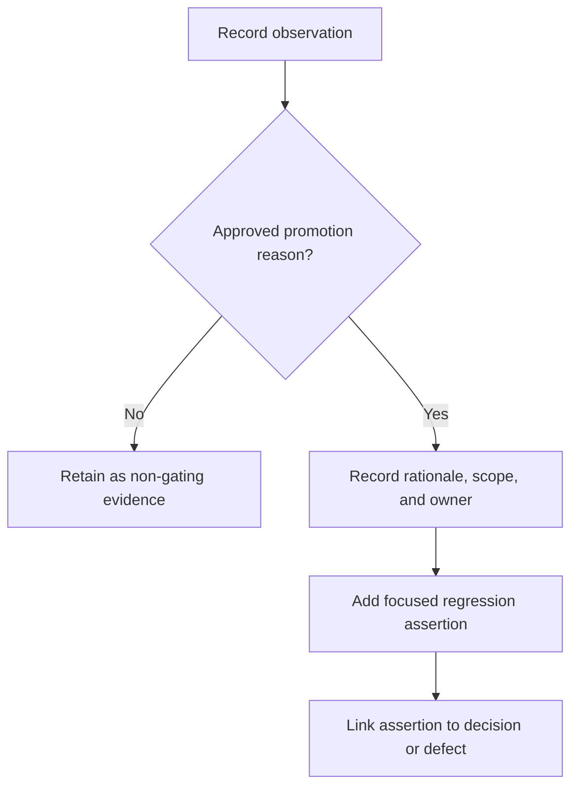

# Browser-lifetime assertion and measurement policy

> - **Status:** Required policy for the planned harness
> - **Last reviewed:** 2026-08-11
> - **Primary risk addressed:** Brittle tests and false lifetime conclusions
> - **Applies before:** Any browser observation is promoted to a CI failure
> - **Parent:** [Real-browser WebGPU lifetime testing](README.md)
> - **Runtime boundary:**
>   [Architecture and code reuse](architecture-and-code-reuse.md)
> - **Implementation order:** [Scenario evolution](scenario-evolution.md)

## Purpose

Real-browser testing produces more information than should become a permanent
regression contract. Chromium, Dawn, GPU drivers, adapter selection, garbage
collection, internal caching, and asynchronous queue execution can all affect
observed counts and timing without changing the analyser's semantic ownership
contract.

This policy defines how the harness separates:

1. Durable semantic invariants.
2. Provisional implementation observations.
3. Exact contracts of deliberately narrow proof fixtures.
4. Long-running or environment-specific measurement evidence.

The policy prevents a current observation such as a buffer count from
accidentally freezing an implementation shape before R2-C selects it.

This separation is mandatory. A value does not become a contract merely
because it is easy to count, currently repeatable, or present in one successful
run.

## Normative language

The terms **must**, **must not**, **required**, **should**, and **may** describe
the policy governing the harness:

- **must** and **must not** define conditions required for trustworthy
  evidence;
- **should** describes the default unless a documented reason justifies a
  different choice;
- **may** describes an optional capability that must still obey the evidence,
  ownership, and provenance rules below.

## Measurement eligibility boundary

Every component scenario has one mandatory prerequisite:

```text
prepare the selected component through its private provider
    → receive a callable capability
    → declare component readiness
    → arm runtime and WebGPU measurement
    → create or reuse the measured device/session/entry/resources
    → invoke or encode the workload
```

Component import, download, compilation, instantiation, and generated-provider
wiring are opaque setup. The harness may assert functionally that preparation
produced the selected callable capability, and may record `fresh-process`,
`fresh-page`, or `artifact-cold` as setup provenance. It must not time those
steps, emit measurement events for their internals, or place their durations in
an H1 or R2-C comparison population.

All measured `cold` and `warm` labels begin after readiness and must name the
actual post-ready scope: `device-generation-cold`, `session-cold`,
`entry-cold`, `resource-cold`, `compatible-warm`, `rebind-warm`, or
`capacity-warm`. “Cold component load,” “warm module,” and similar
provider-loading labels are not runtime metrics in this harness.

Instrumentation plumbing may be installed early when host imports require it,
but it remains dormant until readiness: no measurement clock reads, event IDs,
resource counters, or comparison samples are created before the boundary.
Functional preparation errors remain ordinary scenario setup failures and are
reported outside the measured interval.

## Evidence classes

| Class                  | Meaning                                                                              |                May gate normal CI? | Example                                                                |
| ---------------------- | ------------------------------------------------------------------------------------ | ---------------------------------: | ---------------------------------------------------------------------- |
| Semantic invariant     | Ownership or lifecycle behavior required regardless of internal resource arrangement |                                Yes | Shared-frame code does not finish or submit the borrowed encoder       |
| Structural contract    | An intentionally selected implementation property with a named decision owner        |               Yes, after selection | A selected persistent session performs no warm intermediate allocation |
| Observation            | Current value recorded to understand an implementation or compare alternatives       |                     No, by default | Number of `createBuffer()` calls in the mixed compatibility world      |
| Proof-fixture contract | Exact shape intentionally defined as the subject of one private experiment           |        Yes, only inside that proof | A private discovery resource owns five named intermediate buffers      |
| Environment capability | Fact about the current browser/adapter                                               | Controls skip or profile selection | JSPI unavailable in the selected browser                               |
| Measurement evidence   | Timing, memory, or adapter-specific trend requiring repeated runs and interpretation |                     No, by default | Settled GPU-process memory after five warm batches                     |

An evidence-only result can still keep H1 incomplete. Non-gating does not mean
unimportant; it means the result has different repeatability and portability
properties from a deterministic assertion.

## Evidence layers must remain distinct

The lifetime investigation crosses several layers. One counter or event must
not be reported as if it proved every layer below it.

| Layer                    | Example event                                                | What it establishes                                             |
| ------------------------ | ------------------------------------------------------------ | --------------------------------------------------------------- |
| Component Model identity | A provider resource destructor runs                          | One WIT resource identity was released                          |
| Host registry            | A registry entry is removed                                  | The host no longer resolves that transient identity             |
| JavaScript reachability  | A wrapper becomes unreachable                                | A JavaScript reference may become collectible                   |
| WebGPU API object        | `GPUBuffer.destroy()` is invoked                             | Native destruction was explicitly requested                     |
| Command lifetime         | Work reaches a recording, submission, or settlement boundary | The selected command boundary was reached                       |
| Browser implementation   | Dawn releases or reuses an allocation                        | Browser- and driver-dependent native resource behavior occurred |
| Process accounting       | GPU-process memory changes                                   | A sampled process-level metric changed                          |

The following inferences are therefore prohibited unless a separate proof
establishes the relationship:

- Component Model resource-drop is not native `GPUBuffer.destroy()`.
- Deleting a host registry entry is not native destruction.
- Native `destroy()` is not proof of immediate physical-memory reclamation.
- JavaScript garbage collection is not deterministic cleanup.
- `queue.submit()` returning is not proof that submitted work completed.
- A `createBuffer()` call is not a physical driver-allocation count.

## Initial semantic invariants

The first browser harness may gate only stable facts such as:

1. The selected component prepares through the authored boundary and produces
   a callable capability in a supported Chromium environment.
2. One genuine WebGPU component invocation reaches its variant-specific
   completion boundary.
3. No WebGPU validation error or uncaptured error is observed.
4. Component cleanup does not destroy the caller's device, captured texture,
   reference buffer, or scheduler encoder.
5. Successfully transferred output buffers are not destroyed by component
   wrapper release.
6. The shared-frame component neither finishes nor submits the borrowed
   scheduler encoder.
7. The scheduler can finish and submit that encoder after the component export
   and transient wrappers return.
8. Repeated cleanup is harmless where an idempotent cleanup operation exists.

These invariants describe behavior at ownership and completion boundaries.
They do not dictate how many internal buffers, layouts, pipelines, or bind
groups the implementation uses.

## Initial observations

The harness may record, without initially asserting exact values:

- component-related buffer creation calls;
- shader-module creation calls;
- bind-group-layout and pipeline-layout creation calls;
- compute-pipeline and bind-group creation calls;
- command-encoder and compute-pass creation calls;
- finish and queue-submission calls;
- `mapAsync`, mapped-range copy, and unmap calls;
- explicit `GPUBuffer.destroy()` calls;
- JavaScript object identities;
- resource-origin and purpose metadata;
- explicitly scoped post-ready device/session/entry/resource cold and warm
  durations;
- queue-settling durations;
- wrapper reachability where observable;
- Chrome/Dawn or GPU-process memory observations.

For example, a result may report:

```text
observed component-related buffer creations: <measured count>
observed compute-pipeline creations: <measured count>
observed queue submissions: <measured count>
```

The normal harness must not silently translate those observations into:

```ts
expect(bufferCreations).toBe(FIXED_BASELINE_BUFFER_COUNT);
expect(pipelineCreations).toBe(FIXED_BASELINE_PIPELINE_COUNT);
```

The current values may change through harmless workload isolation, resource
pooling, diagnostic selection, buffer combination, staging changes, or
pipeline reuse.

## Promotion gate

An observation becomes a gating assertion only when at least one approved
reason applies.



Approved reasons:

1. **Accepted architectural contract.** The value or relationship is required
   independently of the current implementation.
2. **R2-C-selected production contract.** The decision record explicitly
   selects an allocation, reuse, completion, or packaging property.
3. **Demonstrated regression.** A real defect occurred and the exact assertion
   is the narrowest durable protection against recurrence.
4. **Deliberate proof-fixture shape.** The private fixture defines an exact
   resource set so that identity, transfer, and destruction can be tested.

Every promoted assertion must document:

- the promotion reason;
- the scope to which it applies;
- the owning decision, requirement, or defect;
- why a weaker relational assertion is insufficient;
- what future event may legitimately change it.

## Prefer relational assertions

Even after an observation becomes relevant, prefer the weakest relationship
that protects the contract.

Examples:

| Stronger than necessary                                  | Preferred initial form                                                                    |
| -------------------------------------------------------- | ----------------------------------------------------------------------------------------- |
| Exactly the current observed buffer count is recreated   | Browser-owned inputs are not counted as component-created resources                       |
| Exactly the current observed pipeline count is recreated | Every pipeline used by submitted work belongs to the supplied device                      |
| Memory returns to its exact baseline                     | Settled memory does not show sustained unbounded growth across repeated batches           |
| Cleanup occurs at a fixed timestamp                      | Cleanup never occurs while an encoder that may be submitted still references the resource |
| Every variant has identical counts                       | Each variant reports counts under its own completion and ownership model                  |

Exact zero warm allocation becomes appropriate only for a resource boundary
that R2-C selects or for a private maximum-reuse fixture explicitly designed to
prove that property.

## Proof-fixture contracts

A private H1 fixture may intentionally declare exact facts, for example:

- five named discovery intermediate buffers;
- two renderer-facing discovery outputs;
- seven discovery pipelines;
- one compatible discovery bind group;
- one-time output transfer;
- exactly-once intermediate disposal.

Those assertions are valid because the fixture's exact shape is the experiment.
They must remain labeled as proof-fixture contracts and must not be generalized
to:

- the mixed compatibility world;
- every future discovery implementation;
- diagnostic workloads;
- all stable, async, and shared-frame production adapters;
- native backends.

If the private fixture changes, its exact-count assertions may change in the
same review without implying a public API break.

## Regression mode versus measurement mode

The future commands are conceptually separate even if they initially share a
runner:

```sh
pnpm run test:browser-lifetime
```

Expected properties:

- bounded duration;
- deterministic fixture;
- invariant-based pass/fail;
- suitable for supported CI environments;
- concise failure artifacts;
- no machine-specific performance threshold;
- no dependency on forced garbage collection or immediate memory reclamation.

```sh
pnpm run measure:browser-lifetime
```

Expected properties:

- repeated post-ready cold and warm batches whose exact device/session/entry/
  resource categories are recorded;
- adapter and environment provenance;
- object and identity observations;
- optional browser/GPU traces;
- memory trends;
- human-reviewable evidence report;
- not required on every change or every CI worker.

These command names are planned documentation, not existing package scripts.
Adding them requires a separately reviewed implementation diff.

Both commands may perform component preparation as untimed setup. Regression
mode may gate whether that setup produced a callable capability; measurement
mode must establish readiness before it creates its first timing sample.

## Observer integrity

Instrumentation can change the behavior it observes. Before a browser event is
treated as evidence, the observer must prove that it preserves the production
call's behavior.

Every wrapped WebGPU method must:

1. preserve the original receiver binding;
2. forward arguments without rewriting production descriptors;
3. return the original value or promise;
4. preserve synchronous exceptions and asynchronous rejection reasons;
5. avoid introducing a queue wait, mapping wait, or other synchronization not
   already required by the scenario;
6. avoid retaining native objects longer than required to assign an identity
   and record their lifecycle;
7. report whether the browser permitted the method to be wrapped reliably;
8. distinguish an unavailable event from an observed count of zero;
9. keep raw fixture activity separate from component-host activity;
10. prefer authored host metadata over heuristic label matching whenever the
    metadata exists.

The Phase 0 raw-device self-check proves only that the observation seam can see
its own known creation and destruction. It remains a separate scenario result
and cannot satisfy a component assertion.

If the browser prevents reliable observation, the corresponding field is
`unavailable` or the conclusion is `inconclusive`. The harness must never
fabricate a zero.

## False-positive controls

### A returned Promise is not sufficient completion evidence

WebGPU validation and execution may fail asynchronously. A scenario must use
the strongest completion boundary available for its variant:

- stable: invocation-local summary resolver passed through `analyze()` options,
  validation promises, queue completion, and staging mapping;
- async: awaited guest call, queue completion, mapping, copy, and unmap;
- shared-frame: scheduler finish/submit followed by pending-summary resolution.

The scenario also listens for `uncapturederror` and uses error scopes where the
production path exposes them.

### Summary success does not prove discovery attribution

The compact summary belongs to diagnostics. A successful summary readback
cannot alone establish that discovery resources were created, retained, or
reused correctly.

Discovery evidence must use purpose-tagged resources, command observations, or
a private discovery-only fixture. The browser harness must not infer discovery
success solely from a diagnostic summary.

### Device-wide counts include fixture activity

The harness creates its own texture, reference buffer, observation self-check
buffer, and shared-frame encoder. Those objects must not be counted as
component-created merely because they share the same device.

Each observation records:

- phase;
- object identity;
- origin;
- purpose when known;
- owning device generation;
- transfer or destruction state when supported.

Resetting a numeric counter after setup is useful but insufficient if later
events cannot still be attributed to an object.

### Labels are diagnostic hints, not ownership proof

WebGPU labels aid trace inspection and human debugging. They may be absent,
duplicated, or changed without transferring ownership. Origin and transfer
assertions must use host metadata and JavaScript object identity rather than
label matching alone.

### API calls are not physical allocation facts

`GPUDevice.createBuffer()` proves that the JavaScript API created a buffer
object. It does not prove that the driver allocated a fresh physical region at
that exact moment. Pipeline creation can likewise use browser or driver caches.

Reports must distinguish:

1. Cumulative API-object creation.
2. Live JavaScript object count where observable.
3. Explicit destruction calls.
4. Wrapper/registry reachability.
5. GPU-process memory.
6. Physical reclamation timing, which remains browser/driver controlled.

### Warm loops must not hide in-flight accumulation

A tight loop can report zero new persistent resources while accumulating
submissions, transient encoders, or queued work. Every measurement records:

- calls started;
- command buffers produced;
- submissions made;
- completion boundaries reached;
- calls still in flight at each sample.

Settled memory samples occur only after the selected completion boundary. The
report keeps peak and settled values separate.

### Browser caching must not masquerade as application reuse

Driver or browser compilation caches can reduce physical cost even when the
application creates new pipeline objects. Application-level reuse requires the
same JavaScript/native object identity according to the relevant host record,
not merely faster subsequent creation.

### Garbage collection is not deterministic cleanup

Garbage collection and `FinalizationRegistry` may be observed as secondary
evidence. They are never the pass condition for timely component-owned buffer
cleanup or bounded production lifetime behavior.

### Unsupported capability is not silent success

If WebGPU, a qualifying adapter, or JSPI is unavailable, the result records an
explicit unsupported reason. A skipped async scenario must not be reported as
passed. A required CI profile may choose to treat an unsupported promised
capability as infrastructure failure.

### A returned object is not necessarily usable

A destroyed WebGPU object can remain reachable as a JavaScript wrapper. Output
survival therefore requires a later valid GPU use permitted by the output's
declared usage. Merely checking that an object reference is non-null proves
reachability, not native resource validity.

The liveness probe must be the smallest operation that establishes the
required lifetime boundary. It must not recreate the full Millipede renderer
or turn visual algorithm correctness into a lifetime assertion.

### Failure injection belongs at the reliable layer

The deterministic typed host is the preferred layer for exhaustive failure
after every allocation, recording, finish, submission, mapping, and cleanup
stage. Browser tests add only failure cases that exercise behavior unavailable
to the typed host, such as real WebGPU validation, browser-owned encoder
abandonment, device loss, or native destruction semantics.

Monkey-patching every browser API to throw would test the patching mechanism
as much as the component. It is not a substitute for the focused failure
matrix.

## Error observation

Each scenario should collect:

- component-preparation errors as untimed setup failures;
- synchronous JavaScript exceptions;
- rejected promises;
- WebGPU validation-scope results;
- uncaptured WebGPU errors;
- `device.lost` state;
- runner/page protocol failures.

A scenario passes only when the expected completion boundary is reached and no
unexpected error channel reports a failure. Console silence alone is not
sufficient.

Expected failures are matched by boundary and reason rather than broad message
substrings wherever typed state is available.

### Completion boundaries

A successful JavaScript return does not establish successful GPU execution.
Every scenario records the strongest boundary it actually reached:

| Boundary                  | Meaning                                                   |
| ------------------------- | --------------------------------------------------------- |
| Component export returned | CPU-side component invocation completed                   |
| Encoder returned          | Recording completed for a borrowed encoder                |
| Encoder finished          | A command buffer was produced                             |
| Queue submit returned     | Submission was accepted synchronously                     |
| Submitted work settled    | Queue work reached the selected completion boundary       |
| Mapping completed         | The requested staging-buffer mapping resolved             |
| Summary resolved          | Variant-specific decoding and cleanup completed           |
| Outputs disposed          | The browser result owner requested final cleanup          |
| Device lost               | The device became unusable or was intentionally destroyed |

The stable scenario does not pass when the synchronous guest export merely
returns; it must reach the invocation-local resolver's completion and mapping
boundary. The async scenario must await its JSPI call and summary readback. The
shared-frame scenario treats component return as recording completion only and
passes the submitted branch only after the harness finishes, submits, and
resolves the pending summary.

The shared-frame abort branch has no successful GPU-completion boundary. It
reports abandonment and cleanup separately instead of pretending that the
recorded work executed.

## Memory evidence policy

Memory measurement is qualified evidence, not an exact regression threshold in
the initial harness.

The evidence run distinguishes:

- post-ready baseline before measured GPU strategy-resource creation;
- explicitly classified post-ready cold-call peak;
- `compatible-warm` batch peak;
- settled state after queue completion;
- state after explicit session/result disposal;
- state after device loss or generation replacement.

It may conclude that memory appears bounded or exhibits sustained growth under
the measured profile. It must not conclude from object counts alone that:

- Chromium reclaimed physical memory immediately;
- `GPUBuffer.destroy()` synchronously freed driver memory;
- the current implementation permanently leaks;
- garbage collection is a sufficient production cleanup policy.

Machine-specific memory values belong in evidence artifacts, not hard-coded
expectations in the normal suite.

## Environment provenance

Every evidence result records, when available:

- wall-clock timestamp;
- repository commit;
- generated component/toolchain provenance;
- Chromium version and launch flags;
- operating system and architecture;
- adapter information exposed by WebGPU;
- fallback-adapter status;
- device features and limits;
- selected test profile and variant;
- fixture identity and dimensions;
- post-ready device/session/entry/resource batch parameters;
- whether browser or measurement-only capabilities were unavailable.

The result also records the component-readiness outcome and any
`fresh-process`, `fresh-page`, or `artifact-cold` setup provenance separately
from post-ready measurement temperature. These fields explain how the callable
capability was obtained; they are never treated as timing samples.

Results from different adapters or browser builds must not be compared as if
only the component changed unless the report calls out those differences.

Retained evidence should also record, when known:

- Rust, `wit-bindgen`, and `wasm-tools` versions;
- selected component-provider and generated-binding toolchain versions;
- the `wasi:webgpu` WIT package version;
- generated component and loader artifact hashes;
- whether the repository worktree was dirty;
- headless mode and WebGPU/JSPI launch flags;
- scenario, fixture, and result-schema versions;
- warm-up count, measured iterations, settling strategy, and timeouts.

Unavailable fields are recorded as unavailable. They must not be silently
omitted in a way that makes two unlike environments appear comparable.

## Result status model

Every scenario has one explicit status:

| Status         | Meaning                                                                                      |
| -------------- | -------------------------------------------------------------------------------------------- |
| `pass`         | Every gating assertion that applies executed and passed                                      |
| `fail`         | At least one gating assertion executed and failed                                            |
| `unsupported`  | A required runtime capability is unavailable                                                 |
| `skipped`      | An explicit test selection excluded the scenario                                             |
| `inconclusive` | Execution occurred, but required evidence could not be interpreted reliably                  |
| `error`        | Runner, browser, protocol, timeout, or other infrastructure failure prevented a valid result |

`unsupported`, `skipped`, `inconclusive`, and `error` are not aliases for
`pass`.

Capability handling follows these rules:

1. Missing WebGPU or no qualifying adapter makes a GPU scenario
   `unsupported`.
2. In a CI profile that promises WebGPU, an unsupported result is an
   infrastructure failure for that job.
3. Missing JSPI may make only the async scenario unsupported; it does not erase
   stable or shared-frame results.
4. A fallback adapter is not automatically rejected if it satisfies the
   compute contract, but it must be identified and its measurements must not
   be compared silently with hardware-adapter results.
5. An unexpected device loss is a failure.
6. An intentionally induced device loss passes only in the dedicated scenario
   that observes the expected loss and replacement behavior.
7. Missing memory instrumentation may make a memory experiment inconclusive;
   it does not invalidate otherwise successful semantic assertions and does
   not complete the H1 memory-evidence requirement.
8. Timeouts, browser crashes, and protocol failures are errors, not unsupported
   capabilities.

An aggregate report preserves every scenario status. It must not reduce a mix
of passed and unsupported scenarios to an unqualified “all tests passed.”

## Proposed observation record

The eventual schema should be versioned and extensible. A minimal conceptual
shape is:

```json
{
  "schemaVersion": 1,
  "run": {
    "id": "2026-08-09T12:00:00.000Z",
    "mode": "regression",
    "sourceCommit": "<git-sha>",
    "dirty": false,
    "fixture": {
      "id": "minimal-component-webgpu",
      "version": 1
    },
    "setup": {
      "process": "fresh-process",
      "page": "fresh-page",
      "componentArtifact": "artifact-cold",
      "componentReadiness": "ready"
    },
    "measurementStartsAfter": "component-ready"
  },
  "environment": {
    "chromiumVersion": "<version>",
    "headless": true,
    "webgpu": "supported",
    "jspi": "supported",
    "adapter": {
      "description": "<reported adapter>",
      "fallback": false,
      "features": [],
      "limits": {}
    }
  },
  "scenarios": [
    {
      "id": "stable-minimal-execution",
      "variant": "stable",
      "status": "pass",
      "measurementTemperature": [
        "device-generation-cold",
        "session-cold",
        "entry-cold"
      ],
      "completionBoundary": "summary-resolved",
      "assertions": [
        {
          "id": "webgpu.validation-clean",
          "outcome": "pass",
          "contract": "semantic-invariant",
          "evidence": "validation-scope-and-uncaptured-error-observer"
        }
      ],
      "observations": {
        "apiCounters": {
          "status": "measured",
          "artifact": "events/webgpu-api.json"
        },
        "memory": {
          "status": "unavailable",
          "provider": null,
          "samples": []
        }
      },
      "errors": [],
      "artifacts": []
    }
  ]
}
```

Exact counts remain in the referenced observation artifact; there is no
matching expected value in this generic schema. A promoted exact assertion
instead records its observed and expected values, contract class, scope,
owning decision or regression, and fixture version when fixture-specific.

This is a documentation model, not a frozen schema. The implemented schema
should use explicit unions for known events and evolve through its own version.
The separation between assertions and observations is normative.

## Artifact retention

Normal local output belongs under ignored `target/browser-lifetime/`, for
example:

```text
target/browser-lifetime/
├── result.json
├── summary.md
├── traces/
└── screenshots/
```

The repository should commit conclusions and stable regression fixtures, not
arbitrary machine-specific trace archives. A formal H1 evidence review may
select a compact reproducible result for durable documentation, with its
environment and collection method recorded.

## Change-review rules

1. Adding an observation does not require an architecture decision.
2. Removing an invariant requires identifying the contract that changed.
3. Promoting an observation requires the promotion rationale described above.
4. Changing a proof-fixture count must remain scoped to that fixture.
5. Adding a performance or memory threshold requires repeatability evidence on
   the environments expected to enforce it.
6. Adding a new browser or native target requires its own capability and
   provenance policy.
7. A test must not pass by silently omitting an unsupported scenario.

## Acceptable and unacceptable assertions

| Candidate                                                                    | Initial classification                   | Reason                                                |
| ---------------------------------------------------------------------------- | ---------------------------------------- | ----------------------------------------------------- |
| No validation or uncaptured WebGPU error occurred                            | Gating invariant                         | Required for a valid execution                        |
| Browser-owned reference input received no component destroy request          | Gating invariant                         | Protects the ownership boundary                       |
| Shared-frame component performed no finish or submission                     | Gating invariant                         | Protects scheduler authority                          |
| Returned output remained usable after transient wrapper release              | Gating invariant                         | Direct lifetime property                              |
| Repeated disposal caused no second native destroy of the same owned resource | Gating after explicit disposal exists    | Protects idempotence                                  |
| Current mixed workload's exact buffer or pipeline creation count             | Observation                              | Incidental current implementation shape               |
| Warm invocation requested zero new buffers                                   | Observation until selected               | Candidate reuse property for R2-C                     |
| Private proof fixture destroyed all five declared intermediates once         | Narrow-fixture assertion after promotion | The fixture's declared shape is itself under proof    |
| GPU-process memory fell immediately after `destroy()`                        | Invalid universal assertion              | Reclamation may be deferred or pooled                 |
| Adapter name equals one particular device                                    | Invalid assertion                        | Environment-specific fact                             |
| Every machine completes within one fixed duration                            | Invalid initial assertion                | Hardware- and load-dependent measurement              |
| Summary mapping succeeded                                                    | Variant assertion                        | Proves its readback path, not all discovery semantics |
| Exact dispatch order matches the Rust contract                               | Belongs in focused tests                 | Duplicating it here adds little lifetime evidence     |

Examples:

```ts
// Valid observation: visible in reports, but not a contract.
report.observe("webgpu.api.create-buffer", {
  scope: invocation.id,
  count: observedBufferCreations,
});

// Valid ownership assertion.
report.assert("ownership.browser-input-not-destroyed", {
  observed: fixtureInput.nativeDestroyCount,
  expected: 0,
  contract: "semantic-invariant",
});

// Invalid: the mixed implementation shape is not the lifetime contract.
expect(allComponentBufferCreations).toBe(FIXED_BASELINE_BUFFER_COUNT);
```

## Review checklist for new assertions

Before accepting a new browser assertion, reviewers must answer:

1. What stable property does it protect?
2. Is it semantic, selected by R2-C, regression-derived, or confined to a
   versioned narrow fixture?
3. Where is that contract documented?
4. Could a permitted buffer, pipeline, staging, batching, or scheduling
   refactor break it?
5. Can fixture setup or unrelated browser activity satisfy it?
6. Is resource origin and current ownership scoped correctly?
7. Does the observer distinguish logical release, registry deletion, native
   destruction, and physical reclamation?
8. Does the scenario wait for the correct asynchronous completion boundary?
9. Can the observer miss an event and report zero?
10. Is the expectation deterministic in every environment where it gates?
11. Does a Rust or component-boundary test already own the property more
    precisely?
12. Is the failure message actionable?
13. Would the assertion accidentally freeze a public API or R2-C choice?
14. If exact, where are its value, scope, and fixture version owned?
15. If environment-dependent, should it remain a measurement instead?

A new exact count should be rejected when these questions do not have clear
answers.

## Scenario maturity

Every scenario declares one maturity level:

| Level         | Meaning                                               |
| ------------- | ----------------------------------------------------- |
| `planned`     | Documented but not implemented                        |
| `implemented` | Runs and records structured results                   |
| `measured`    | Has retained evidence from a qualifying environment   |
| `gating`      | Contains reviewed deterministic assertions used by CI |

A scenario may contain both gating assertions and non-gating observations.
Moving from implemented to gating requires assertion review; merely running
successfully does not promote its evidence.

## Re-audit triggers

Re-audit this policy and affected assertions when changing:

- the selected component provider, generated bindings, or lowering toolchain;
- `wit-bindgen` or Component Model resource lowering;
- `wasi:webgpu` WIT definitions;
- generated world ownership or package mapping;
- the authored browser WebGPU host;
- buffer-origin, current-owner, or purpose metadata;
- the public loader or completion boundary;
- Chromium/Dawn instrumentation;
- the R2-C lifetime decision;
- the private H1 proof fixture;
- the result schema;
- the first non-browser GPU backend.

A dependency or generated-artifact change must not silently alter the meaning
of resource-drop, destruction, transfer, or completion evidence.

## Policy non-goals

This policy does not:

1. Select the final H1 lifetime design.
2. Define the private H1 component API.
3. Require every observation to become an assertion.
4. Require long-running measurements in normal CI.
5. Guarantee access to Chromium/Dawn internal counters.
6. Define cross-vendor performance thresholds.
7. Replace algorithm-correctness or renderer tests.
8. Measure or optimize component-provider loading, module topology, request
   count, compilation, or instantiation.

## Governing rule

The harness begins as a small real-execution and observation seam. It first
obtains a prepared callable component through the production boundary, then
uses real browser WebGPU primitives, executes real compute work, asserts only
stable ownership and submission behavior, and records exact implementation
details as observations. Component preparation remains an opaque, untimed
prerequisite.

> Observations are evidence, not contracts. Record first, interpret carefully,
> and promote only what the architecture deliberately chooses to preserve.
