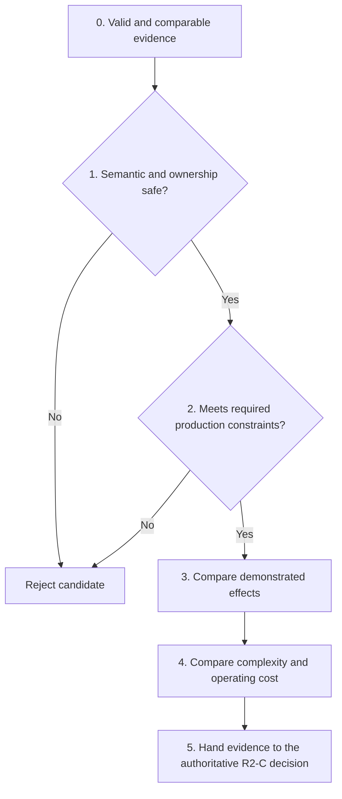

# R2-C comparison and decision contract

> - **Status:** Planned evidence and decision schema; no candidate selected
> - **Last reviewed:** 2026-08-10
> - **Applies after:** H1 has produced valid real-browser lifetime evidence
> - **Local responsibility:** Comparable evidence and a decision-ready R2-C
>   evidence summary
> - **Authoritative decision owner:** Millipede GPU-discovery migration plan,
>   unless documentation ownership is separately migrated
> - **Does not authorize:** A public API, permanent resource, package, or world
>   before the evidence is reviewed
> - **Parent:** [Real-browser WebGPU lifetime testing](README.md)
> - **Timing definitions:**
>   [Timing and observation contract](timing-and-observation-contract.md)
> - **Reuse terminology:**
>   [Resource reuse and submission strategy](resource-reuse-and-submission-strategy.md)
> - **Evidence policy:**
>   [Assertion and measurement policy](assertion-and-measurement-policy.md)
> - **Runtime boundary:**
>   [Architecture and code reuse](architecture-and-code-reuse.md)

## Purpose

R2-C must produce an implementable architectural decision, not merely a table
of timings. This document defines how local H1 observations become a
reviewable comparison and a decision-ready evidence handoff. The authoritative
selection remains in the Millipede GPU-discovery migration plan unless that
documentation boundary is separately migrated.

The comparison answers four related questions:

1. Which stable, async, and shared-frame entry shapes have a demonstrated
   production role?
2. Which resource classes should be recreated, cached, retained, pooled, or
   rotated for each retained entry shape?
3. Which workloads should share a pass, encoder, command buffer, submission,
   completion boundary, or publication gate?
4. Which generated worlds and package artifacts must be combined, selected at
   build time, or physically separated?

The answer is not assumed to be one global strategy. A valid decision may, for
example, retain pipelines across all variants, retain mutable buffers only for
one sequential variant, and use a bounded readback ring only for overlapping
diagnostic work. Every selected difference must be supported by evidence at
the completion and ownership boundary of that variant.

This document deliberately contains no preselected winner and no benchmark
threshold chosen after seeing results.

## Callable-component readiness precondition

R2-C accepts runtime samples only after the selected component has been
prepared through its private provider and exposed as a callable capability.
Download, compilation, instantiation, and provider-specific glue are opaque,
untimed setup. A preparation failure may reject or block a candidate on
capability or reliability grounds, but it contributes no runtime latency
sample.

Provider/toolchain versions, component hashes, emitted bytes, entry topology,
and selected-only exclusion remain provenance and structural evidence. The
measurement interval begins after readiness and still includes every declared
post-readiness GPU/runtime cold, warm, replacement, submission, publication,
and cleanup boundary.

Preparation must not execute an analyser workload or create candidate
GPU/session resources before observation is armed. A consumer capture that
begins before callable readiness is startup evidence outside the canonical
R2-C runtime metrics, not a longer value for one of those metrics.

## Decision hierarchy

Candidate selection follows a strict hierarchy. A lower level cannot
compensate for failure at a higher level.



| Level                     | Gate or comparison                                                                                                                                                                                                                                   |
| ------------------------- | ---------------------------------------------------------------------------------------------------------------------------------------------------------------------------------------------------------------------------------------------------- |
| 0. Evidence validity      | Inputs, workload, features, output semantics, environment, and instrumentation are comparable; otherwise the run is `invalid` and contributes no aggregate value                                                                                     |
| 1. Semantic safety        | Caller inputs remain caller-owned; outputs remain live for their owner; shared-frame code does not finish/submit; wrapper release preserves submitted work; cleanup and replacement obey ownership/device-generation rules; validation remains clean |
| 2. Production constraints | Active migration-plan requirements are proven, including compute execution, required diagnostic exclusion and failure independence, selected publication gates, scheduler authority, and no unintended world instantiation                           |
| 3. Demonstrated effects   | Compare user-visible latency, CPU recording, GPU-pass duration, throughput, object churn, retained capacity, replacement/rebind, readback/publication, artifact bytes, and post-readiness cold/warm GPU/runtime behavior                             |
| 4. Complexity             | If effects are practically equivalent, evidence favors fewer public APIs, ownership states, invalidation paths, instrumentation seams, generated worlds, and package artifacts                                                                       |

Every active Level 2 constraint links to its proof; timing cannot waive a
structural requirement. An unsafe candidate is rejected even when faster or
smaller. “Simpler” must name the states, APIs, resources, or artifacts removed.

R2-C must not collapse the hierarchy into a weighted score. Such a score could
hide an ownership, exclusion, or first-result failure behind unrelated bytes
or throughput. The authoritative decision retains every dimension.

### Semantic and production gate results

Every candidate receives gate results before its performance or complexity is
compared. A summary row records the first failing level; detailed rows retain
each checked rule and its evidence so one passing invariant cannot conceal a
different failure.

| Candidate | Workload / variant / state | Level 0 evidence validity          | Level 1 semantic and ownership safety | Level 2 production constraints     | First failing rule | Gate outcome                                                        |
| --------- | -------------------------- | ---------------------------------- | ------------------------------------- | ---------------------------------- | ------------------ | ------------------------------------------------------------------- |
| `—`       | `—`                        | `pass`, `fail`, or `not-evaluated` | `pass`, `fail`, or `not-evaluated`    | `pass`, `fail`, or `not-evaluated` | `—`                | `admit-effects-comparison`, `pending-proof`, `reject`, or `invalid` |

Each non-trivial gate check also receives one detailed row:

| Candidate | Level | Constraint or invariant                                         | Expected contract | Evidence and proof link | Result                             | Failure disposition or limitation |
| --------- | ----: | --------------------------------------------------------------- | ----------------- | ----------------------- | ---------------------------------- | --------------------------------- |
| `—`       |     0 | Comparable workload and environment                             | `—`               | `—`                     | `pass`, `fail`, or `not-evaluated` | `—`                               |
| `—`       |     1 | Caller-input ownership                                          | `—`               | `—`                     | `pass`, `fail`, or `not-evaluated` | `—`                               |
| `—`       |     1 | Output lifetime and cleanup ownership                           | `—`               | `—`                     | `pass`, `fail`, or `not-evaluated` | `—`                               |
| `—`       |     1 | Variant encoder, submission, and abort authority                | `—`               | `—`                     | `pass`, `fail`, or `not-evaluated` | `—`                               |
| `—`       |     2 | Compute-execution and selected publication contract             | `—`               | `—`                     | `pass`, `fail`, or `not-evaluated` | `—`                               |
| `—`       |     2 | Diagnostic exclusion, failure independence, and world selection | `—`               | `—`                     | `pass`, `fail`, or `not-evaluated` | `—`                               |

The listed rows are the minimum categories, not a closed checklist. A candidate
enters Level 3 comparison only when every applicable detailed Level 0–2 rule
passes. `not-evaluated` never means `pass`; it either makes the run `invalid`
or leaves the candidate `pending-proof` until the missing proof is supplied.

## Decisions that R2-C must close

| Decision ID           | Question                                                                     | Representative candidates                                                  | Required evidence                                                                      |
| --------------------- | ---------------------------------------------------------------------------- | -------------------------------------------------------------------------- | -------------------------------------------------------------------------------------- |
| `D-ENTRY-STABLE`      | Does the synchronous stable entry retain a production role?                  | Retain as primary, retain as fallback, or remove after migration           | Completion semantics, output publication, summary behavior, compatibility need         |
| `D-ENTRY-ASYNC`       | Does JSPI-backed async execution provide a required capability?              | Retain, retain only for diagnostics, or remove                             | Genuine delayed work, mapping/readback, availability, failure behavior, latency        |
| `D-ENTRY-FRAME`       | Is scheduler-borrowed shared-frame execution the production discovery shape? | Select, retain as optional integration, or reject                          | Encoder authority, first edge, integration cost, abort behavior                        |
| `D-RESOURCE-PREPARED` | Which prepared objects persist?                                              | Recreate, application cache, or prewarm                                    | Cold/warm creation counts, CPU preparation, invalidation scope                         |
| `D-RESOURCE-MUTABLE`  | Which mutable buffers persist?                                               | One-shot, compatible working set, capacity reuse, pool, or ring            | Warm allocation, stale-data proof, overlap, replacement, retained bytes                |
| `D-OUTPUT`            | Who owns reusable outputs?                                                   | One-shot transfer, browser-owned stable pair, lease, or bounded ring       | Liveness, consumer overlap, identity, slot waits, exactly-once cleanup                 |
| `D-READBACK`          | How are diagnostic readbacks staged?                                         | Per-invocation, sequential reuse, pool, or ring                            | Concurrent mappings, summary latency, bounded slots, cleanup                           |
| `D-PUBLICATION`       | Must outputs wait for summary completion?                                    | Summary-gated or outputs-first with later summary                          | Output-ready, summary-ready, gate-delay, error independence                            |
| `D-COMPOSITION`       | How are discovery and diagnostics recorded and submitted?                    | Combined or separate pass/encoder/command buffer/submission                | First edge, submissions, GPU duration, failure coupling                                |
| `D-BATCHING`          | Which logical work may be batched?                                           | Immediate, bounded coalescing, invocation batch, or readback batch         | Per-item latency, throughput, queue depth, flush policy                                |
| `D-WORLD`             | How are component worlds selected?                                           | Combined world, feature-selected worlds, or separate worlds                | Imports/exports, dead-code exclusion, compatibility, generation cost                   |
| `D-ARTIFACT`          | How are distributable artifacts packaged?                                    | Combined artifact, selected artifacts in one package, or separate packages | Physical bytes, selected entry/import topology, diagnostics exclusion, versioning cost |

Each row receives its own authoritative conclusion. Selecting persistent
pipelines does not imply persistent outputs; selecting a shared-frame
discovery entry does not imply that diagnostic completion uses the same entry.

## Candidate identity

A candidate is an explicit tuple, not a prose nickname:

```text
workload
× entry variant
× prepared-resource policy
× mutable-resource policy
× output-ownership policy
× recording/submission composition
× publication policy
× world/artifact topology
× lifecycle state
```

For example, this is a sufficiently specific candidate identity:

```text
discovery
× shared-frame
× cached pipelines and layouts
× one compatible intermediate working set
× browser-owned output pair
× scheduler command-buffer consolidation
× outputs-first
× discovery-only artifact
× compatible-warm
```

The example describes a possible experiment; it is not a recommendation.

### Candidate registry

Every evaluated candidate must have a stable ID and a registry record:

| Field                           | Required content                                                                                |
| ------------------------------- | ----------------------------------------------------------------------------------------------- |
| Candidate ID                    | Stable identifier used by result files and tables                                               |
| Hypothesis                      | One falsifiable statement the comparison tests                                                  |
| Baseline candidate              | Candidate against which the changed axis is compared                                            |
| Changed axis                    | Exactly one primary design difference where possible                                            |
| Inherited contract              | Ownership, correctness, and packaging constraints common to both                                |
| Required capabilities           | JSPI, timestamp queries, shared-frame seam, or trace support                                    |
| Primary outcome                 | One canonical metric or structural result that can close the named decision                     |
| Expected benefit                | Named metric or structural property expected to improve                                         |
| Accepted cost                   | Predeclared metric or complexity regression considered tolerable                                |
| Practical-equivalence threshold | Absolute or relative threshold, unit, population, and justification used when effects are close |
| Rejection condition             | Safety, structural, or practical threshold that rejects it                                      |
| Safe interim behavior           | Existing or deliberately conservative behavior retained if the comparison is inconclusive       |
| Implementation delta            | Test-only proof, private artifact, or production candidate seam                                 |
| Evidence owner                  | Person or task responsible for interpreting the result                                          |

The candidate registry and decision-specific comparison header are frozen
before the first selection-bearing sample. At minimum, hypothesis, baseline,
changed axis, primary outcome, accepted cost, practical-equivalence threshold,
rejection condition, and safe interim behavior must be non-empty and reviewed.
A run started without those fields may remain exploratory evidence, but it
cannot select or reject a production contract. Any later threshold change
creates a new comparison revision and preserves the original record.

### Do not run an undirected Cartesian product

The tuple defines candidate identity but does not require testing every
possible combination. Each experiment should change one primary axis and
answer one named question. Additional combinations are justified only when an
interaction is itself the hypothesis, such as whether a resource ring helps
only when two scheduler generations genuinely overlap.

An experiment that simultaneously changes the entry variant, buffer lifetime,
submission count, publication gate, and artifact layout cannot attribute its
result and must not select a production contract by itself.

## Evidence layers

R2-C combines evidence from several layers without confusing what each layer
can establish.

| Layer                          | Work executed                                                                      | Establishes                                                          | Cannot establish alone                                    |
| ------------------------------ | ---------------------------------------------------------------------------------- | -------------------------------------------------------------------- | --------------------------------------------------------- |
| Raw WebGPU calibration         | Minimal browser-created buffer, compute pass, query resolve, copy, and map         | Observer works; feature and clock availability; measurement overhead | Prepared-component or host lifetime behavior              |
| Minimal real component fixture | Small deterministic component workload through the public loader and authored host | Variant ownership, wrapper lifetime, command validity                | Production workload performance or Millipede presentation |
| Isolated real workload         | Production discovery or diagnostic workload with controlled inputs                 | Actual allocation, GPU-pass, readback, and replacement behavior      | Consumer scheduler and first rendered edge                |
| Package/artifact inspection    | Built components and JavaScript package payloads                                   | Physical inclusion, bytes, import graph, selected exports            | Runtime latency or native ownership                       |
| Millipede black-box acceptance | Existing consumer route without changing its implementation for the comparison     | Capture, scheduler, publication, renderer, and presentation behavior | Isolated attribution without component evidence           |
| Chromium trace                 | Browser, GPU-process, Dawn, compositor, and presentation events where exposed      | Location of browser-side delay and first-edge evidence               | A portable production timer contract                      |

The raw calibration layer validates measurement machinery. It is never a
substitute for the real component path. Conversely, the Millipede acceptance
layer must not be asked to explain an allocation without an isolated
component-side observation.

## Workload matrix

Workload IDs label evidence fixtures; they do not create new public APIs.
Exact dispatch or resource counts remain observations unless separately
selected as contracts.

| Workload ID | Workload                               |                               Summary/readback | Primary question                                                                      |
| ----------- | -------------------------------------- | ---------------------------------------------: | ------------------------------------------------------------------------------------- |
| `W0`        | Raw WebGPU calibration kernel          |                        Timestamp readback only | Does the timing and observation seam produce coherent evidence?                       |
| `W1`        | Smallest valid real component workload | Only what the selected entry contract requires | Are ownership and completion semantics valid in Chromium?                             |
| `W2`        | Production discovery only              |                                           None | What is the real production discovery cost and first-result path?                     |
| `W3`        | Reference-overlay diagnostics only     |                                           None | What is the independent visual diagnostic cost?                                       |
| `W4`        | Statistics/summary diagnostics only    |                                            Yes | What cost and completion boundary does compact readback add?                          |
| `W5`        | Full selected diagnostic workload      |                                            Yes | What is the complete diagnostic cost without discovery?                               |
| `W6`        | Discovery and diagnostics combined     |                        Diagnostic summary only | What does shared recording/submission save, and what does it delay or couple?         |
| `W7`        | Discovery and diagnostics separated    |                        Diagnostic summary only | What does independent recording, completion, publication, and failure isolation cost? |

### Workload equivalence contract

A performance comparison is valid only when the candidates have equivalent
semantic work. The result record must preserve:

- byte-identical texture and reference inputs;
- identical texture dimensions, format, usage, and initialized content;
- identical logical reference records and workload selection;
- the same Rust/Wasm source revision and shader generation unless artifact
  generation is the tested axis;
- equivalent output layouts, logical lengths, and contents;
- equivalent validation and liveness probes;
- the same required clearing or initialization semantics;
- the same iteration count when comparing per-invocation work;
- no additional dummy dispatch used solely to make a timestamp non-zero.

`W6` and `W7` are comparable only when they perform the same logical discovery
and diagnostic work and produce equivalent outputs. A combined candidate that
silently omits diagnostic work is not faster evidence; it is a different
workload.

## Variant boundary contract

Stable, async, and shared-frame calls return at different lifecycle moments.
Their raw function durations therefore are not interchangeable. Comparisons
must use normalized milestones whose meanings are the same across candidates.

| Property                      | Stable                                                                                     | Async/JSPI                                          | Shared-frame                                                     |
| ----------------------------- | ------------------------------------------------------------------------------------------ | --------------------------------------------------- | ---------------------------------------------------------------- |
| Encoder creator               | Component/host path                                                                        | Component/host path                                 | Browser scheduler                                                |
| Compute-pass owner            | Component invocation                                                                       | Component invocation                                | Component records into borrowed encoder                          |
| Encoder finisher              | Component/host path                                                                        | Component/host path                                 | Browser scheduler                                                |
| Queue submitter               | Component/host path                                                                        | Component/host path                                 | Browser scheduler                                                |
| Export return means           | Component recording/submission and stable handoff reached                                  | Awaited async export reached its defined completion | Recording returned; no submission implied                        |
| Queue settlement owner        | Resolver/consumer when required                                                            | Async path when its contract awaits completion      | Browser scheduler/consumer                                       |
| Summary completion            | Configured resolver after transfer                                                         | Inside awaited mapping/decode path                  | Pending summary after scheduler submission, or disposal on abort |
| Abort authority               | Stable invocation/resolver policy                                                          | Async invocation policy                             | Browser scheduler owns unsubmitted encoder abandonment           |
| Valid cross-variant milestone | Output published, matching submission settled, matching summary ready, first rendered edge | Same                                                | Same after scheduler submission                                  |

### Required milestone correlation

Every invocation must carry a generation or correlation ID through:

```text
input ready
    → component recording
    → output publication
    → command submission
    → relevant queue/buffer completion
    → summary readiness, when requested
    → matching rendered/presented generation, when observed
```

The harness must not associate a queue fence or rendered edge with an
invocation merely because it happened next in wall-clock order. Shared queue
or renderer activity requires an explicit generation correlation.

### Completion-normalized comparison

Use these rules:

1. Compare recording cost from equivalent input-ready to commands-recorded
   milestones.
2. Compare output publication from input-ready to the point at which the
   consumer can legally take ownership of the matching output handles.
3. Compare queue completion only for the submission containing the matching
   work.
4. Compare summary readiness only for candidates that request equivalent
   summary work.
5. Compare first edge only after confirming that the rendered generation uses
   the matching outputs.
6. Report export duration as variant-local diagnostic evidence, not as the
   primary cross-variant winner metric.

## Controlled-comparison contract

### Environmental controls

| Control              | Required record                                                                                                    |
| -------------------- | ------------------------------------------------------------------------------------------------------------------ |
| Chromium             | Exact version/build, channel, executable, headless/headed mode, flags                                              |
| Origin and isolation | Served origin, secure-context status, cross-origin isolation status                                                |
| Adapter              | Reported name where available, backend, vendor/device identifiers where exposed, fallback status, power preference |
| Device generation    | Stable run-local ID, requested features, limits, loss state                                                        |
| GPU timing           | Timestamp-query availability, quantization/developer-feature state, timing profile                                 |
| Host machine         | OS version, CPU architecture, power source/mode, thermal notes where observable                                    |
| Page state           | Visibility, focus, viewport, device-pixel ratio, reload/context policy                                             |
| Package              | Git commit, dirty-state fingerprint, package version, lockfile hash                                                |
| Component            | Rust target, Wasm/component hash, private provider/toolchain version, WIT package hash, callable-readiness result  |
| Workload             | Workload ID, dimensions, format, reference-data hash, selected lanes                                               |
| Run policy           | Warmup, sample count, batch size, run order, timeout, settling rule                                                |

Results from different adapter/device generations must not be silently pooled.
Cross-machine results may show portability or trend consistency, but they are
not paired samples.

### Candidate controls

Unless a field is the tested axis, paired candidates must use the same:

- browser context and device generation;
- input fixture and logical workload;
- package and component revision;
- observer profile;
- queue-settling policy;
- page visibility and scheduler policy;
- output verification;
- exact canonical post-readiness lifecycle state or transition;
- batching and flush policy;
- prior unrelated GPU activity;
- error-observation window.

If the tested feature requires a new device—for example enabling optional
timestamp queries—the result record must state that the runs are not strict
same-device pairs and must include a calibration/control run on each device.

### Instrumentation integrity

An observer profile is accepted only after a control proves that it preserves:

- semantic outputs;
- validation behavior;
- ownership and destruction events apart from declared observer-owned
  resources;
- the production dispatch and copy sequence apart from declared query
  resolution commands;
- the submission and publication strategy under test;
- resource compatibility and clearing rules.

GPU timestamp resolution and mapping must not be accidentally included in a
production summary readback or used to change when an output is published.

### Invalid-run conditions

A run is `invalid` and excluded from performance aggregates when any of the
following occurs:

1. Output correctness or liveness validation fails.
2. A WebGPU validation, uncaptured, device-lost, or unexpected console error
   occurs.
3. The input, workload, artifact, or device identity differs from the declared
   candidate record.
4. The required completion boundary is not reached or cannot be correlated.
5. Instrumentation changes the candidate's semantic work or ownership.
6. The page becomes hidden or loses a required execution capability unless
   background behavior is the explicit experiment.
7. A timeout, runner crash, browser crash, or trace truncation prevents the
   required evidence.
8. A supposedly `compatible-warm` invocation performs a
   `capacity-replacement` or `generation-replacement`; it belongs to that
   replacement population instead.

Invalid samples remain in raw evidence with their reason. They are never
deleted merely to improve an aggregate.

## Lifecycle-state comparisons

State definitions, compatibility keys, initialization obligations, and
per-resource reuse rules belong to the
[resource reuse and submission strategy](resource-reuse-and-submission-strategy.md).
Every result uses those canonical names and records the transition it measured.

The only lifecycle labels used here are `fresh-process`, `fresh-page`,
`artifact-cold`, `device-generation-cold`, `session-cold`, `entry-cold`,
`resource-cold`, `compatible-warm`, `rebind-warm`, `capacity-warm`,
`capacity-replacement`, `generation-replacement`, `device-replacement`,
`post-loss-recovery`, and `retirement/disposal`.

| Transition                                                             | Comparison purpose                                                                |
| ---------------------------------------------------------------------- | --------------------------------------------------------------------------------- |
| `device-generation-cold` → `compatible-warm`                           | Separate initial GPU/runtime preparation from steady-state work                   |
| `session-cold`, `entry-cold`, or `resource-cold` → `compatible-warm`   | Attribute the preparation boundary actually under test                            |
| `compatible-warm` → `compatible-warm`                                  | Establish stable repeated behavior and bounded churn                              |
| `compatible-warm` → `rebind-warm`                                      | Measure changing texture/reference identities without unrelated capacity change   |
| `compatible-warm` → `capacity-warm`                                    | Prove whether retained capacity serves a changed logical size safely              |
| `compatible-warm` → `capacity-replacement`                             | Measure scoped growth beyond retained capacity                                    |
| `compatible-warm` → `generation-replacement`                           | Validate hard-key incompatibility handling                                        |
| `capacity-replacement` or `generation-replacement` → `compatible-warm` | Confirm the replacement becomes the new stable generation                         |
| Any active state → `device-replacement` → `post-loss-recovery`         | Prove old-device objects are not reused and recovery establishes a new generation |
| Any active state → `retirement/disposal`                               | Prove no new work and exactly-once owned cleanup                                  |

`fresh-process`, `fresh-page`, and `artifact-cold` describe setup-provenance
categories rather than measured populations or resource-generation
transitions. `artifact-cold` is retained as an existing migration label and
setup-provenance field; component preparation under that label is opaque and
untimed. Cold and warm post-readiness GPU/runtime populations remain separate;
averaging a cold invocation into a warm batch hides both behaviors.

## Experiment families

These identifiers name comparison candidates. The reuse document owns their
resource mechanics; this document owns what is compared and what evidence can
select them.

### Prepared and mutable resources

| Candidate family  | Changed policy                                                             | Primary evidence                                                  |
| ----------------- | -------------------------------------------------------------------------- | ----------------------------------------------------------------- |
| `PREP-BASE`       | Recreate prepared objects according to current baseline                    | Object creation, preparation time                                 |
| `PREP-CACHE`      | Cache shader modules, layouts, and pipelines                               | Cold/warm creation identities, recording CPU time, invalidation   |
| `PREP-PREWARM`    | `PREP-CACHE` plus deliberate prewarming outside the latency-sensitive call | First-call latency, prewarm cost, readiness contract              |
| `MUT-ONESHOT`     | Per-invocation mutable resources                                           | Allocation churn, baseline correctness                            |
| `MUT-WORKING-SET` | One compatible persistent working set                                      | Warm allocation, stale-data/clear proof, sequential safety        |
| `MUT-CAPACITY`    | Capacity-based reuse                                                       | Binding-range correctness, retained capacity, resize behavior     |
| `MUT-POOL`        | Lease-based pool                                                           | Concurrent lease count, waits, bounded high-water mark            |
| `MUT-RING`        | Bounded N-slot ring                                                        | In-flight generations, slot wait count/duration, overwrite safety |

The comparison distinguishes application identity reuse from faster opaque
browser/driver recreation. `MUT-POOL` or `MUT-RING` requires observed overlap;
conventional double or triple buffering does not establish a slot requirement.

### Output ownership

| Candidate family | Ownership after success                                       | Required proof                                                       |
| ---------------- | ------------------------------------------------------------- | -------------------------------------------------------------------- |
| `OUT-TRANSFER`   | One-shot component-created outputs transfer to browser caller | Wrapper-release survival, caller cleanup                             |
| `OUT-STABLE`     | Browser/session owns one stable output pair                   | No overlapping consumer need, stable identity, replacement safety    |
| `OUT-RING`       | Browser/session owns a bounded output ring                    | Matching generations, no overwrite, bounded slots, final cleanup     |
| `OUT-LEASE`      | Explicit lease/return protocol                                | Unique lease owner, return after use, abort and late-return behavior |

Any reusable-output candidate must explicitly replace the current one-shot
handoff; the component cannot silently reclaim an already transferred output.

### Publication policy

| Candidate family    | Policy                                                     | Primary evidence                                             |
| ------------------- | ---------------------------------------------------------- | ------------------------------------------------------------ |
| `PUB-SUMMARY-GATED` | Output publication waits for diagnostic summary            | Summary-ready, output-ready, gate delay, error coupling      |
| `PUB-OUTPUTS-FIRST` | GPU-resident outputs publish first; summary resolves later | First edge, summary completion, independent failure handling |
| `PUB-NO-SUMMARY`    | No summary is requested on production discovery            | Physical workload/artifact exclusion, discovery first edge   |

Candidates compare only with equivalent required semantics. `PUB-NO-SUMMARY`
is a structural candidate, not a faster `PUB-SUMMARY-GATED` implementation.

### Recording and submission composition

| Candidate family           | Composition                                                         | Primary evidence                                                               |
| -------------------------- | ------------------------------------------------------------------- | ------------------------------------------------------------------------------ |
| `COMPOSE-COMBINED`         | Discovery and diagnostics share pass/encoder/submission where valid | Submission count, combined GPU duration, coupling                              |
| `COMPOSE-PASSES`           | Separate passes in one encoder and command buffer                   | Pass overhead, common submission, independent timestamps where supported       |
| `COMPOSE-COMMAND-BUFFERS`  | Separate command buffers in one queue submission                    | Recording/command-buffer cost, one submission, completion coupling             |
| `COMPOSE-SEPARATE-SUBMITS` | Separate submissions                                                | Discovery first edge, diagnostic completion, queue behavior, failure isolation |
| `COMPOSE-FRAME`            | Scheduler command-buffer consolidation in shared-frame mode         | Borrowed-encoder authority, whole-frame submission, first edge                 |

Pass, encoder, command buffer, and submission remain distinct axes.

### Batching and coalescing

| Candidate family   | Unit batched                                     | Benefit metric              | Cost metric                                         |
| ------------------ | ------------------------------------------------ | --------------------------- | --------------------------------------------------- |
| `BATCH-NONE`       | None; submit according to one logical invocation | Per-item latency            | Submission/recording overhead                       |
| `BATCH-SUBMIT`     | Several command buffers in one `queue.submit()`  | Submit CPU cost, throughput | Time until first item enters queue                  |
| `BATCH-INVOCATION` | Several logical inputs before submission         | Items/second                | Per-item and first-item latency, retained resources |
| `BATCH-READBACK`   | Several query/summary results in one readback    | Mapping/copy count          | Individual summary delay                            |
| `BATCH-WINDOW`     | Bounded time-window coalescing                   | Throughput under burst      | Flush-delay distribution                            |

Every batching result reports latency and throughput. Reduced total batch time
cannot hide first-result delay beyond the declared product budget.

## Instrumentation profiles and result statuses

Clock domains, measurement call chains, observer overhead, capability handling,
and exact event semantics belong to the
[timing and observation contract](timing-and-observation-contract.md). R2-C
uses its canonical profiles and statuses rather than redefining timing here.

| Profile               | R2-C use                                                                                     |
| --------------------- | -------------------------------------------------------------------------------------------- |
| `semantic`            | Admit or reject candidate execution before measurement                                       |
| `structure`           | Compare application-visible objects, calls, identities, and cleanup                          |
| `content-timing`      | Compare recording, publication, and summary milestones on the content timeline               |
| `gpu-query-normal`    | Explain production-observable compute-pass contribution when supported                       |
| `gpu-query-developer` | Obtain finer controlled diagnostic evidence without treating it as production precision      |
| `queue-settlement`    | Measure the deliberate queue-wide completion boundary where applicable                       |
| `trace`               | Attribute browser-side delay and identify matching presentation                              |
| `resource-memory`     | Compare bounded growth and settled trends                                                    |
| `package`             | Compare physical artifacts, selected entry/import topology, and unselected-payload exclusion |

Profiles may run separately. A maximally instrumented run is not inherently
more trustworthy than focused profiles whose integrity has been verified.

| Metric status      | Decision treatment                                |
| ------------------ | ------------------------------------------------- |
| `measured`         | Include in its matching aggregate                 |
| `unsupported`      | Exclude without substituting a different metric   |
| `below-resolution` | Retain as censored evidence, never zero cost      |
| `not-applicable`   | Exclude with the lifecycle reason                 |
| `invalid`          | Exclude from aggregates but retain the raw record |
| `inconclusive`     | Retain without selecting from this metric         |
| `timeout`          | Record as reliability evidence and invalid timing |

## Metric contract

The timing contract owns each metric's start, end, clock, unit, capability,
and permitted interpretation. R2-C refers to these metrics by exact name and
never substitutes one for another:

| Decision area                   | Canonical metrics                                                                                                                          |
| ------------------------------- | ------------------------------------------------------------------------------------------------------------------------------------------ |
| Explicit post-ready preparation | `gpu_runtime_prepare_ms`, qualified by its exact device/session/entry/resource lifecycle scope                                             |
| Isolated input path             | `input_to_recorded_ms`, `input_to_submit_ms`, `input_to_output_publish_ms`, `input_to_summary_ready_ms`, `input_to_first_rendered_edge_ms` |
| Millipede capture path          | `capture_to_submit_ms`, `capture_to_output_publish_ms`, `capture_to_summary_ready_ms`, `capture_to_first_rendered_edge_ms`                 |
| GPU and settlement              | `gpu_compute_pass_ns`, `submit_to_queue_settled_ms`                                                                                        |
| Diagnostic readback             | `submit_to_summary_map_ms`, `summary_gate_delay_ms`                                                                                        |

Throughput, object counts, slot waits, retained capacity, and physical artifact
bytes remain supporting observations. They must not be given a second timing
metric name in this document.

### Primary versus explanatory metrics

Every decision row must declare:

- one primary outcome metric or structural fact;
- safety and correctness gates;
- secondary cost metrics;
- explanatory observations;
- a practical-equivalence rule defined before measurement.

For example, a consumer first-edge decision may use
`capture_to_first_rendered_edge_ms` as its primary outcome and GPU-pass
duration, submission count, and trace spans as explanation. Results cannot
swap the primary outcome afterward because an explanatory metric looks more
favorable.

## Sampling and statistical treatment

### Separate functional proof from timing samples

Before timing, run the semantic profile, verify deterministic output and
ownership, verify each observer, and establish the declared lifecycle state.
Lightweight correctness and error checks remain active for every measured run.

Record process/page freshness and `artifact-cold` only as setup provenance.
Keep separate measured populations for every applicable post-readiness
lifecycle label, including device/session/entry/resource cold scopes,
warm/rebind/capacity cases, both replacement scopes, post-loss recovery, and
retirement. Warmups are recorded state transitions, not silently discarded
slow samples; steady state begins only at the declared compatibility boundary.

### Repetition

Record independent browser contexts, device generations, batches per
candidate, warmup and measured iterations, batch/flush policy, settlement
boundary, invalid/timeouts, and run order. No universal sample count applies;
the count must reveal the decision-relevant distribution and remain stable
enough that additional samples do not change its interpretation. Expensive
trace profiles may have fewer repetitions, with uncertainty kept visible.
`artifact-cold` may still describe the setup provenance of a run, but its
component-preparation interval is not sampled or aggregated.

### Run order

Where candidates share an environment, use a stored-seed randomized order or
an interleaved balanced order such as:

```text
A B
B A
A B
B A
```

Do not measure every baseline before every alternative after conditions may
have drifted. If state contaminates the next run, use fresh contexts or
counterbalanced blocks and record the remaining limitation.

### Report distributions, not one best number

Report valid, invalid, and timeout counts; median (`p50`); a supported tail
percentile, normally `p95`; diagnostic minimum/maximum; absolute paired effect;
relative effect only against a non-zero resolved baseline; and an uncertainty
interval or repeated-block range. Mean and standard deviation may supplement,
but never replace, distribution summaries for skewed browser timings. Numeric
precision cannot exceed clock resolution and observed stability.

### Practical equivalence

Before observing results, define what would change the decision: an absolute
latency budget; relative throughput gain with a maximum latency regression;
zero warm creation for a selected class; bounded high-water mark without slot
waits; physical absence of diagnostic bytes; or practical equivalence that
defers to complexity. The threshold needs a product, architecture, or
operating justification and cannot be selected after measurement.

### Outliers, censored values, and failures

- Raw samples are immutable evidence.
- Outliers may be explained and shown separately but must not be deleted
  without a predeclared mechanical rule and retained exclusion record.
- `below-resolution` GPU intervals are censored observations, not zero.
- Timeouts and device losses are reliability outcomes, not unusually slow
  numeric samples.
- A candidate with lower median but materially more timeouts or validation
  failures cannot be selected from the valid-timing subset.
- Browser/OS background events found in a trace may explain a sample but do
  not automatically authorize its removal.

## Result tables

The following tables are templates. Empty cells remain `—` until measured;
they must not be populated with estimates.

### Timing results

| Candidate | Workload | Variant/state | Samples valid/invalid/timeout | `gpu_runtime_prepare_ms` p50/p95 | `input_to_recorded_ms` p50/p95 | `input_to_submit_ms` or `capture_to_submit_ms` p50/p95 | `input_to_output_publish_ms` or `capture_to_output_publish_ms` p50/p95 | `input_to_summary_ready_ms` or `capture_to_summary_ready_ms` p50/p95 | `input_to_first_rendered_edge_ms` or `capture_to_first_rendered_edge_ms` p50/p95 | `gpu_compute_pass_ns` p50/p95 | Status |
| --------- | -------- | ------------- | ----------------------------- | -------------------------------: | -----------------------------: | -----------------------------------------------------: | ---------------------------------------------------------------------: | -------------------------------------------------------------------: | -------------------------------------------------------------------------------: | ----------------------------: | ------ |
| `—`       | `—`      | `—`           | `—`                           |                              `—` |                            `—` |                                                    `—` |                                                                    `—` |                                                                  `—` |                                                                              `—` |                           `—` | `—`    |

Where applicable, attach `submit_to_queue_settled_ms`,
`submit_to_summary_map_ms`, and `summary_gate_delay_ms` as separate metric
columns in the evidence artifact; do not fold them into another interval.

The overview is incomplete without one normalized detail row for every
canonical metric or derived quantitative outcome used to support a decision.
This includes decision-bearing throughput such as valid items per second:

| Candidate | Baseline | Workload / variant / state | Metric or quantitative outcome | Samples valid/invalid/timeout | Min | p50 | p95 | Max | Absolute paired effect | Relative effect | Uncertainty interval or repeated-block range | Status |
| --------- | -------- | -------------------------- | ------------------------------ | ----------------------------- | --: | --: | --: | --: | ---------------------: | --------------: | -------------------------------------------- | ------ |
| `—`       | `—`      | `—`                        | `—`                            | `—`                           | `—` | `—` | `—` | `—` |                    `—` |             `—` | `—`                                          | `—`    |

When pairing is impossible, the absolute-effect cell names the unpaired
comparison and population rather than implying paired samples. Relative effect
is `not-applicable` for a zero, unresolved, or incompatible baseline. Timeout
counts remain reliability evidence and are never hidden inside the invalid
count.

### Resource and lifetime results

| Candidate | Resource class       | Canonical lifecycle state or transition | Creations | Identity reused | Retained capacity | Replacement trigger              | Slot waits | Cleanup proof              | Status |
| --------- | -------------------- | --------------------------------------- | --------: | --------------- | ----------------: | -------------------------------- | ---------: | -------------------------- | ------ |
| `—`       | Shader module        | `—`                                     |       `—` | `—`             |               N/A | Shader/device generation         |        N/A | Host identity release      | `—`    |
| `—`       | Layout/pipeline      | `—`                                     |       `—` | `—`             |               N/A | Layout/config/device             |        N/A | Host identity release      | `—`    |
| `—`       | Bind group           | `—`                                     |       `—` | `—`             |               N/A | Bound identities/ranges          |        N/A | Host identity release      | `—`    |
| `—`       | Intermediate buffers | `—`                                     |       `—` | `—`             |               `—` | Capacity/format/device           |        `—` | Exactly-once owned destroy | `—`    |
| `—`       | Renderer outputs     | `—`                                     |       `—` | `—`             |               `—` | Capacity/consumer overlap/device |        `—` | Selected browser owner     | `—`    |
| `—`       | Summary staging      | `—`                                     |       `—` | `—`             |               `—` | Map state/capacity/device        |        `—` | Resolver/session cleanup   | `—`    |
| `—`       | Timestamp readback   | `—`                                     |       `—` | `—`             |               `—` | In-flight measurement/device     |        `—` | Observer cleanup           | `—`    |

Creation counts are observations until a selected contract promotes a
relationship for one exact lifecycle state. They are not assumed to be zero in
every warm, replacement, or recovery state.

### Execution-structure results

| Candidate | Workload | Compute passes | Encoders | Command buffers | Submissions | Copies | Map calls/bytes | Output gate | Failure coupling | Status |
| --------- | -------- | -------------: | -------: | --------------: | ----------: | -----: | --------------- | ----------- | ---------------- | ------ |
| `—`       | `—`      |            `—` |      `—` |             `—` |         `—` |    `—` | `—`             | `—`         | `—`              | `—`    |

Exact structure is first recorded, then promoted only when R2-C explicitly
selects it or a focused regression requires it.

### Batching results

| Candidate | Batch unit | Batch size/window | Derived valid items/s p50/p95 | First-item canonical metric/p50/p95 | Last-item canonical metric/p50/p95 | Flush reason | Peak in-flight | Status |
| --------- | ---------- | ----------------- | ----------------------------: | ----------------------------------: | ---------------------------------: | ------------ | -------------: | ------ |
| `—`       | `—`        | `—`               |                           `—` |                                 `—` |                                `—` | `—`          |            `—` | `—`    |

### Package and selection results

| Candidate | Selected world/entry | Discovery component bytes | Diagnostic component bytes | Authored/generated JS bytes | Entry/import topology manifest | Unselected payload absent? | Diagnostics fetched when off? | Diagnostics instantiated when off? | Build/provider provenance | Status |
| --------- | -------------------- | ------------------------: | -------------------------: | --------------------------: | ------------------------------ | -------------------------- | ----------------------------- | ---------------------------------- | ------------------------- | ------ |
| `—`       | `—`                  |                       `—` |                        `—` |                         `—` | `—`                            | `—`                        | `—`                           | `—`                                | `—`                       | `—`    |

This table records topology, physical bytes, selection/exclusion, and
provenance only. It contains no provider download, compilation, instantiation,
or readiness duration.

“Diagnostics disabled” must be tested at multiple boundaries:

| Boundary               | Proof required                                                                                                                        |
| ---------------------- | ------------------------------------------------------------------------------------------------------------------------------------- |
| Source/build selection | Build graph does not select diagnostic world for the production discovery artifact                                                    |
| Component bytes        | Diagnostic exports, imports, shaders, and reachable code are absent from the inspected discovery artifact where exclusion is required |
| JavaScript package     | Diagnostic loader chunk is physically separate when lazy exclusion is claimed                                                         |
| Network loading        | Browser trace/network log shows no diagnostic payload fetch when disabled                                                             |
| Instantiation          | Loader observation shows no diagnostic component instantiation when disabled                                                          |
| Runtime work           | WebGPU observation shows no diagnostic pipelines, passes, copies, mappings, or summary work                                           |

Dead-code elimination is evidence only when the built artifact is inspected.
A feature flag or uncalled export does not by itself prove physical exclusion.

## Interpretation rules

Measurements support bounded conclusions. They must not be translated into a
different causal claim without supporting evidence.

| Observation                                                                  | Supported conclusion                                                   | Unsupported conclusion                                    |
| ---------------------------------------------------------------------------- | ---------------------------------------------------------------------- | --------------------------------------------------------- |
| GPU pass is unchanged while first edge improves                              | Improvement occurred outside measured shader-pass execution            | Shader execution became faster                            |
| Persistent candidate removes warm object creation and lowers record CPU time | Application reuse removed preparation calls on the measured path       | Driver allocation or physical memory disappeared          |
| Later recreation is faster but native object identities change               | Opaque browser/driver caching may be helping                           | Application-owned persistent reuse is proven              |
| Warm allocation falls but first edge and throughput are equivalent           | Reuse works structurally but has no demonstrated critical-path benefit | Persistence is automatically preferable                   |
| Retained memory plateaus under the declared batch                            | Bounded retention is plausible for that workload and environment       | Immediate native reclamation is proven                    |
| Summary completes after outputs become publishable                           | A measurable summary gate exists                                       | Outputs were semantically unusable before summary         |
| Outputs-first improves first edge with equivalent correctness                | Decoupled publication benefits the measured path                       | Every consumer must adopt outputs-first                   |
| Combined composition uses one fewer submission                               | The measured structure reduces submission count                        | It is safer or faster end to end                          |
| Separate composition improves first edge                                     | Diagnostic independence benefits discovery publication                 | Individual shaders became faster                          |
| Async maps no data and publishes no sooner than another valid variant        | No async-only benefit was demonstrated for this workload               | JSPI can never be useful                                  |
| A timestamp delta is zero/below resolution                                   | Duration was not resolved under the current timer policy               | The GPU did no work                                       |
| `GPUBuffer.destroy()` calls are observed exactly once                        | Explicit API destruction was requested exactly once                    | Driver memory was immediately reclaimed                   |
| One output slot never waits in a sequential run                              | A ring was not needed in that run                                      | One slot is safe under overlapping generations            |
| Ring slots prevent overwrite but introduce waits                             | Ring provides bounded overlap with measured backpressure               | Increasing ring size indefinitely is justified            |
| Batching increases items/s and delays first item                             | Throughput/latency tradeoff is quantified                              | Batching is unconditionally better                        |
| Diagnostic payload is not fetched                                            | Network exclusion is proven for that run                               | Diagnostic bytes are absent from every published artifact |

### Causal attribution

When a result changes, interpretation should proceed in this order:

1. Confirm workload, output, and lifecycle equivalence.
2. Locate the changed clock interval or structural boundary.
3. Use object/call observations to identify application-visible changes.
4. Use GPU timestamps to distinguish compute-pass change from surrounding
   latency.
5. Use Chromium trace evidence to explain browser-side delay where available.
6. Run a focused one-axis follow-up before assigning causality when several
   mechanisms still differ.

Trace evidence is explanatory. It must not be elevated into a portable API
contract unless the runtime actually exposes that boundary.

## Decision-specific comparison sheets

Every decision uses a compact comparison sheet before the final record.

### Comparison header

```text
decision ID:
hypothesis:
baseline candidate:
alternative candidate:
primary changed axis:
required constraints:
primary outcome:
secondary costs:
practical-equivalence threshold and unit:
threshold rationale:
comparison revision ID (frozen before measurement):
rejection conditions:
safe interim behavior if inconclusive:
revisit trigger or decision deadline:
environment blocks:
evidence artifact paths:
```

Every field through `revisit trigger or decision deadline` is required before
the first selection-bearing sample. The frozen revision identifier is stored
with every run. A missing or retrospectively chosen threshold restricts the
comparison to exploratory evidence and must be reported as such.

### Comparison result

| Item                                   | Baseline | Alternative | Difference | Interpretation                                                                                         |
| -------------------------------------- | -------- | ----------- | ---------- | ------------------------------------------------------------------------------------------------------ |
| Correctness/ownership                  | `—`      | `—`         | `—`        | `—`                                                                                                    |
| Structural constraints                 | `—`      | `—`         | `—`        | `—`                                                                                                    |
| Primary outcome                        | `—`      | `—`         | `—`        | `—`                                                                                                    |
| Secondary latency/throughput           | `—`      | `—`         | `—`        | `—`                                                                                                    |
| Resource/retention cost                | `—`      | `—`         | `—`        | `—`                                                                                                    |
| Package cost                           | `—`      | `—`         | `—`        | `—`                                                                                                    |
| Added states/API/artifacts             | `—`      | `—`         | `—`        | `—`                                                                                                    |
| Environment limitations                | `—`      | `—`         | `—`        | `—`                                                                                                    |
| Evidence disposition                   | `—`      | `—`         | N/A        | `supports-selection`, `supports-retained-fallback`, `supports-rejection`, `inconclusive`, or `invalid` |
| Safe interim behavior                  | N/A      | N/A         | N/A        | `—`; required when disposition is `inconclusive`                                                       |
| Required follow-up and revisit trigger | N/A      | N/A         | N/A        | `—`; required when disposition is `inconclusive`                                                       |

An `inconclusive` comparison is a valid outcome. It must name what additional
evidence could close the decision and whether implementation can safely defer
the choice. Its safe interim behavior must be an already proven contract or a
deliberately conservative restriction, not an unmeasured candidate. It must
not silently become selection of the more complex candidate “just in case.”

## Machine-readable evidence envelope

Human-readable tables link to immutable raw result artifacts. The exact JSON
schema may evolve with the harness, but it must preserve the following
conceptual envelope:

```json
{
  "schemaVersion": 1,
  "runId": "...",
  "comparisonRevisionId": "...",
  "candidateId": "...",
  "baselineCandidateId": "...",
  "decisionIds": ["D-..."],
  "workload": { "id": "W2", "inputHash": "..." },
  "variant": "stable | async | shared-frame",
  "lifecycleState": "compatible-warm",
  "callableComponentPrecondition": {
    "status": "ready",
    "provider": "...",
    "toolchain": "...",
    "componentHash": "...",
    "timed": false
  },
  "policies": {
    "preparedResources": "...",
    "mutableResources": "...",
    "outputs": "...",
    "composition": "...",
    "publication": "...",
    "packaging": "..."
  },
  "predeclaredDecisionContract": {
    "primaryOutcome": "...",
    "practicalEquivalenceThreshold": {},
    "acceptedCost": {},
    "rejectionConditions": [],
    "safeInterimBehavior": "..."
  },
  "environment": {
    "chromium": "...",
    "adapter": "...",
    "deviceGeneration": "...",
    "features": [],
    "gitCommit": "...",
    "artifactHashes": {}
  },
  "profiles": ["semantic", "content-timing"],
  "correctness": { "status": "valid | invalid", "checks": [] },
  "gates": {
    "evidenceValidity": "pass | fail | not-evaluated",
    "semanticAndOwnership": "pass | fail | not-evaluated",
    "productionConstraints": "pass | fail | not-evaluated",
    "outcome": "admit-effects-comparison | pending-proof | reject | invalid",
    "details": []
  },
  "metrics": {
    "input_to_output_publish_ms": {
      "status": "measured",
      "samples": [],
      "summary": {}
    },
    "gpu_compute_pass_ns": {
      "status": "unsupported",
      "reason": "adapter feature unavailable"
    }
  },
  "observations": {},
  "errors": [],
  "artifacts": []
}
```

Raw samples, invalid-run records, traces, and package manifests live under the
ignored evidence output directory. Reviewed local evidence summaries refer to
them by stable relative path and content hash.

## Authoritative R2-C decision handoff

This repository owns the evidence because it owns the component and browser
host under test. It may retain:

- an ignored machine-readable evidence manifest under
  `target/browser-lifetime/`;
- a reviewed `r2-c-evidence-summary.md` beside this methodology;
- candidate comparison sheets, limitations, hashes, and evidence
  dispositions;
- links from each evidence disposition to the eventual roadmap decision.

It must not create a second local selected-contract record. The authoritative
R2-C selection, fallback, rejection, and implementation ownership remain in
the Millipede GPU-discovery migration plan under
`packages/surface/inspector-browser/docs/implementation-plans/gpu-discovery-migration/`
unless documentation ownership is explicitly migrated in a separate change.
Once the local evidence manifest and summary exist, the authoritative plan
must link back to them.

### Authoritative decision statuses

| Status              | Meaning                                                                                   |
| ------------------- | ----------------------------------------------------------------------------------------- |
| `selected`          | Becomes part of the production contract and receives an implementation owner              |
| `retained-fallback` | Remains available for a named compatibility or capability condition, but is not primary   |
| `rejected`          | Must not be implemented as the selected production path; reason and evidence are recorded |
| `inconclusive`      | Evidence cannot yet distinguish candidates; follow-up and safe interim behavior are named |

### Required authoritative table

The following table is completed in the Millipede migration plan, not copied
into a local decision record:

| Decision ID           | Selected or retained contract | Status | Supporting evidence | Rejected alternatives | Why | Safe interim behavior | Implementation owner | Required follow-up tests |
| --------------------- | ----------------------------- | ------ | ------------------- | --------------------- | --- | --------------------- | -------------------- | ------------------------ |
| `D-ENTRY-STABLE`      | `—`                           | `—`    | `—`                 | `—`                   | `—` | `—`                   | `—`                  | `—`                      |
| `D-ENTRY-ASYNC`       | `—`                           | `—`    | `—`                 | `—`                   | `—` | `—`                   | `—`                  | `—`                      |
| `D-ENTRY-FRAME`       | `—`                           | `—`    | `—`                 | `—`                   | `—` | `—`                   | `—`                  | `—`                      |
| `D-RESOURCE-PREPARED` | `—`                           | `—`    | `—`                 | `—`                   | `—` | `—`                   | `—`                  | `—`                      |
| `D-RESOURCE-MUTABLE`  | `—`                           | `—`    | `—`                 | `—`                   | `—` | `—`                   | `—`                  | `—`                      |
| `D-OUTPUT`            | `—`                           | `—`    | `—`                 | `—`                   | `—` | `—`                   | `—`                  | `—`                      |
| `D-READBACK`          | `—`                           | `—`    | `—`                 | `—`                   | `—` | `—`                   | `—`                  | `—`                      |
| `D-PUBLICATION`       | `—`                           | `—`    | `—`                 | `—`                   | `—` | `—`                   | `—`                  | `—`                      |
| `D-COMPOSITION`       | `—`                           | `—`    | `—`                 | `—`                   | `—` | `—`                   | `—`                  | `—`                      |
| `D-BATCHING`          | `—`                           | `—`    | `—`                 | `—`                   | `—` | `—`                   | `—`                  | `—`                      |
| `D-WORLD`             | `—`                           | `—`    | `—`                 | `—`                   | `—` | `—`                   | `—`                  | `—`                      |
| `D-ARTIFACT`          | `—`                           | `—`    | `—`                 | `—`                   | `—` | `—`                   | `—`                  | `—`                      |

For `inconclusive`, `Safe interim behavior` is mandatory and the selected or
retained-contract cell states `no new selection` unless an existing proven
contract is explicitly retained. The follow-up column names both the missing
evidence and its revisit trigger or decision deadline. Other statuses may use
`not-applicable` only when no interim behavior is required.

### Required authoritative narrative for every selected row

Each selected or retained-fallback row must state:

1. The exact ownership and completion contract.
2. The compatibility/invalidation key where resources persist.
3. The behavior for every applicable canonical lifecycle label.
4. The batching, flush, and backpressure policy where applicable.
5. The artifact/world inclusion, selection, and exclusion rule.
6. The primary evidence and practical effect size.
7. Known environments where the evidence does not apply.
8. The code boundary and repository that must implement the decision.
9. Which observations are promoted to regression assertions.
10. Which measurements remain non-gating operational evidence.

### Required authoritative narrative for every rejected row

Each rejected alternative must state whether rejection resulted from:

- semantic or ownership failure;
- active production-constraint failure;
- no demonstrated benefit;
- unacceptable latency, throughput, retention, or packaging cost;
- complexity without sufficient evidence;
- missing platform capability;
- or evidence that remained inconclusive past the decision deadline.

“Slower” is insufficient without naming the metric, state, workload,
environment, effect, and predeclared practical threshold.

## Promotion into regression contracts

After authoritative R2-C selection, the decision owner reviews each selected
property against the
[assertion and measurement policy](assertion-and-measurement-policy.md). Only
selected structural properties become new gating assertions.

Examples include:

- a selected shared-frame entry performs no finish or submission;
- a selected discovery-only artifact physically excludes diagnostics;
- a selected compatible persistent working set performs no replacement for an
  explicitly compatible input;
- a selected bounded ring never overwrites an in-flight generation and never
  exceeds its chosen slot bound;
- a selected outputs-first policy does not wait on diagnostic mapping;
- a selected diagnostic failure boundary does not invalidate discovery output.

Measured latency values ordinarily remain baselines or operational evidence,
not exact CI assertions. A performance regression budget requires a separate,
environment-aware policy and must not be inferred merely from the R2-C sample
median.

## Review checklist

Before R2-C is declared complete, reviewers must be able to answer:

1. Does every evaluated candidate have a precise tuple and hypothesis?
2. Did every candidate first pass semantic and ownership validation?
3. Are active non-negotiable production constraints listed and proven?
4. Are comparisons controlled at input, workload, device, state, and observer
   boundaries?
5. Are stable, async, and shared-frame milestones normalized rather than
   compared by raw export duration?
6. Are GPU timestamps, JavaScript durations, queue fences, mappings, and traces
   kept in their correct clock and completion domains?
7. Are all applicable canonical lifecycle populations distinguished?
8. Are reuse, pooling/rings, and batching evaluated as separate axes?
9. Do batching results report both first-item latency and throughput?
10. Are exact resource counts still observations unless explicitly selected?
11. Are invalid, timeout, unsupported, and below-resolution samples retained
    and classified correctly?
12. Was practical significance defined before inspecting the result?
13. Does package evidence prove physical inclusion/exclusion rather than only
    an unused flag or export?
14. Does each interpretation stay within what its evidence layer establishes?
15. Does every decision have a status, rationale, evidence link, owner, and
    required follow-up test?
16. Are inconclusive decisions named honestly rather than resolved by an
    unsupported preference?
17. Does the selected contract minimize permanent API and lifecycle complexity
    when demonstrated outcomes are practically equivalent?

The local handoff is complete only when this evidence can be traced into the
authoritative, implementable R2-C contracts without undocumented benchmark
interpretation.
