# Resource reuse and submission strategy

> - **Status:** Experiment design; implementation and measurements pending
> - **Last reviewed:** 2026-08-10
> - **Applies to:** H1 browser-lifetime evidence and the R2-C execution decision
> - **Current implementation baseline:** Stable, async, and shared-frame mixed
>   compatibility worlds
> - **Decision owner:** R2-C, after H1 evidence
> - **Parent:** [Real-browser WebGPU lifetime testing](README.md)
> - **Harness architecture:**
>   [Browser-lifetime architecture and code reuse](architecture-and-code-reuse.md)
> - **Evidence policy:**
>   [Assertion and measurement policy](assertion-and-measurement-policy.md)
> - **Scenario sequence:** [Browser-lifetime scenario evolution](scenario-evolution.md)

## Purpose

This document defines the resource-reuse and command-submission alternatives
that the browser-lifetime harness must compare. It supplies a precise
vocabulary, a current resource ledger, compatibility and replacement rules,
data-initialization hazards, bounded-overlap policies, batching alternatives,
and an experiment matrix.

It does not select a production design. In particular, it does not assume that
stable, async, and shared-frame should use the same lifetime boundary. H1 must
first establish which patterns are safe and measurable. R2-C then selects a
contract independently for each retained variant, and P2 implements the
selected permanent component and loader surfaces.

The central question is not merely whether an object _can_ be retained. It is:

> For a precisely defined compatibility scope, can the implementation reuse
> an object's native identity without stale data, capacity errors, ownership
> ambiguity, unsafe overlap, or an unintended completion barrier—and does the
> measured benefit justify the added state and teardown complexity?

## Decision boundary

This document may define and measure candidates. It must not:

1. Introduce a public `discovery-session` or another permanent WIT resource.
2. Freeze stable, async, or shared-frame completion signatures.
3. Require one command-composition policy for all variants.
4. Turn current mixed-world object counts into production promises.
5. Treat a JavaScript wrapper identity as proof of a physical GPU allocation.
6. Infer native-memory reclamation from `GPUBuffer.destroy()` timing alone.
7. Add a permanent output ring without demonstrated overlap.
8. Add a CPU-visible queue-completion wait only to make destruction appear
   simpler.
9. Replace real Chromium evidence with fake-host or native-`wgpu` evidence.
10. Broaden support to a backend that cannot execute the compute workload.

## Evidence vocabulary

The following terms are intentionally narrower than informal uses of “cold,”
“warm,” “cached,” and “reused.” Every result must use the exact code-style
category it measured.

Browser-process, page, and component-artifact terms describe setup provenance.
They never define a timed comparison population. Every measured population
starts only after the selected component has produced a callable capability.
From that point onward, device and resource terms describe the state of one
candidate device generation, session, entry, or object class. A resource can
therefore be `resource-cold` in a `compatible-warm` session. A run may also
carry `fresh-page` provenance while using browser-process caches left by
earlier pages, but that fact remains outside the measured interval.

`capacity-replacement`, `generation-replacement`, `device-replacement`,
`post-loss-recovery`, `retirement`, and `disposal` are lifecycle transitions,
not temperature categories.

### Untimed setup provenance

| Canonical term  | Scope            | Meaning                                                                                       | What it may establish                                                                               |
| --------------- | ---------------- | --------------------------------------------------------------------------------------------- | --------------------------------------------------------------------------------------------------- |
| `fresh-process` | Setup provenance | New Chromium process and profile                                                              | Functional isolation from earlier process state; not a timed loader baseline                        |
| `fresh-page`    | Setup provenance | New page or context in which the selected component has not yet been prepared                 | Functional page isolation; browser-process, adapter, and driver caches may remain populated         |
| `artifact-cold` | Setup provenance | The selected component has not been fetched, compiled, instantiated, or memoized in this page | Functional preparation coverage; never component-loading timing or a strategy comparison population |

The harness may retain these labels to reproduce a run or verify that package
refresh and component preparation still work. It must finish that preparation,
obtain the callable capability, and only then arm H1 or R2-C measurement.
Provider-specific module graphs, generated shims, request counts, and
preparation durations are outside this experiment.

### Post-ready temperature taxonomy

| Canonical term           | Scope                         | Required post-ready precondition                                                                                   | What may remain cached or uncreated                                                            |
| ------------------------ | ----------------------------- | ------------------------------------------------------------------------------------------------------------------ | ---------------------------------------------------------------------------------------------- |
| `device-generation-cold` | Environment/resource boundary | First measured component workload on one newly requested `GPUDevice` generation after the component is callable    | Browser process and prepared component may already exist                                       |
| `session-cold`           | Resource                      | First creation of one candidate session, cache, pool, or retained generation after component readiness             | Device and browser caches may already be populated                                             |
| `entry-cold`             | Resource                      | First retained generation for one analysis entry or captured source                                                | Device-level shader, layout, or pipeline objects may already exist                             |
| `resource-cold`          | Resource                      | First creation of the named object kind inside an otherwise existing session or entry                              | Other object kinds in the same session may be reusable                                         |
| `compatible-warm`        | Resource                      | The selected strategy exists and every required compatibility key matches                                          | Command encoders, passes, and command buffers remain one-shot                                  |
| `rebind-warm`            | Resource                      | Reusable pipelines/layouts/buffers remain valid, but a bound texture, reference, range, or output identity changed | Bind-group creation is expected                                                                |
| `capacity-warm`          | Resource                      | Logical dimensions or node count change without exceeding proven physical capacities                               | Reset and active-range correctness still require proof                                         |
| `capacity-replacement`   | Transition                    | One or more logical extents exceed retained capacity while the device and hard schemas remain compatible           | Selected buffers and dependent bind groups become `resource-cold`                              |
| `generation-replacement` | Transition                    | Shader, layout, usage, configuration, or another hard non-device key changes                                       | Affected objects become `resource-cold`; a replacement retained boundary may be `session-cold` |
| `device-replacement`     | Transition                    | Browser owner proactively creates a new device generation                                                          | No native object crosses from the old device generation                                        |
| `post-loss-recovery`     | Transition                    | Browser owner creates a replacement after device loss                                                              | No old native identity is reusable                                                             |
| `retirement`             | Lifecycle state               | A committed generation accepts no new work but still has submission, publication, or ownership obligations         | Native objects may remain live until those obligations end                                     |
| `disposal`               | Lifecycle transition/state    | The owning boundary deterministically releases identities and destroys its eligible native resources exactly once  | Physical GPU memory may be reclaimed later                                                     |

A sequence described only as “second run” is ambiguous and is not acceptable
evidence. Its setup may have `fresh-page` or `artifact-cold` provenance while
its measured population is `device-generation-cold`; alternatively, it may
create a `resource-cold` object inside an otherwise `compatible-warm` session.
Setup provenance and post-ready temperature must be reported in separate
fields.

## Resource state machine

The state model below applies to one candidate resource generation. A strategy
may use only a subset of the states, but it must not invent weaker transition
rules.

```mermaid
stateDiagram-v2
  state "absent" as Absent
  state "preparing" as Preparing
  state "ready" as Ready
  state "recording" as Recording
  state "submitted" as Submitted
  state "rebinding" as Rebinding
  state "replacing" as Replacing
  state "retirement" as Retirement
  state "disposal" as Disposal
  state "failed" as Failed

  [*] --> Absent
  Absent --> Preparing: session-cold or entry-cold preparation
  Preparing --> Ready: commit complete compatible generation
  Preparing --> Failed: create, validate, or component call fails
  Failed --> Disposal: destroy every untransferred owned object

  Ready --> Recording: accept compatible-warm encode
  Recording --> Ready: recording abandoned before submit\nand resources remain reusable
  Recording --> Submitted: referencing commands submitted
  Recording --> Retirement: generation-replacement or disposal\nafter encoder abandonment
  Submitted --> Ready: queue ordering permits compatible-warm reuse
  Submitted --> Retirement: generation-replacement or disposal requested

  Ready --> Rebinding: rebind-warm identity change
  Rebinding --> Ready: new bind group committed
  Rebinding --> Ready: rebind fails; old compatible binding retained

  Ready --> Replacing: capacity-replacement or generation-replacement
  Submitted --> Replacing: prepare replacement without mutating old generation
  Replacing --> Retirement: replacement committed
  Replacing --> Ready: replacement fails; old generation remains current

  Retirement --> Disposal: no unsubmitted encoder can reference generation
  Disposal --> [*]
```



### Transaction rules

1. `preparing` and `replacing` record every successfully created native object.
2. Ownership transfers only when the complete candidate generation commits.
3. A failure destroys only objects created by the failed transaction.
4. A failed replacement must not mutate or destroy the previous committed
   generation.
5. `retirement` stops new recordings but may wait for an encoder to be
   submitted or explicitly abandoned.
6. Repeated `disposal` is harmless and does not repeat native destruction.
7. A generation number is attached to every asynchronous cleanup path.
8. Cleanup ignores or rejects an object whose current generation does not
   match the cleanup request.

## Reuse terminology and proof strength

| Term                                          | Exact meaning                                                                                                                 | Insufficient evidence                                                    |
| --------------------------------------------- | ----------------------------------------------------------------------------------------------------------------------------- | ------------------------------------------------------------------------ |
| Wrapper reuse                                 | The same Rust, Component Model, or host wrapper remains reachable                                                             | Native object or allocation reuse                                        |
| Native identity reuse                         | Strict JavaScript identity of the underlying WebGPU object is unchanged                                                       | Physical allocation placement                                            |
| Descriptor equivalence                        | Two create calls received equivalent descriptors                                                                              | Cache hit or identity reuse                                              |
| Browser cache reuse                           | Browser/driver avoids equivalent compilation or allocation work                                                               | Same JavaScript object identity                                          |
| Capacity reuse                                | One native buffer is retained while logical active extent changes within a proven bound                                       | Stale-data safety                                                        |
| Binding reuse                                 | The exact same `GPUBindGroup` is used again                                                                                   | Correctness after a bound-resource identity change                       |
| Rebinding                                     | Reusable resources remain, but a new immutable bind group is created for changed identities                                   | Zero `compatible-warm` allocation                                        |
| Pipeline reuse                                | The exact same `GPUComputePipeline` object is used again                                                                      | Reuse of its shader/layout wrapper identities unless separately observed |
| Output identity stability                     | The renderer receives the same native output object across selected calls                                                     | Preservation of prior generation contents                                |
| Slot reuse                                    | One resource from a bounded pool or ring returns to an available state                                                        | Zero resources or unbounded overlap                                      |
| Zero `compatible-warm` preparation allocation | No new strategy-owned shader, layout, pipeline, bind group, or buffer object is created in the scoped `compatible-warm` phase | No command encoder/pass/buffer creation                                  |
| Zero readback                                 | No summary copy, `mapAsync`, mapped-range copy, or unmap occurs                                                               | No GPU output or no CPU interaction elsewhere                            |

Every identity claim must name the object kinds to which it applies. “The
session was reused” is incomplete unless the result lists retained and rebuilt
objects.

## Current repository resource ledger

This ledger describes the current mixed compatibility workloads. It is a
baseline for attribution, not a permanent resource-count contract.

### Browser-owned invocation inputs

| Resource                         | Created by                          | Passed across WIT as               | Native owner              | Current reuse scope                                                                          |
| -------------------------------- | ----------------------------------- | ---------------------------------- | ------------------------- | -------------------------------------------------------------------------------------------- |
| `GPUDevice`                      | Browser fixture or consumer engine  | Borrowed/registered device handle  | Browser device generation | Multiple calls until `device-replacement`, `post-loss-recovery`, or browser-owner `disposal` |
| Captured `GPUTexture`            | Browser capture system or fixture   | Borrowed/registered texture handle | Capture owner             | Until capture replacement or destruction                                                     |
| Component-reference `GPUBuffer`  | Browser reference writer or fixture | Borrowed/registered buffer handle  | Reference owner           | Until reference generation changes                                                           |
| Shared-frame `GPUCommandEncoder` | Browser scheduler                   | Borrowed encoder handle            | Scheduler                 | Exactly one frame; never retained                                                            |

Releasing the transient host/WIT projections for these objects must not invoke
native destruction.

### Component-created buffer baseline

One current full mixed invocation requests thirteen native buffers through the
host when every diagnostic lane and readback is present:

| Lane                  | Buffer                          | Count | Current role after recording                 |
| --------------------- | ------------------------------- | ----: | -------------------------------------------- |
| Discovery             | Feature                         |     1 | Private per-texel intermediate               |
| Discovery             | Evidence                        |     1 | Private per-texel intermediate               |
| Discovery             | Thinned evidence                |     1 | Private per-texel intermediate               |
| Discovery             | Tile statistics                 |     1 | Private per-tile intermediate                |
| Discovery             | Low/high-frequency state        |     1 | Private per-tile intermediate                |
| Discovery             | Frequency-supported edge output |     1 | Transferred renderer-facing output           |
| Discovery             | Indirect draw arguments         |     1 | Transferred renderer-facing output           |
| Diagnostic visual     | Rectangle records               |     1 | Transferred renderer-facing output           |
| Diagnostic visual     | Indirect draw arguments         |     1 | Transferred renderer-facing output           |
| Diagnostic statistics | Atomic summary output           |     1 | Internal readback source                     |
| Diagnostic border     | Border records                  |     1 | Transferred renderer-facing output           |
| Diagnostic border     | Indirect draw arguments         |     1 | Transferred renderer-facing output           |
| Diagnostic readback   | Summary staging                 |     1 | Mapped/decoded by the selected resolver path |

The six renderer-facing buffer handles are the three output/indirect pairs:
visual, border trace, and edge discovery. Summary output and staging have a
different completion and `disposal` lifetime and must not be grouped with those
renderer outputs.

### Component-created preparation baseline

The current mixed preparation also requests:

| Object kind        | Diagnostic lanes | Discovery lane | Current total |
| ------------------ | ---------------: | -------------: | ------------: |
| Shader modules     |         1 shared |       1 shared |             2 |
| Bind-group layouts |                3 |              1 |             4 |
| Pipeline layouts   |                3 |              1 |             4 |
| Compute pipelines  |                3 |              7 |            10 |
| Bind groups        |                3 |              1 |             4 |

These exact totals are useful for checking observer attribution against the
current mixed fixture. They are not production acceptance thresholds. An
isolated discovery fixture intentionally has a different ledger.

### Command baseline by variant

| Variant      | Encoder creation                  | Compute pass                                     | Dispatches in current mixed call | Summary copy | Finish                         | Submit                         | Mapping/completion                                                   |
| ------------ | --------------------------------- | ------------------------------------------------ | -------------------------------: | -----------: | ------------------------------ | ------------------------------ | -------------------------------------------------------------------- |
| Stable       | Component through imported device | One pass, ended by compatibility orchestration   |                               10 |            1 | Component                      | Component                      | Browser summary resolver after stable return                         |
| Async        | Component through imported device | One pass, ended by compatibility orchestration   |                               10 |            1 | Component                      | Component                      | Component awaits queue completion, maps, copies, unmaps, and decodes |
| Shared-frame | Browser scheduler                 | One component-recorded pass, ended before return |                               10 |            1 | Browser scheduler after return | Browser scheduler after return | Pending summary resolves only after submit                           |

All command encoders, pass encoders, and command buffers are one-shot. A reuse
strategy concerns data and preparation objects; it never recycles a finished
encoder or resubmits a command buffer.

### Current ownership gaps relevant to H1

The authored host currently distinguishes component-owned and
scheduler-borrowed command encoders, and the loader explicitly destroys several
unclaimed outputs on error. H1 still needs a complete, purpose-aware buffer
origin/current-owner model and trap-safe allocation transaction. Generic
resource-handle release must remain separate from explicit native destruction.

## Component provenance, compatibility keys, and reuse scopes

A single global “same request” predicate is too coarse. Compatibility is a
layered decision. Component-provider facts are recorded once as untimed setup
provenance. After readiness, each WebGPU object records the narrowest key that
makes its reuse correct.

### Component-provider provenance

```text
selected component artifact digest
provider and generated-binding provenance
world/interface shape
authored host module identity
```

Component preparation is an opaque, untimed prerequisite. These values explain
which callable capability entered the test and allow a failed functional setup
to be reproduced; they are not resource compatibility keys, timing boundaries,
or R2-C comparison variables.

An artifact or provider change requires a new prepared capability. Once that
capability is ready, the post-ready device/session/resource experiment begins
from an explicitly classified state. The harness does not inspect or optimize
the provider's internal module topology.

### Device scope

```text
GPUDevice native identity
monotonic device generation
selected adapter/backend provenance
required features and limits
device-lost state
```

No WebGPU object crosses device generations. Device loss invalidates all
pipelines, layouts, bind groups, buffers, encoders, and output identities from
the old generation.

### Shader and pipeline scope

```text
device generation
assembled WGSL/workload version
entry point
bind-group layout schema
pipeline layout schema
specialization or configuration values that affect compilation
required device features/limits
```

Texture identity, reference-buffer identity, entry label, and logical output
count do not normally belong in a pipeline key. Keeping them out permits
device-level pipeline reuse.

### Bind-group scope

```text
device generation
bind-group layout identity or equivalent schema generation
every bound texture/view identity
every bound buffer identity
every bound offset and exposed size, if subranges are introduced
```

Bind groups are immutable. A changed captured texture, reference buffer,
intermediate buffer, output buffer, or binding range requires a new bind group
even when its pipeline remains compatible.

### Buffer-capacity scope

```text
device generation
resource purpose
usage flags
record stride and layout version
physical byte capacity
required alignment
mapping role
```

Logical width, height, tile count, node count, or active byte length may vary
within physical capacity only after initialization and indexing safety are
proven.

### Invocation scope

```text
captured texture dimensions
dispatch workgroup geometry
logical node count
logical summary byte length
logical discovery slot count
algorithm thresholds and configuration
entry/generation attribution
```

Invocation facts choose dispatches and active extents. A matching physical
capacity may remain `capacity-warm`; exceeding it triggers
`capacity-replacement` rather than an unspecified resource replacement.

### Publication scope

```text
entry id and result generation
output native identities
device generation
logical capacity and record layout
submission/publication state
renderer references still outstanding
```

An output may be safe for compute reuse yet unsafe to overwrite because a
previous published generation remains part of browser state or recorded render
commands.

### Readback-slot scope

```text
device generation
summary layout and byte capacity
map state
pending map/copy generation
resolver ownership state
```

A staging buffer is reusable only when it is unmapped and no pending map or
decoder still owns its contents.

### Central compatibility decision

The runtime or private proof boundary must make one centralized compatibility
decision and return a scoped action:

```text
reuse unchanged
rebind only
reset and reuse within capacity
replace selected buffers and dependent bind groups
replace pipelines and dependent objects
replace entire device generation
reject unsupported request
```

Individual callers must not independently infer reuse from dimensions or
labels.

### Smallest-valid replacement matrix

| Change                                                  | Minimum candidate action                                                     | Evidence still required                                         |
| ------------------------------------------------------- | ---------------------------------------------------------------------------- | --------------------------------------------------------------- |
| Same inputs and logical extents                         | Reuse all eligible preparation/data objects                                  | Reset and overlap safety                                        |
| New texture identity, same compatible format/dimensions | Recreate texture-dependent bind group                                        | Texture/view binding semantics                                  |
| New reference-buffer identity, same layout/capacity     | Recreate diagnostic bind groups that reference it                            | Reference-generation synchronization                            |
| Smaller dimensions within retained capacity             | Reuse capacity and rebind if texture changed                                 | Row-stride, stale tail, indirect count, and active-range safety |
| Larger dimensions within retained capacity              | Reuse capacity and rebind if texture changed                                 | Every derived byte extent fits physical capacity                |
| Discovery capacity exceeded                             | Perform `capacity-replacement` for affected discovery buffers and bind group | Dependency closure and old-output `retirement`                  |
| Diagnostic node capacity exceeded                       | Replace affected summary/visual/border buffers and bind groups               | Per-lane capacity independence                                  |
| Algorithm constant changes in assembled WGSL            | Replace affected shader and pipelines                                        | Whether layouts and buffers remain compatible                   |
| Binding schema or usage changes                         | Replace dependent layouts, pipelines, buffers, and bind groups               | Complete dependency closure                                     |
| Device identity changes or loss occurs                  | Replace complete generation                                                  | Late-cleanup isolation                                          |

Partial replacement is a candidate, not a requirement. If its measured benefit
is negligible, a larger but simpler replacement scope may be selected later.

## Initialization and stale-data hazards

### Allocation initialization is not `compatible-warm` initialization

WebGPU protects newly created buffers from exposing uninitialized memory. That
does not reset a persistent buffer after its first use. Every retained buffer
must satisfy one of these rules before a `compatible-warm` dispatch reads it:

1. The invocation overwrites every byte that can be read.
2. An explicit clear/reset command initializes the complete readable range.
3. A reset compute stage initializes the complete readable range with proven
   ordering before later stages.
4. Stale bytes remain outside every logical read, copy, indirect count, and
   renderer-visible range, with that exclusion proven structurally.

“The buffer was zero when created” is not a valid `compatible-warm` reuse
argument.

### Current resource-specific audit

| Resource                  | Current write behavior                                                                           | Reuse concern                                                                                |
| ------------------------- | ------------------------------------------------------------------------------------------------ | -------------------------------------------------------------------------------------------- |
| Feature                   | Current texture-sized dispatch overwrites every in-bounds texel record                           | Prove all later reads use current dimensions and cannot reach retained tail bytes            |
| Evidence                  | Current texture-sized dispatch overwrites every in-bounds record                                 | Same row-stride and stale-tail proof as feature                                              |
| Thinned evidence          | Current dispatch writes either zero or evidence for every in-bounds texel                        | Same current-dimension proof                                                                 |
| Tile statistics           | One current tile-grid invocation overwrites each active tile record                              | Retained records outside the smaller active grid must stay unreachable                       |
| Frequency state           | Haar level 1 initializes active records; level 2 overwrites remaining active fields              | Prove both stages cover every record later read by projection                                |
| Edge indirect arguments   | First feature invocation resets all four words; final stage atomically increments instance count | Prove reset executes for every valid invocation and precedes projection in queue order       |
| Edge output records       | Final stage writes only accepted records up to the indirect instance count                       | Old records above the new count may remain but must never be drawn or exposed as active      |
| Diagnostic summary output | Statistics uses atomic additions                                                                 | Persistent reuse requires explicit zeroing of the full current summary range before dispatch |
| Diagnostic staging        | Copy overwrites only the requested summary byte range                                            | Slot must be unmapped; stale tail must not be copied or decoded after a smaller request      |
| Visual indirect arguments | Visual dispatch rewrites the four draw words                                                     | Prove zero-node behavior still writes a safe instance count                                  |
| Visual records            | One active invocation writes one record per current node                                         | Old records above instance count must remain unreachable                                     |
| Border indirect arguments | Border dispatch rewrites the four draw words                                                     | Prove zero-node behavior and current instance count                                          |
| Border records            | One active invocation writes one record per current node                                         | Old records above instance count must remain unreachable                                     |

This table is an audit plan, not a completed proof. Shader inspection must be
paired with adversarial browser tests that alternate large/small inputs and
distinctive data.

### Adversarial stale-data sequence

Each capacity-reuse candidate should run at least this sequence:

```text
large input A with high/nonzero values
    → small input B with low/zero values
    → different-shape input C within the same physical capacity
    → large input D again
```

The test then checks:

- active indirect counts;
- copied summary bytes;
- renderer-visible active records;
- guard or sentinel regions where a private fixture can expose them safely;
- validation errors;
- stable identities expected by the candidate.

Alternating only identical inputs cannot reveal stale-state defects.

### Capacity and binding risks

1. **Logical versus physical size.** The current host binds whole buffers.
   Reusing a larger allocation exposes its physical array length to WGSL even
   when one invocation needs less. Indexing must use current logical dimensions,
   not `arrayLength()` as an accidental active-count source.
2. **Changed row stride.** Per-texel buffers use current texture width in their
   linear index. A retained larger allocation is safe only if every active read
   and write uses the same current stride and the required active byte count
   fits.
3. **Append overflow.** The discovery output uses an atomic append index. The
   physical output capacity must be at least the maximum possible accepted
   record count for the current dispatch. A label or previous plan is not a
   bounds check.
4. **Atomic accumulation.** Reused summary counters require an explicit reset
   before any `atomicAdd`.
5. **Copy extent.** Summary copy length must use the current validated logical
   byte length and fit both source and staging buffers.
6. **Mapped state.** A mapped or mapping-pending staging buffer cannot be used
   as a new copy destination.
7. **Usage immutability.** A buffer created without a later-required usage flag
   cannot gain that usage through reuse; it must be replaced.
8. **Alignment.** Any future suballocation or dynamic range must preserve
   WebGPU offset and binding-size alignment.
9. **Zero logical capacity.** WebGPU buffers cannot rely on a zero-byte
   allocation shape. Empty inputs need an explicit minimum physical allocation
   and zero logical activity policy, or they must be rejected by validation.
10. **Output metadata.** Renderer-visible logical stride, slot capacity, and
    device generation must travel with a reused output identity.

## Ownership and native destruction

### Ownership classes

| Class                          | Examples                                                    | Native destruction owner                                           |
| ------------------------------ | ----------------------------------------------------------- | ------------------------------------------------------------------ |
| Browser input                  | Device, captured texture, component-reference buffer        | Browser fixture/consumer subsystem                                 |
| Scheduler command object       | Shared-frame encoder and its finished command buffer        | Browser scheduler/queue lifecycle                                  |
| Component private intermediate | Discovery working buffers, retained diagnostic work buffers | Selected component/session or submission-safe host owner           |
| Transferred renderer output    | Visual, border, and edge output/indirect pairs              | Browser result/renderer owner after transfer                       |
| Diagnostic readback            | Summary output and staging                                  | Diagnostic pending-summary/resolver owner                          |
| Preparation object             | Shader, layouts, pipelines, bind groups                     | Resource/session identity release; no buffer destruction operation |

### Release and destruction rules

1. Ending a WIT borrow never authorizes native destruction.
2. Dropping a Component Model resource invokes a provider-defined release
   path; it is not automatically `GPUBuffer.destroy()`.
3. Generic host registry removal must not blindly destroy native buffers.
4. Explicit destruction checks origin, current owner, device generation, and
   idempotence.
5. A buffer referenced by an encoder that might still be submitted remains
   alive.
6. After `queue.submit()` returns normally, an obsolete owner may request
   destruction; the browser defers physical reclamation as required.
7. Persistent resources remain alive after submission because later calls
   intentionally reuse them.
8. Transferred outputs are never destroyed by the component after transfer.
9. Trap rollback destroys only untransferred component-created objects from the
   failed transaction.
10. Device loss cleanup is generation-scoped and tolerates already-invalid
    native objects.

### Ownership-transfer checkpoints

An event record should distinguish at least:

```text
created
registered as component-created
bound
referenced by recording encoder
returned as owned WIT handle
resolved to native browser output
transferred to result owner
published
retirement entered
native destroy requested
wrapper/provider identity released
```

Several of these may occur close together. They remain distinct states.

Failure injection follows the same ownership acquisition order: shader,
layout, pipeline, intermediate buffer, output buffer, bind group, pass begin,
recording, pass end, summary copy, finish, submit, map, output transfer, and
publication. The deterministic host exhausts those stages; Chromium confirms
representative pre-submit abort, validation, successful submission,
`generation-replacement`, `device-replacement`, and `post-loss-recovery`.

## In-flight overlap and bounded rings

### Define overlap before allocating for it

Two requests overlap only when the earlier request still has a live ownership
or data dependency while the later request starts using the same candidate
resource. Relevant forms are:

- both encoders can still be submitted;
- earlier submitted GPU work has not completed;
- an earlier output generation remains published or has recorded render work;
- an earlier staging buffer is mapping, mapped, or being decoded;
- `generation-replacement` or `capacity-replacement` is preparing while the
  old generation remains committed;
- independent queues or devices are involved.

JavaScript promises existing at the same time do not by themselves require a
ring if queue ordering and ownership eliminate every conflicting resource use.

### Single-slot candidate

One persistent intermediate set and one output pair may be sufficient when all
of these are true:

1. Work uses one device queue.
2. Requests are serialized at the encode/publication boundary.
3. Queue order makes reset, compute, and render consumption unambiguous.
4. The previous output generation need not remain independently visible.
5. No staging map overlaps the next copy.
6. `generation-replacement` waits for submission or explicit abandonment
   before referenced objects enter `retirement`.

These are proof conditions, not current assumptions.

### Output rings

An output ring is justified only if measured runtime behavior requires more
than one simultaneously addressable output generation, for example:

- one generation remains published while the next is computed off-frame;
- rendering and analysis use independently scheduled command streams;
- a frame can intentionally display an older result while a newer one is
  pending;
- consumer rollback must retain the old generation until the new submission
  and validation succeed.

The ring size is derived from the maximum permitted overlap, not from frame
count or guesswork:

```text
minimum slots = maximum simultaneously live output generations
```

If overlap is unbounded by API policy, adding an unbounded pool is not an
acceptable solution; the request policy must apply backpressure, coalescing,
or cancellation.

### Diagnostic staging rings

Staging has a separate reason for overlap: `mapAsync()` and mapped-state
exclusivity. A diagnostic staging ring may be appropriate when multiple
readbacks are deliberately in flight. The slot state is:

```text
available
    → copy-recorded
    → submitted
    → mapping
    → mapped/decoding
    → unmapped
    → available
```

A slot never returns to `available` merely because the component export
returned.

### Intermediate rings

Intermediate buffers may be reused across sequential submissions on one queue
because queue execution is ordered, but only when later writes cannot corrupt
data that an earlier output or render still depends on. If outputs contain
fully projected records and rendering does not read intermediates, a separate
intermediate ring may be unnecessary even when output generations overlap.
This must be verified from actual bindings rather than assumed.

### Ring experiment

For each proposed ring size `N`, run `N + 1` deliberately overlapping requests
and require one explicit result:

- backpressure;
- coalescing/cancellation;
- safe wait for a slot;
- documented rejection.

Silently allocating an `N + 1`th slot makes the pool unbounded and fails the
experiment.

## Command composition and batching taxonomy

“Batched” is ambiguous. Results must use one of these precise forms.

| Term                | Shape                                                                                    | Submission count implication                   |
| ------------------- | ---------------------------------------------------------------------------------------- | ---------------------------------------------- |
| Pass-composed       | Several dispatches share one compute pass                                                | None by itself                                 |
| Encoder-composed    | Compute passes, copies, and possibly rendering share one command encoder                 | Produces one command buffer when finished once |
| Submission-composed | Multiple command buffers are passed in one `queue.submit([...])`                         | One submit call, several command buffers       |
| Queue-ordered       | Separate submissions use one queue and rely on queue order                               | Multiple submit calls                          |
| Entry-batched       | Work for several entries is recorded before one finish/submit boundary                   | Depends on encoder/submission shape            |
| Lane-isolated       | Discovery and diagnostics use separate passes, encoders, command buffers, or submissions | Must name the exact separation                 |
| Readback-batched    | Several summary copies share one command/submission or completion wait                   | Mapping may still be per staging slot          |

### Current compatibility composition

The current compatibility orchestrator records three diagnostic dispatches
followed by seven discovery dispatches in one compute pass, ends the pass, and
then records the summary copy. Stable and async finish and submit their own
encoder. Shared-frame returns the borrowed encoder for the scheduler to append
rendering, finish, and submit.

This is the baseline behavior protected by existing R2 tests. It is not the
only R2-C candidate.

### Candidate command shapes

1. **One pass, one encoder, one command buffer, one submission.** Diagnostic
   and discovery commands remain pass- and encoder-composed.
2. **Separate passes in one encoder.** Lanes keep independent pass state but
   still finish and submit together.
3. **Separate command buffers in one submit call.** Lanes finish independently
   but enter the queue in one irreversible call.
4. **Separate submissions on one queue.** Discovery can be published or
   rendered independently from diagnostic completion, at the cost of another
   submit call.
5. **Shared-frame discovery plus out-of-band diagnostics.** Frame-critical
   discovery is encoded with rendering; optional diagnostics use their own
   completion/readback path.
6. **Cross-entry batching.** Compatible entry workloads share an encoder or
   submission while retaining per-entry resource and publication ownership.

Each shape must report pass, encoder, command-buffer, submit, copy, map, and
completion-wait counts. “One submission” alone does not identify the shape.

### Ordering versus CPU synchronization

Commands recorded or submitted to one queue already have queue ordering. A
separate `onSubmittedWorkDone()` wait introduces a CPU-visible completion
boundary and must be attributed explicitly. It is required for CPU readback or
some teardown/evidence operations, not merely to order later GPU work.

The experiments must distinguish:

```text
GPU order only
    ≠ component export completion
    ≠ Promise resolution
    ≠ queue completion observed by CPU
    ≠ staging map completion
    ≠ output publication
```

## Resource-strategy candidates

The following candidates define comparison points. R2-C may select different
candidates for different variants or reject all but the baseline.

### Candidate A — Per-invocation baseline

- Recreate current WebGPU preparation objects and buffers for each call.
- Preserve current variant-specific encoder/submission behavior.
- Add correct owner-aware deterministic teardown.
- Measure allocation churn, transient retention, and settled memory.

This is the correctness baseline. It is not automatically the performance
fallback unless its cleanup policy is proven.

### Candidate B — Device-level preparation cache

- Reuse compatible shader modules, layouts, and pipelines per device.
- Recreate bind groups and all data buffers per invocation.
- Preserve current output transfer.

This isolates WebGPU shader/pipeline preparation benefit from buffer
persistence. Component preparation is already complete and is not part of the
comparison.

### Candidate C — Reused private intermediates

- Reuse compatible discovery intermediates and preparation objects.
- Allocate or transfer fresh renderer-facing outputs per invocation.
- Recreate bind groups when output or input identities change.

This reduces private allocation churn without requiring stable output
identities.

### Candidate D — Persistent entry generation

- Retain compatible preparation, private intermediates, outputs, and bind
  groups for one entry/device/capture generation.
- Publish stable output identities.
- Reset or overwrite all active data correctly.
- Enter `disposal` once during `capacity-replacement`,
  `generation-replacement`, `device-replacement`, removal,
  `post-loss-recovery`, or shutdown.

This is the maximum-reuse hypothesis. Its exact session API is deliberately
outside this document.

### Candidate E — Browser-allocated final outputs

- Browser owner allocates edge and indirect output buffers once.
- Component proof boundary receives borrowed output handles.
- Component retains private intermediates, pipelines, and compatible bind
  groups.
- Browser keeps final native destruction authority.

This tests whether explicit browser ownership is clearer than transferring
outputs from a persistent Rust resource.

### Candidate F — Capacity-bucketed pool

- Reuse buffers from bounded capacity classes.
- Rebind on identity changes.
- Return resources to the pool only after `retirement` completes.
- Enforce a hard pool bound and eviction/destruction policy.

This candidate may reduce resize churn, but adds fragmentation and stale-data
risk.

### Candidate G — Bounded output or staging ring

- Allocate a proven number of slots for real overlap.
- Track every slot's encode, submit, publication/map, and `retirement` state.
- Apply backpressure or cancellation when no slot is available.

This candidate is invalid unless overlap evidence demonstrates why one slot is
insufficient.

### Candidate H — Alternative command composition

- Hold the resource policy constant.
- Compare pass-, encoder-, command-buffer-, submission-, and lane-isolation
  shapes.
- Measure publication and first-rendered-edge latency separately from summary
  completion.

Resource persistence and command composition are orthogonal axes. They must
not be changed simultaneously in the first attribution experiment.

## `device-replacement`, `post-loss-recovery`, `retirement`, and `disposal`

### `device-replacement` and `post-loss-recovery`

During proactive `device-replacement` or reactive `post-loss-recovery`:

1. Mark the entire old device generation unavailable for new work.
2. Stop accepting encode requests against its sessions, pools, rings, outputs,
   and bind groups.
3. Reject or cancel pending publication from that generation.
4. Let cleanup tolerate already-invalid native objects.
5. Clear browser state that refers to old output identities.
6. Prevent late promises or finalizers from acting on a replacement generation.
7. Request a replacement adapter/device only through the browser owner.
8. Build a fresh strategy generation; never transplant old WebGPU objects.

### Replacement commit protocol

```text
old generation remains current
    → prepare candidate replacement transactionally
    → validate candidate resources and compatibility
    → stop or redirect new recordings
    → commit replacement generation atomically
    → old generation enters retirement after every encoder is submitted or abandoned
    → old private resources enter disposal
    → old outputs enter retirement through browser result owner
```

A failure before commit leaves the old generation current and usable.

### Final `disposal` protocol

```text
begin owner disposal
    → reject new work
    → settle, cancel, or abandon every accepted request
    → prove no unsubmitted encoder remains a future submission candidate
    → perform component/private disposal exactly once
    → destroy owned private native buffers exactly once
    → release strategy-owned WebGPU preparation identities
    → destroy transferred outputs through browser owner
    → unmap and destroy diagnostic staging through resolver owner
    → release browser fixture inputs through their original owner
    → mark generation disposal complete
```

`disposal` timing is reported relative to submission and mapping. Physical
memory is allowed to reclaim later.

## Result interpretation

### Allocation interpretation

| Observation                                   | Permitted conclusion                                        | Not yet permitted                                     |
| --------------------------------------------- | ----------------------------------------------------------- | ----------------------------------------------------- |
| Fewer `createBuffer` calls                    | Lower API-level buffer creation churn in the measured scope | Proportional physical-memory saving                   |
| Same native identity                          | Object retained across measured calls                       | Driver allocation never moved internally              |
| Repeated descriptor with low time             | Possible browser/driver caching                             | Proven cache hit without trace evidence               |
| Zero `compatible-warm` strategy-owned creates | Candidate met scoped zero-preparation-allocation target     | No command-object allocation or no hidden driver work |
| More destroys than creates                    | Attribution or idempotence defect likely                    | Immediate proof of native use-after-free              |

### Memory interpretation

Classify trends separately:

1. **Bounded live set:** live objects stabilize at the expected session/ring
   bound.
2. **Transient driver retention:** API objects are destroyed/released, but
   GPU-process memory settles later.
3. **Delayed garbage collection:** wrappers remain until a later collection
   opportunity while explicit owner state is already bounded.
4. **Pool high-water retention:** a bounded pool intentionally keeps its peak
   capacity.
5. **Unbounded growth candidate:** live objects or settled memory continue
   growing across equivalent batches without a documented bound.
6. **Inconclusive:** browser instrumentation or run duration cannot distinguish
   the categories.

Do not label a permanent leak from one peak or from wrapper counts alone.

### Timing interpretation

- Attach `fresh-process`, `fresh-page`, and `artifact-cold` only as untimed
  setup provenance. Never place their preparation duration in an H1 or R2-C
  timing population.
- Report only post-ready device and resource temperature categories as measured
  cold/warm populations; do not collapse them into generic cold/warm
  distributions.
- Attribute queue waits and mapping time rather than folding them into encode.
- Compare first-rendered-edge latency independently from diagnostic summary
  completion.
- A lower submit count is not automatically faster; command construction,
  validation, scheduling, and delayed publication may dominate.
- A persistent candidate must include `capacity-replacement`,
  `generation-replacement`, `retirement`, and final `disposal` cost, not only
  `compatible-warm` steady state.
- A ring candidate must include contention/backpressure behavior at capacity.

### Complexity interpretation

The evidence report records implementation costs alongside performance:

- number of compatibility scopes;
- number of owner states and transitions;
- number of partial-rebuild dependency edges;
- failure and device-loss paths;
- pool/ring bound and backpressure policy;
- generated-boundary changes a permanent implementation would require;
- variant-specific code that cannot be shared safely.

R2-C may select a slightly slower candidate when its measured performance is
adequate and its ownership/failure model is materially simpler. This document
does not define that trade-off threshold. If it selects different policies for
stable, async, and shared-frame, their tests must preserve those differences
instead of normalizing them behind one misleading “session” abstraction.
