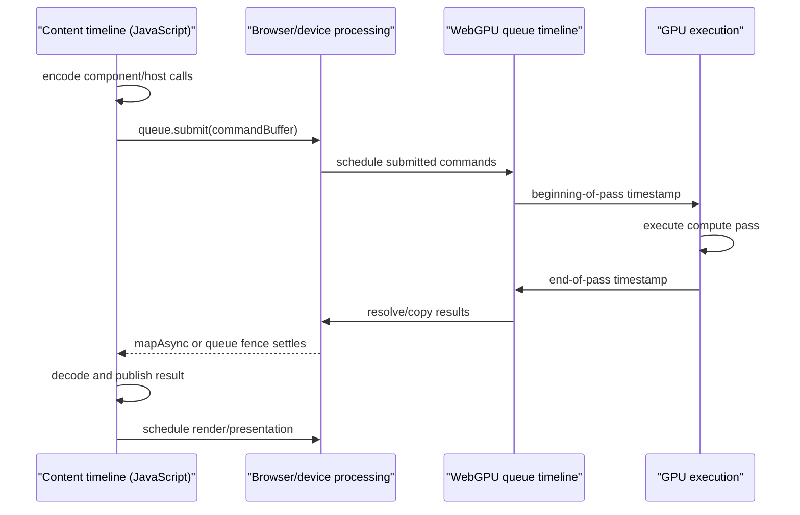

# Browser-lifetime timing and observation contract

> - **Status:** Design specification; implementation pending
> - **Last reviewed:** 2026-08-10
> - **Applies to:** Real-browser GPU, host, and end-to-end timing evidence
> - **Current runtime target:** Chromium WebGPU
> - **Decision consumers:** H1 evidence and the later R2-C selection
> - **Parent:** [Real-browser WebGPU lifetime testing](README.md)
> - **Evidence policy:**
>   [Assertion and measurement policy](assertion-and-measurement-policy.md)
> - **Runtime boundary:**
>   [Architecture and code reuse](architecture-and-code-reuse.md)
> - **Related strategy:**
>   [Resource reuse and submission strategy](resource-reuse-and-submission-strategy.md)

## Purpose

This document defines how the browser-lifetime harness measures time and
records browser execution evidence without confusing different clock domains,
completion boundaries, or instrumentation profiles.

The objective is not one undifferentiated “analysis time.” It is to distinguish
post-readiness CPU preparation/recording, compute-pass execution,
queue/readback latency, output publication, and first consumer-visible
rendering, then determine whether a change came from reuse, submission
composition, publication policy, or a changed workload.

The answers support H1 lifetime evidence and later R2-C decisions. This
document deliberately does **not** select stable, async, shared-frame,
one-shot, persistent, combined, or separate execution as the production
winner. It defines the common observation contract under which those
candidates can be compared.

## Callable-component readiness precondition

Every measured sample starts with the selected component already prepared and
callable. Component download, compilation, instantiation, and provider-specific
glue are an opaque prerequisite, not part of this timing contract.

```text
prepare the selected component through the private provider
    → establish a callable component capability
    → arm the measurement observer
    → gpu_runtime_prepare_begin, when an explicit preparation phase exists
    → prepare the declared device/session/entry/resource scope
    → gpu_runtime_prepare_end
    → invoke or encode the selected workload
```

Readiness is an eligibility gate rather than a timed event. If preparation is
unsupported or fails, no runtime timing sample begins. The run may retain that
outcome and the selected provider, toolchain, component hash, and package
topology as setup provenance, but it must not manufacture a duration or fold
preparation into a post-readiness metric.

This boundary does not erase cold GPU/runtime behavior. Device-generation,
session, entry, and resource preparation that occurs after callable-component
readiness remains measurable under the existing lifecycle labels.
Preparation may establish bindings, but it must not execute an analyser
workload or create candidate GPU/session resources before the observer is
armed. In a consumer run, `capture_requested` is eligible for a canonical
metric only when readiness was already established.

## Scope and source-of-truth boundary

This document owns clock definitions; timestamp-query, JavaScript, mapping,
queue-fence, and trace semantics; canonical events and metrics; profiles,
statuses, provenance; variant call chains; and timing-specific sampling rules.

It does not select an entrypoint, packaging topology, reuse/pooling/ring or
batching policy; promise optional adapter capabilities; or define Millipede's
publication implementation. Assertion promotion remains owned by the
[assertion policy](assertion-and-measurement-policy.md), implementation order
by [scenario evolution](scenario-evolution.md), reuse terminology by the
[resource strategy](resource-reuse-and-submission-strategy.md), and candidate
selection by the [R2-C comparison contract](r2-c-comparison-contract.md).

## Clock domains and execution timelines

WebGPU execution crosses multiple timelines. They are not interchangeable
clocks and do not share a subtractable timestamp origin.



### Clock-domain contract

| Domain                    | Primary mechanism                        | Timestamp origin                         | Valid subtraction                                                | Invalid subtraction                                                |
| ------------------------- | ---------------------------------------- | ---------------------------------------- | ---------------------------------------------------------------- | ------------------------------------------------------------------ |
| GPU/queue execution       | WebGPU timestamp queries                 | Implementation-defined GPU/queue origin  | End query minus beginning query from one valid measured interval | GPU timestamp minus `performance.now()`                            |
| JavaScript/content        | `performance.now()`, marks, and measures | Time origin of the current global object | Two values from the same browser context                         | Value from another page/process without explicit trace correlation |
| Chromium trace            | DevTools/Perfetto trace events           | Trace system's normalized event clocks   | Relationships established by the trace processor                 | Ad hoc subtraction of raw clocks from unrelated APIs               |
| Process/resource sampling | Browser- or platform-specific sampler    | Provider-specific                        | Values within one documented provider and run                    | Treating provider samples as GPU timestamps                        |

Rules:

1. A metric must declare its clock domain.
2. Only timestamps from the same compatible clock domain may be subtracted.
3. GPU timestamp values must never be converted into a JavaScript absolute
   time.
4. A trace may correlate events only through the trace system's own event
   model; the harness must not recreate clock synchronization itself.
5. A metric from one domain must not silently substitute for a missing metric
   from another domain.

## Measurement catalogue

The harness uses several complementary timing mechanisms because no single
browser API measures the complete path.

| Mechanism                                      | Measures                                                                     | Includes                                                                                     | Excludes or cannot isolate                                                 | Primary role                        |
| ---------------------------------------------- | ---------------------------------------------------------------------------- | -------------------------------------------------------------------------------------------- | -------------------------------------------------------------------------- | ----------------------------------- |
| Compute-pass timestamp writes                  | Interval between beginning and end of one compute pass on the queue timeline | Commands inside the measured pass                                                            | JS encoding, earlier queue backlog, post-pass query readback, publication  | Direct GPU-pass evidence            |
| `performance.now()` around component recording | JavaScript-visible elapsed time                                              | Authored call-adapter, host, and component CPU work reached inside the marked interval       | Component preparation and pure GPU execution after asynchronous submission | CPU and API-boundary evidence       |
| `performance.now()` around submit              | Synchronous submission-call duration                                         | JS-to-browser submission overhead visible to the caller                                      | Queue execution completion                                                 | Submission CPU evidence             |
| `queue.onSubmittedWorkDone()`                  | Time until all queue work submitted before the call is processed             | Queue backlog, browser scheduling, GPU work, completion notification, promise resumption     | Isolated duration of only the target pass                                  | Queue-wide completion evidence      |
| Target-buffer `mapAsync()`                     | Time until one result buffer is safe and available for mapping               | Work required to produce/copy that buffer plus mapping and promise resumption                | Unrelated later queue work and pure pass-only duration                     | Result-specific completion evidence |
| Performance marks/measures                     | Named application and harness intervals                                      | Exactly the chosen content-timeline boundaries                                               | GPU-internal interval unless coupled to a fence                            | Publication and end-to-end evidence |
| Chromium Performance/Perfetto trace            | Cross-process scheduling and presentation relationships                      | Browser, GPU process, Dawn/backend, compositor, and presentation events exposed by the trace | A stable product API or portable regression value                          | Investigation and attribution       |

## WebGPU timestamp-query contract

### Capability and device creation

`timestamp-query` is an optional WebGPU feature. The fixture must inspect the
adapter before requesting the device:

```ts
const supportsTimestampQuery = adapter.features.has("timestamp-query");
const requiredFeatures: Array<GPUFeatureName> = [];
if (supportsTimestampQuery) {
  requiredFeatures.push("timestamp-query");
}

const device = await adapter.requestDevice({
  requiredFeatures,
});
```

The feature decision belongs to device creation. An existing `GPUDevice`
cannot be upgraded later with another required feature. Therefore:

1. The isolated measurement fixture may request `timestamp-query` when the
   selected adapter exposes it.
2. A device supplied by a consumer must be inspected as created; the harness
   must not claim timestamp support merely because a different adapter could
   create another device with it.
3. If the feature is absent, GPU-pass duration is `unsupported`. JavaScript
   queue or completion time may still be collected under its own name.
4. Core lifecycle scenarios must remain valid without timestamp queries unless
   a deliberately timestamp-specific profile is the subject under test.

### Current portable operation shape

The current portable WebGPU operation brackets a compute pass through
`GPUComputePassDescriptor.timestampWrites`:

```text
create timestamp query set with two entries
    → begin compute pass with beginning index 0 and end index 1
    → encode the unchanged production dispatch sequence
    → end compute pass
    → resolve query entries into a QUERY_RESOLVE buffer
    → copy the 16 result bytes into a MAP_READ staging buffer
    → finish and submit according to the variant's normal ownership
    → map the staging buffer
    → read two unsigned 64-bit values
    → subtract end - beginning
```

An illustrative native WebGPU sequence is:

```ts
const querySet = device.createQuerySet({ type: "timestamp", count: 2 });
const resolve = device.createBuffer({
  size: 16,
  usage: GPUBufferUsage.QUERY_RESOLVE | GPUBufferUsage.COPY_SRC,
});
const readback = device.createBuffer({
  size: 16,
  usage: GPUBufferUsage.COPY_DST | GPUBufferUsage.MAP_READ,
});
const pass = encoder.beginComputePass({
  timestampWrites: {
    querySet,
    beginningOfPassWriteIndex: 0,
    endOfPassWriteIndex: 1,
  },
});
// Encode the unchanged candidate dispatch sequence.
pass.end();
encoder.resolveQuerySet(querySet, 0, 2, resolve, 0);
encoder.copyBufferToBuffer(resolve, 0, readback, 0, 16);
```

After submission and successful mapping, the harness copies the mapped bytes
before unmapping and interprets them as two `BigUint64` values. It subtracts in
`bigint` space:

```ts
const [beginning, end] = new BigUint64Array(copiedBytes);
const gpuPassDurationNs = end - beginning;
```

Conversion to microseconds or milliseconds occurs only after subtraction.
The raw values and raw delta remain available in the measurement artifact.

The query set and buffers must match the encoder's device generation and stay
live through readback. The harness unmaps before exactly-once destruction,
reports validation/mapping failure as an invalid sample, excludes observer
resources from candidate allocation counts, and uses separate resources or a
safe bounded ring only when measured invocations overlap.

### What the delta means

The beginning and end writes occur at compute-pass boundaries on the queue
timeline. Their difference is the duration of the measured pass according to
the implementation's timestamp mechanism.

The delta includes:

- the pass's dispatches;
- synchronization and barriers that the backend places inside that pass;
- GPU-side work attributable to the pass boundary as defined by WebGPU.

The delta does not include:

- component preparation or Wasm execution on the CPU;
- WebGPU object creation before the pass;
- JavaScript descriptor translation;
- time waiting behind previously submitted queue work before the beginning
  timestamp executes;
- `resolveQuerySet()` or the readback copy encoded after the ending timestamp;
- buffer mapping, summary decoding, output publication, rendering, or
  presentation.

The specification exposes a nanosecond result unit, but it does not promise
nanosecond effective precision. Implementations reduce timing precision for
security and privacy. Current Chrome documentation describes normal WebGPU
timestamp-query values as quantized to 100-microsecond intervals. Browser
behavior remains version- and implementation-dependent, and short passes can
therefore produce identical beginning and ending values.

The result must be interpreted as:

```text
nanosecond unit
≠ nanosecond precision
≠ CPU wall-clock timestamp
≠ globally comparable GPU clock
```

### Pass granularity and workload integrity

The current analyser records several dispatches inside one compute pass. A
beginning/end timestamp pair measures that combined pass. It does not provide
portable per-dispatch durations.

The harness must not split a production pass solely to obtain more timing
points. Splitting can introduce pass transitions, barriers, altered scheduling,
and changed command structure. Such a result would time a different workload.

If a future architectural candidate intentionally uses separate passes, it may
be measured as that candidate. The comparison record must then make the pass
structure difference explicit.

Arbitrary command-encoder or per-dispatch timestamp writes are not part of the
current portable WebGPU contract used here. The harness must use pass
`timestampWrites` and must not depend on historical examples of a removed
`writeTimestamp()` operation.

### Quantization and developer mode

Chrome's normal timestamp-query behavior deliberately reduces precision. The
Chrome WebGPU developer-features flag can remove timestamp quantization for
local debugging and controlled evidence collection. That creates two distinct
profiles:

| Profile                     | Browser configuration                        | Appropriate claim                         |
| --------------------------- | -------------------------------------------- | ----------------------------------------- |
| Production-observable query | Normal Chromium security behavior            | What a normal browser context can observe |
| Developer precision query   | WebGPU developer features explicitly enabled | High-resolution local diagnostic evidence |

Results from these profiles must not be pooled. A report collected with the
developer flag must record the flag and must not be presented as the precision
available to production JavaScript.

For short work:

1. Preserve zero deltas as raw observations.
2. Mark a consistently quantized interval `below-resolution` rather than
   inventing a replacement value.
3. Prefer a realistic larger fixture when the architectural question permits
   it.
4. Do not add unrelated dummy dispatches merely to make the timer non-zero.
5. If repeated logical work is deliberately batched for throughput evidence,
   label it as a different batching experiment; do not divide by the batch
   size and call the result an unbatched latency without a validated model.

## JavaScript/content-timeline timing

### `performance.now()`

`performance.now()` is the primary content-timeline clock. It is monotonic and
expressed in milliseconds relative to the current global object's time origin.
It is also privacy-coarsened and may include jitter. High Resolution Time
defines different minimum coarsening targets for ordinary and cross-origin
isolated contexts—commonly 100 microseconds and 5 microseconds respectively—
while still allowing an implementation to reduce precision further. The run
must record cross-origin isolation instead of assuming that the numeric
millisecond representation describes the effective resolution.

The harness should prefer named marks and measures over anonymous subtraction
when an interval crosses several reusable helpers:

```ts
performance.mark("rsa:input-ready");
// Invoke the selected variant.
performance.mark("rsa:outputs-published");
performance.measure(
  "rsa:capture-to-output-publish",
  "rsa:input-ready",
  "rsa:outputs-published",
);
```

Marks must carry an invocation/generation identifier in their recorded detail
or in the harness result mapping. Global mark names must not cause events from
two overlapping invocations to be correlated accidentally.

`performance.now()` may establish JavaScript-visible elapsed time. It must not
be described as the GPU's internal execution duration.

### Submission-call timing

The synchronous interval around `GPUQueue.submit()` is useful but narrow:

```text
submit_call_begin
    → queue.submit(commandBuffers)
    → submit_call_end
```

It measures the caller-visible cost of handing command buffers to WebGPU. It
does not wait for the queued commands to complete. A shorter submit call does
not establish faster GPU execution or earlier result availability.

### Queue-wide completion

`GPUQueue.onSubmittedWorkDone()` returns a promise that settles after all work
submitted on that queue before the call has been processed. A measured
submit-to-settled interval includes more than the candidate pass:

```text
earlier queue backlog
    + browser/device scheduling
    + candidate GPU commands
    + following commands already covered by the fence
    + completion notification
    + JavaScript promise resumption
```

Use this mechanism when the architectural question concerns the queue-wide
completion boundary, such as safe teardown after all prior work. Do not use it
as a substitute for pass timestamps.

Controls:

1. Record whether the queue was deliberately settled before each sample.
2. Record which submission is intended to be covered by the fence.
3. Avoid unrelated queue work in isolated candidate comparisons.
4. For consumer black-box runs, retain real queue activity but interpret the
   result as end-to-end queue latency rather than isolated component cost.
5. Do not place an unconditional queue fence into the semantic regression
   profile merely to make timing convenient; it may serialize behavior that
   production permits to overlap.

### Result-specific mapping completion

`GPUBuffer.mapAsync()` provides a narrower completion boundary when the
question is when a particular copied result becomes CPU-readable:

```text
record producer and copy commands
    → submit through the owning variant
    → mapAsync target readback buffer
    → promise settles
    → copy mapped bytes
    → unmap
```

Its measured interval includes:

- queue work needed before the target buffer can be mapped;
- the result copy;
- browser mapping work;
- promise notification and JavaScript resumption.

It does not isolate the producer compute pass. It also does not prove that
unrelated queue work submitted later has completed.

For the timestamp-query profile, mapping the timestamp readback buffer is
sufficient to obtain the resolved timestamp values. A separate
`onSubmittedWorkDone()` call would widen and potentially serialize that
measurement unless queue-wide settlement is itself another named metric.

For diagnostic summary timing, use the existing summary staging buffer and
resolver boundary when that is the result under study. Do not add a duplicate
summary copy simply to obtain a timer.

## Chromium tracing

Chromium's Performance/Perfetto trace can expose relationships that WebGPU
timestamps and content-timeline marks cannot explain alone: main/worker and
Wasm/JavaScript scheduling; GPU-process and exposed Dawn/backend command work;
compositor/presentation events; and custom performance marks/measures.

Tracing is an investigation profile, not the stable browser API contract.
Trace category names, event availability, and backend details can change with
Chromium versions.

Record the Chromium/DevTools or trace-processor versions, mode, flags,
categories, platform, adapter, and backend; preserve the raw trace; and
correlate it through custom content marks. Missing internal events mean
unavailable instrumentation, not zero work. Traces explain separately recorded
WebGPU/JavaScript intervals; their unstable internal names are neither a fast
CI requirement nor a public runtime dependency.

The first consumer-visible edge may require a consumer publication marker and
Chromium compositor/presentation evidence. WebGPU has no single API that
reports “the analyser's output first became visible on screen.” That event
must retain an entry/generation identity so a later unrelated frame cannot be
mistaken for the target result.

## Canonical event vocabulary

All variants use the same event names where the semantics truly match. Events
that do not exist for a variant are `not-applicable`; they are not synthesized.
The recorder is armed only after callable-component readiness, so
component-provider preparation has no event in this vocabulary.

| Event                       | Clock                  | Definition                                                                                                                        |
| --------------------------- | ---------------------- | --------------------------------------------------------------------------------------------------------------------------------- |
| `capture_requested`         | Content                | Consumer-only marker identifying when the target capture generation is requested; not synthesized by the isolated fixture         |
| `gpu_runtime_prepare_begin` | Content                | After callable-component readiness and immediately before the explicitly declared device/session/entry/resource preparation phase |
| `gpu_runtime_prepare_end`   | Content                | The declared post-ready preparation phase is complete; its exact lifecycle scope is attached to the event                         |
| `input_ready`               | Content                | Browser-owned device, texture, reference buffer, and request metadata are ready                                                   |
| `component_call_begin`      | Content                | Immediately before entering the public ready-capability operation for the measured invocation                                     |
| `component_call_end`        | Content                | The selected public ready-capability operation returns synchronously or its promise settles successfully                          |
| `commands_recorded`         | Content                | Variant-specific boundary at which analyser commands have been appended and no more analyser recording occurs                     |
| `submit_call_begin`         | Content                | Immediately before the owning queue submission                                                                                    |
| `submit_call_end`           | Content                | Immediately after synchronous `queue.submit()` returns successfully                                                               |
| `gpu_pass_begin`            | GPU/queue              | Beginning timestamp write for the measured compute pass                                                                           |
| `gpu_pass_end`              | GPU/queue              | Ending timestamp write for the measured compute pass                                                                              |
| `output_handles_resolved`   | Content                | Returned component handles have been validated and resolved to browser GPU resources                                              |
| `outputs_published`         | Content                | The consumer-visible state owns the output handles for the target generation                                                      |
| `summary_map_begin`         | Content                | Begin waiting to map the summary staging buffer                                                                                   |
| `summary_map_end`           | Content                | Mapping has completed successfully and bytes are available                                                                        |
| `summary_ready`             | Content                | Summary bytes have been decoded and correlated with the target invocation                                                         |
| `queue_settled`             | Content                | A deliberately requested queue fence has settled                                                                                  |
| `first_rendered_edge`       | Trace/content evidence | A render/presentation event attributable to the target output generation                                                          |
| `cleanup_begin`             | Content                | Begin caller/session cleanup for the target invocation or generation                                                              |
| `cleanup_end`               | Content                | Synchronous cleanup calls have returned; not a physical-memory reclamation event                                                  |

### Event attribution

Every event must include or inherit:

- run id;
- scenario id;
- sample id;
- entry id;
- output generation id where applicable;
- device generation id;
- workload id;
- variant;
- lifecycle state;
- instrumentation profile.

An event without sufficient correlation metadata may remain diagnostic trace
data but must not enter a candidate comparison.

## Canonical metric contract

### Primary metrics

| Metric                              | Start → end                                             | Clock         | Unit           | Meaning                                                                                                                                                               |
| ----------------------------------- | ------------------------------------------------------- | ------------- | -------------- | --------------------------------------------------------------------------------------------------------------------------------------------------------------------- |
| `gpu_runtime_prepare_ms`            | `gpu_runtime_prepare_begin` → `gpu_runtime_prepare_end` | Content       | ms             | Explicit post-ready GPU runtime/device/session/entry/resource preparation for the attached canonical lifecycle scope; `not-applicable` when no separable phase exists |
| `input_to_recorded_ms`              | `input_ready` → `commands_recorded`                     | Content       | ms             | CPU/API work until analyser recording is complete                                                                                                                     |
| `component_call_ms`                 | `component_call_begin` → `component_call_end`           | Content       | ms             | Variant-specific public call duration; not directly comparable without its completion semantics                                                                       |
| `submit_call_ms`                    | `submit_call_begin` → `submit_call_end`                 | Content       | ms             | Synchronous submit-call cost                                                                                                                                          |
| `input_to_submit_ms`                | `input_ready` → `submit_call_end`                       | Content       | ms             | Time until the owning submission returns; not applicable when a shared-frame caller has not submitted yet                                                             |
| `input_to_output_publish_ms`        | `input_ready` → `outputs_published`                     | Content       | ms             | Time until the selected output generation becomes consumer-owned/visible in state                                                                                     |
| `capture_to_submit_ms`              | `capture_requested` → `submit_call_end`                 | Content       | ms             | Consumer capture-to-submission latency; `not-applicable` in the isolated fixture                                                                                      |
| `capture_to_output_publish_ms`      | `capture_requested` → `outputs_published`               | Content       | ms             | Consumer capture-to-publication latency; `not-applicable` in the isolated fixture                                                                                     |
| `gpu_compute_pass_ns`               | `gpu_pass_begin` → `gpu_pass_end`                       | GPU/queue     | ns as `bigint` | Direct measured compute-pass interval                                                                                                                                 |
| `submit_to_queue_settled_ms`        | `submit_call_end` → `queue_settled`                     | Content       | ms             | Queue-wide completion latency as observed by JavaScript                                                                                                               |
| `submit_to_summary_map_ms`          | `submit_call_end` → `summary_map_end`                   | Content       | ms             | Result-specific summary readback availability after submission                                                                                                        |
| `input_to_summary_ready_ms`         | `input_ready` → `summary_ready`                         | Content       | ms             | Full diagnostic-summary availability                                                                                                                                  |
| `capture_to_summary_ready_ms`       | `capture_requested` → `summary_ready`                   | Content       | ms             | Consumer capture-to-summary latency; `not-applicable` in the isolated fixture                                                                                         |
| `summary_gate_delay_ms`             | `output_handles_resolved` → `outputs_published`         | Content       | ms             | Delay caused by a policy that withholds already validated output handles pending summary completion                                                                   |
| `input_to_first_rendered_edge_ms`   | `input_ready` → `first_rendered_edge`                   | Trace/content | ms             | Consumer-visible latency for the correlated output generation                                                                                                         |
| `capture_to_first_rendered_edge_ms` | `capture_requested` → `first_rendered_edge`             | Trace/content | ms             | Full consumer capture-to-visible-result latency; `not-applicable` in the isolated fixture                                                                             |
| `cleanup_call_ms`                   | `cleanup_begin` → `cleanup_end`                         | Content       | ms             | Synchronous explicit cleanup-call cost, not reclamation latency                                                                                                       |

The isolated harness uses `input_to_*` metrics because it constructs already
captured fixture inputs. It reports every `capture_to_*` metric
`not-applicable`; only a consumer run with a generation-correlated
`capture_requested` marker may populate those metrics.

`gpu_runtime_prepare_ms` is never an alias for component-provider preparation.
Its record must name the exact post-ready lifecycle scope. Current one-shot
variants may report it `not-applicable` when analyzer resource creation occurs
inside `component_call_ms`; a future explicit session-preparation operation may
populate it without moving that work into `input_to_*`.

### Supporting observations

The measurement record should also include non-duration facts needed to
interpret the primary metrics:

| Observation                                    | Why required                                                                        |
| ---------------------------------------------- | ----------------------------------------------------------------------------------- |
| Compute-pass count and measured pass label     | Establishes which interval `gpu_compute_pass_ns` covers                             |
| Dispatch count as an observation               | Detects a changed workload; not automatically a permanent assertion                 |
| Command-encoder count                          | Describes command composition                                                       |
| Command-buffer count                           | Describes finish/composition strategy                                               |
| Queue-submission count                         | Describes submission/coalescing strategy                                            |
| Query-resolve and measurement-copy counts      | Makes instrumentation overhead explicit                                             |
| Summary-copy and mapped-byte counts            | Distinguishes readback policy                                                       |
| Resource creation and identity observations    | Relates timing change to reuse without equating API calls with physical allocations |
| Correctness digest or expected semantic result | Prevents a faster wrong or incomplete workload from entering comparison             |
| Validation and uncaptured-error results        | Invalidates measurements from erroneous WebGPU execution                            |

### Metric naming rules

1. Names encode the observed boundary, not an interpretation. Use
   `submit_to_queue_settled_ms`, not `gpu_time_ms`.
2. Unit suffixes are mandatory.
3. GPU deltas remain integer nanoseconds in raw evidence.
4. A metric's event definitions do not change between candidates.
5. If a candidate lacks an event, the metric is `not-applicable`; another
   event must not be substituted under the same name.
6. `component_call_ms` is retained for within-variant diagnosis, but it is not
   a primary stable-versus-async-versus-frame ranking because those calls
   return at different lifecycle boundaries.

## Variant-specific timing call chains

All variants reuse the same input fixture, event recorder, result validator,
and output cleanup. They differ only where their real lifecycle semantics
differ.

### Stable entry

The current public stable ready-capability operation is promise-shaped even
though the generated Rust export is synchronous. Rust
creates its encoder, records the compute pass and copies, finishes, submits,
and returns a summary readback descriptor. The authored loader then resolves
the summary before returning the complete public result.

```text
input_ready
    → component_call_begin
    → synchronous generated analyze export
        → create/record component-owned encoder
        → GPU pass timestamp writes, if this profile is wired
        → resolve/copy measurement query, if enabled
        → finish
        → submit_call_begin/end
    → output handles resolved
    → summary map begin/end
    → summary ready
    → public promise settles
    → outputs published
```

`component_call_ms` includes authored call-local summary resolution, while
`input_to_output_publish_ms` can expose summary gating. Query resolution must
be encoded before the component-owned encoder is finished; the public return
is too late. An outputs-first candidate would move the publication event but
must retain the same work and explicit summary timing.

### Async/JSPI entry

The async component export owns encoding, finishing, submission, queue
completion, mapping, and summary decoding across the JSPI boundary. The public
ready-capability Promise settles after the generated export returns its summary
and output handles.

```text
input_ready
    → component_call_begin
    → async generated analyze export
        → create/record component-owned encoder
        → GPU pass timestamp writes, if this profile is wired
        → resolve/copy measurement query, if enabled
        → finish
        → submit_call_begin/end
        → await queue completion and/or required result mapping
        → decode summary
    → output handles resolved
    → summary ready
    → public promise settles
    → outputs published
```

`component_call_ms` contains asynchronous completion and is not directly
comparable with shared-frame recording. Queue settlement and summary
completion remain separate events. The authored helper's real
`GPUQueue.onSubmittedWorkDone()` is queue-wide evidence, not a GPU-pass clock;
query readback must not add a second unconditional fence when mapping already
provides its result boundary.

### Shared-frame entry

The shared-frame entry borrows a scheduler-owned encoder. It records
synchronously and must neither finish nor submit. Its outputs may be consumed
by later commands in the same encoder. Summary resolution remains pending
until the scheduler submits or the frame aborts.

```text
input_ready
    → scheduler creates/opens encoder
    → component_call_begin
    → generated frame encode appends analyser commands
        → GPU pass timestamp writes, if this profile is wired
    → commands_recorded
    → output handles resolved
    → public encode call returns synchronously
    → outputs may be published or consumed by later frame commands
    → scheduler appends remaining frame work
    → resolve/copy measurement query before finish, if enabled
    → scheduler finishes encoder
    → scheduler submit_call_begin/end
    → pending summary resolves after submission
    → first rendered edge, where consumer evidence is enabled
```

The synchronous call measures recording only; `input_to_submit_ms` also
contains scheduler delay and other frame work. Only the scheduler may finish
or submit. A seam may attach pass timestamps while the component records, but
must leave resolution/readback before finish to the scheduler-owned portion.
An aborted, unsubmitted frame has no submitted GPU duration: dispose observer
resources and report `not-applicable` or `invalid` according to the scenario.

### Cross-variant comparison guard

The following durations represent different boundaries and must not be placed
in one ranking column as if identical:

| Stable                                       | Async                                                        | Shared-frame                                                |
| -------------------------------------------- | ------------------------------------------------------------ | ----------------------------------------------------------- |
| Public promise after host summary resolution | Public promise after async guest/host completion and summary | Synchronous return after command recording                  |
| Component-owned finish and submit            | Component-owned finish and submit                            | Scheduler-owned later finish and submit                     |
| Output publication currently follows summary | Output publication currently follows async result            | Outputs can exist before later scheduler submission/summary |

Valid isolated comparisons use boundary-stable `input_to_*` metrics and
`gpu_compute_pass_ns`; consumer comparisons use the corresponding
`capture_to_*` metrics from a correlated `capture_requested` event. Every
variant-specific absent boundary remains explicitly `not-applicable`.

## Instrumentation profiles

Instrumentation can alter the behavior it observes. Each run uses one named
profile or an explicitly recorded composition of compatible profiles.

| Profile               | Added instrumentation                                                                          | Primary question                                                          |                                  Normal CI? |
| --------------------- | ---------------------------------------------------------------------------------------------- | ------------------------------------------------------------------------- | ------------------------------------------: |
| `semantic`            | Validation/error observation and ownership events only                                         | Is the real lifecycle correct?                                            |                                         Yes |
| `structure`           | Attributed WebGPU creation, recording, finish, submit, map, destroy, and identity observations | What execution/resource structure produced the result?                    | Potentially, without exact-count thresholds |
| `content-timing`      | Content-timeline marks and measures                                                            | Where are CPU, recording, publication, and summary boundaries?            |     Potentially, without numeric thresholds |
| `gpu-query-normal`    | Timestamp query, resolve buffer, copy, and mapping under normal Chromium precision             | What GPU-pass duration can production browser code observe?               |               Capability-dependent evidence |
| `gpu-query-developer` | Same query path with WebGPU developer precision enabled                                        | What finer GPU-pass interval is visible for controlled diagnosis?         |                                          No |
| `queue-settlement`    | Deliberate `onSubmittedWorkDone()` boundary                                                    | When is all earlier queue work processed?                                 | Only where the scenario requires settlement |
| `trace`               | Chromium/Perfetto tracing plus correlation marks                                               | Where did browser/process/presentation latency occur?                     |                                          No |
| `resource-memory`     | Repeated batches and an identified memory provider                                             | Is retained resource behavior bounded across lifecycle states?            |                                          No |
| `package`             | Static artifact sizes, selected entry/import topology, and unselected-payload exclusion        | Which bytes and entry graph does the selected package contain or exclude? |   Evidence command, not normal lifecycle CI |

### Profile isolation

The harness should collect different profiles in separate runs when their
instrumentation changes synchronization or resource shape materially.

In particular:

- GPU-query resources must be counted as observer-owned resources, not
  candidate resources.
- Queue settlement must not be enabled in a latency run that is supposed to
  preserve natural overlap unless settlement is the subject of the metric.
- Chromium tracing must not be assumed cost-free.
- Memory runs must not pool results with short latency runs.
- Developer-precision timestamp data must not be combined with normally
  quantized timestamp data.

### Observer-integrity calibration

Before the GPU-query profile is trusted, it must pass a raw WebGPU calibration
and a component-path integrity check.

Raw calibration:

```text
create smallest valid raw compute fixture
    → execute without timestamp instrumentation
    → validate semantic output
    → execute equivalent fixture with pass timestamp instrumentation
    → validate identical semantic output
    → resolve and read query values
    → verify query result status and cleanup
```

Component-path integrity:

1. Same input bytes and metadata.
2. Same selected component artifact and workload.
3. Same semantic output digest.
4. Same production dispatch and ownership behavior except declared query
   commands/resources.
5. Clean error scopes and uncaptured-error stream.
6. No added production queue fence unless the profile explicitly measures it.
7. No query resources escaping their measurement owner.

A raw WebGPU calibration proves the timer mechanism. It does not prove the
prepared component or authored-host lifetime behavior and must remain labeled
as calibration.

## Repository integration inventory

The upstream WIT already defines the conceptual operations needed for GPU-side
timing:

| Capability                              | Existing source                                                                           |
| --------------------------------------- | ----------------------------------------------------------------------------------------- |
| `gpu-command-encoder.resolve-query-set` | [`wkg/vendor/wasi-webgpu/wit/webgpu.wit`](../../../wkg/vendor/wasi-webgpu/wit/webgpu.wit) |
| Compute-pass `timestamp-writes`         | [`wkg/vendor/wasi-webgpu/wit/webgpu.wit`](../../../wkg/vendor/wasi-webgpu/wit/webgpu.wit) |
| `gpu-device.create-query-set`           | [`wkg/vendor/wasi-webgpu/wit/webgpu.wit`](../../../wkg/vendor/wasi-webgpu/wit/webgpu.wit) |
| `timestamp-query` feature name          | [`wkg/vendor/wasi-webgpu/wit/webgpu.wit`](../../../wkg/vendor/wasi-webgpu/wit/webgpu.wit) |
| `gpu-queue.on-submitted-work-done`      | [`wkg/vendor/wasi-webgpu/wit/webgpu.wit`](../../../wkg/vendor/wasi-webgpu/wit/webgpu.wit) |

The checked-in resolved dependency contains the same operations in
[`wit/deps/wasi-webgpu-0.0.1/package.wit`](../../../wit/deps/wasi-webgpu-0.0.1/package.wit).
No project-specific clock API is required to represent these WebGPU concepts.

The current production surface is intentionally narrower:

1. The ignored generated outputs under
   `pkg/generated/gpu-analysis/interfaces/wasi-webgpu-webgpu.d.ts`,
   `pkg/generated/gpu-analysis-async/interfaces/wasi-webgpu-webgpu.d.ts`, and
   `pkg/generated/gpu-analysis-frame/interfaces/wasi-webgpu-webgpu.d.ts`
   retain the `GpuQuerySet` type and compute-pass descriptor shape but do not
   expose `createQuerySet()` or `resolveQuerySet()` in the selected component
   worlds because the Rust guest does not call those operations. These paths
   are observations of regenerated output, not stable Markdown link targets.
2. The
   [authored WebGPU host](../../../component-loader/src/host/webgpu/index.ts)
   currently models `GpuQuerySet` as an empty resource class.
3. The authored `GpuCommandEncoder.beginComputePass()` forwards the label but
   does not forward `descriptor.timestampWrites` to the native browser pass.
4. The
   [authored async queue helper](../../../component-loader/src/host/webgpu/async/queue.ts)
   already delegates `on-submitted-work-done` to
   `GPUQueue.onSubmittedWorkDone()`.

Consequently, WebGPU provides the timing mechanism, but the current component
path does not yet carry it end to end.

### Possible measurement seams

The later implementation decision may evaluate these seams. Their listing is
not a selection.

| Seam                                   | Shape                                                                                                                                                             | Advantage                                                         | Risk or cost                                                                                                                                                    |
| -------------------------------------- | ----------------------------------------------------------------------------------------------------------------------------------------------------------------- | ----------------------------------------------------------------- | --------------------------------------------------------------------------------------------------------------------------------------------------------------- |
| Private authored-host measurement seam | Host owns native query set/readback and attaches it to the real native pass; stable/async host resolves before finish, frame scheduler resolves before its finish | Reuses production guest workload without publishing timing in WIT | Requires carefully isolated test-only host state and variant-aware encoder ownership                                                                            |
| Private guest/WIT proof path           | Rust uses the existing WIT query APIs so the generated component surface retains the required methods; authored host implements registries and operations         | Exercises the complete Component Model query surface              | Changes the guest command path and expands proof code; must remain private unless later selected                                                                |
| Browser method wrapping                | Harness wraps native WebGPU calls and attempts descriptor/query injection                                                                                         | Can observe raw calls without guest changes                       | Cannot safely append query resolution after component-owned encoders are finished; descriptor rewriting can change behavior and is not the preferred first seam |
| Consumer-owned timestamp integration   | Existing application device/scheduler owns query resources and frame resolution                                                                                   | Natural for shared-frame end-to-end evidence                      | Requires timestamp feature at consumer device creation and risks dragging H1 changes into the already changing consumer repository                              |

Any seam must preserve:

- the exact production workload under comparison;
- native object receiver identity and device generation;
- stable/async component-owned finish/submit behavior;
- shared-frame scheduler-owned finish/submit behavior;
- output and summary ownership;
- separate accounting of measurement resources;
- absence of a new public API until an explicit later decision authorizes it.

## Timing-sample context

The complete controlled-comparison and decision rules belong to the
[R2-C comparison contract](r2-c-comparison-contract.md). This timing contract
adds clock-specific requirements:

1. Record Chromium version and flags, headless/headful and visibility state,
   adapter identity, device generation and features, cross-origin isolation,
   instrumentation profile, and queue-settling policy.
2. Use the precise lifecycle state from the
   [resource reuse and submission strategy](resource-reuse-and-submission-strategy.md),
   not a bare `cold` or `warm` label.
3. Do not pool normal and developer-precision timestamp queries, different
   adapters, different pass structures, or settled and backlogged queue runs.
4. Accept a timing sample only after semantic output, ownership, validation,
   uncaptured-error, workload, and instrumentation checks pass. Otherwise
   retain it as `invalid` diagnostic evidence.

### Timing-specific sampling caveats

- Declare warmups before collection. Record their lifecycle state, profile,
  queue-settlement behavior, and whether resources intentionally survived the
  warmup boundary.
- Retain `artifact-cold` as untimed setup provenance and keep
  device-generation-cold trials separate from warm distributions. Component
  preparation itself never enters a measured distribution.
- Use repeated accepted samples. Record raw values, accepted and rejected
  counts, median, supported tail percentiles, and a robust spread statistic.
- Alternate candidate order when thermal drift, driver caches, or background
  load could systematically favor one order.
- Preserve long but valid scheduling delays. Exclude a sample only for a
  recorded integrity reason such as device loss, visibility change,
  validation failure, wrong generation, or observer failure.
- Treat a deliberately batched invocation as a batch sample. Record batch
  size, pass/command-buffer/submission structure, total latency, per-input
  completion where visible, and throughput. Do not divide the batch duration
  and relabel it as unbatched per-input latency.
- Keep resource reuse and batching as separate dimensions. A timing change
  cannot be attributed to reuse when batching changed in the same uncontrolled
  comparison.
- A baseline distribution remains measurement evidence; it does not become a
  normal CI threshold without the assertion-policy promotion gate.

## Result-status vocabulary

Every metric has a status as well as an optional value.

| Status             | Meaning                                                                                                         |                                Numeric value allowed? |                                   Aggregated? |
| ------------------ | --------------------------------------------------------------------------------------------------------------- | ----------------------------------------------------: | --------------------------------------------: |
| `measured`         | The declared mechanism produced a valid value for a semantically accepted sample                                |                                                   Yes |                                           Yes |
| `unsupported`      | The required browser/adapter capability is absent                                                               |                                                    No |                                            No |
| `below-resolution` | The mechanism ran, but privacy quantization or effective resolution cannot distinguish the interval             |                    Preserve raw value, including zero | Separately counted; not treated as exact zero |
| `not-applicable`   | The event does not exist for this variant/scenario                                                              |                                                    No |                                            No |
| `timeout`          | The declared completion boundary did not occur within the scenario's recorded deadline                          |              No; retain partial events as diagnostics |                                            No |
| `invalid`          | Correctness, validation, instrumentation, correlation, or environment integrity failed                          | Raw diagnostic value may be retained but not accepted |                                            No |
| `inconclusive`     | Valid observations exist but sample size, noise, or conflicting evidence cannot support the intended comparison |                      Values remain in evidence record |  Not used for selection without qualification |

Each non-`measured` status carries a machine-readable reason code and a human
explanation. Examples include `adapter-feature-absent` for an unsupported GPU
query, `chromium-timestamp-quantization` with raw value `"0"` for a
below-resolution query, and `shared-frame-not-submitted-by-component-call` for
a non-applicable component-owned submit interval.

An `unsupported` GPU query must never be converted into a measured
`gpu_compute_pass_ns` using `performance.now()`.

## Evidence record shape

The exact TypeScript schema may evolve, but serialized evidence retains:

| Record   | Required timing fields                                                                                                                             |
| -------- | -------------------------------------------------------------------------------------------------------------------------------------------------- |
| Run      | Schema/run id, start time, repository state, Chromium/platform/adapter provenance, device generation/features, and profile                         |
| Scenario | Scenario/workload/variant ids, precise lifecycle state, submission and publication policies, callable-readiness result, input and artifact digests |
| Sample   | Correlation id, correctness result, metrics, and structural observations such as passes, submissions, and observer resources                       |
| Metric   | Status, reason where needed, value/raw value, unit, and clock domain                                                                               |

JSON has no lossless native `bigint`, so GPU timestamp values are serialized
as decimal strings. Derived display values may be numeric milliseconds, but
the raw integer delta remains authoritative.

## Timing interpretation guard

The report must not claim:

- `performance.now()` around submit is GPU execution time;
- `onSubmittedWorkDone()` isolates one component pass;
- zero timestamp delta means no GPU work;
- one headless Chromium result predicts every browser, adapter, or native
  backend;
- a developer-precision query result is production-observable precision;
- shared-frame's synchronous call is faster than async merely because it
  returns before submission and completion;
- a missing timestamp query is equivalent to a measured JavaScript duration;
- a valid timing value can enter comparison after correctness, ownership, or
  workload-integrity checks fail.

## Verification checklist

Before accepting a timing run:

- [ ] The selected component was callable before the observer was armed, and
      the real component and authored WebGPU host ran.
- [ ] Workload/input digests match, the result is correct, and WebGPU
      validation/uncaptured-error observations are clean.
- [ ] Every metric names its clock/unit, and GPU subtraction uses only
      compatible GPU timestamps.
- [ ] Timestamp feature/device negotiation and normal versus developer
      precision are recorded.
- [ ] Observer resources are attributed and cleaned; query resolution precedes
      finish; shared-frame finish/submit remain scheduler-owned.
- [ ] Queue fences exist only when the named profile requires them.
- [ ] Missing metrics use explicit statuses; lifecycle state is precise; and
      warmups, sample count, candidate order, and exclusions are recorded.
- [ ] Raw evidence remains available, and interpretation states what the
      result does and does not prove.
- [ ] No timing observation was promoted into a CI threshold without the
      assertion-policy promotion gate.

## Explicit non-goals

This contract does not:

1. Introduce a project-specific shader clock or timing WIT API.
2. Require timestamp-query support for every supported WebGPU adapter.
3. Treat JavaScript wall time as a fallback GPU timestamp.
4. Split the current compute pass merely to time individual dispatches.
5. Add artificial GPU work to overcome timestamp quantization.
6. Select resource persistence, pooling, a ring size, or submission batching.
7. Select stable, async, or shared-frame as the production entrypoint.
8. Make browser-internal trace events part of the public runtime contract.
9. Establish immediate driver-memory reclamation.
10. Require changes to the Millipede consumer repository for the isolated H1
    measurement harness.
11. Turn exact timings, counts, or percentiles into permanent CI thresholds by
    default.

## Standards and browser references

- [WebGPU specification](https://www.w3.org/TR/webgpu/)
- [WebGPU timestamp queries](https://gpuweb.github.io/gpuweb/#timestamp-query)
- [WebGPU compute-pass timestamp writes](https://gpuweb.github.io/gpuweb/#dictdef-gpucomputepasstimestampwrites)
- [WebGPU query-set resolution](https://gpuweb.github.io/gpuweb/#dom-gpucommandencoder-resolvequeryset)
- [WebGPU queue completion](https://gpuweb.github.io/gpuweb/#dom-gpuqueue-onsubmittedworkdone)
- [GPUWeb removal of arbitrary timestamp writes](https://github.com/gpuweb/gpuweb/pull/4370)
- [High Resolution Time](https://www.w3.org/TR/hr-time-3/)
- [Chrome WebGPU developer features](https://developer.chrome.com/docs/web-platform/webgpu/developer-features)
- [Chrome DevTools Performance reference](https://developer.chrome.com/docs/devtools/performance/reference/)
- [Chrome trace saving and sharing](https://developer.chrome.com/docs/devtools/performance/save-trace)
