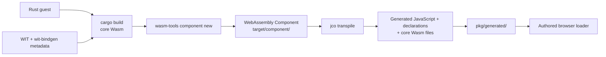
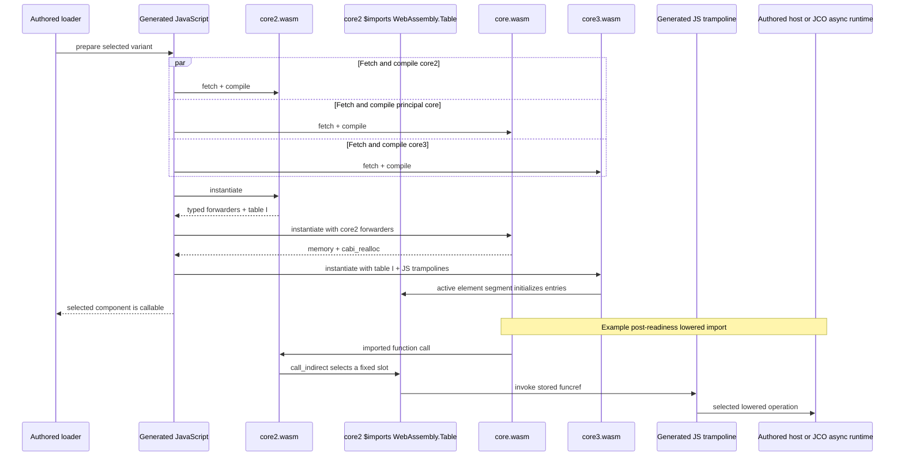

# JCO transpilation and generated Wasm artifact baseline

> **Status:** Current implementation reference, recorded 2026-08-11
>
> **Scope:** Browser artifact generation, generated-file roles, and toolchain
> provenance
>
> **Not owned here:** Public loader architecture, GPU scheduling, lifetime
> measurement, or future native Component Model browser integration

This document explains how the repository's Rust-authored WebAssembly
Components become the generated browser payload currently consumed by the
authored TypeScript loader. These details describe the locked compatibility
provider; they are not stable public API.

For package purpose and usage, start with the [project README](../../README.md).
For provider-neutral readiness and lifecycle behavior, see the
[component capability loading contract](../architecture/component-capability-loading-contract.md).

## Recorded toolchain

| Tool                    | Version                     | Role                                                                                 |
| ----------------------- | --------------------------- | ------------------------------------------------------------------------------------ |
| Rust                    | stable (1.96.0 recorded)    | `rust-toolchain.toml` selects the floating stable channel                            |
| `wit-bindgen`           | 0.60.0                      | Guest bindings and Component Model metadata                                          |
| `wasm-tools`            | 1.251.0                     | Component lifting and world verification                                             |
| `wkg`                   | 0.15.1                      | WIT dependency fetch and validation                                                  |
| `@bytecodealliance/jco` | 1.28.1 resolved             | CLI used to transpile existing components                                            |
| Node                    | 24.15.0                     | Generated-component test runtime, including JSPI support                             |
| WIT package             | `millipede:inspector@0.1.0` | Versioned project interfaces                                                         |
| WIT dependency          | `wasi:webgpu@0.0.1`         | Upstream GPU resource interface, currently supplied through the local `wkg` override |

The lockfile pins the JCO CLI. JCO owns its internal transpilation and
binding-generation stack; this repository neither selects nor invokes those
lower-level implementation packages separately. Replacing the CLI with a
lower-level generator API would be a separate build-architecture change
requiring generated-artifact parity review.

## Build direction

JCO transpiles components that already exist. It does not create the
Rust-authored component boundary in this repository.



`scripts/build.sh` compiles every selected Rust world for
`wasm32-unknown-unknown` and lifts it into a Component Model artifact:

```sh
wasm-tools component new \
  target/wasm32-unknown-unknown/release/inspector_component.wasm \
  -o target/component/inspector-component.analysis.wasm
```

The resulting file under `target/component/` is already a WebAssembly
Component. `scripts/sync.sh` then transpiles each of the five components into
one staging directory and replaces `pkg/generated/` only after every world
succeeds:

```sh
npx jco transpile \
  target/component/inspector-component.analysis.wasm \
  -o pkg/generated/analysis \
  --name inspector-component \
  --map \
    'millipede:inspector/host-log@0.1.0=../../../component-loader/dist/host/log.js' \
  --map \
    'millipede:inspector/host-events@0.1.0=../../../component-loader/dist/host/events.js' \
  --base64-cutoff 0 \
  --no-namespaced-exports
```

The mappings connect component imports to the built handwritten browser host.
Async worlds additionally use JSPI mode and explicit async-export names. The
zero base64 cutoff keeps every generated core module in an external `.wasm`
file rather than embedding Wasm bytes into JavaScript.

The root package contains the authored loader output under
`component-loader/dist/` and current generated-provider payload under
`pkg/generated/`. `target/component/` is disposable build input. The Millipede
workspace consumes the repository root through its pnpm `file:` dependency and
does not own copied generated bindings.

### Guest target and generated-binding constraints

The Rust guest targets `wasm32-unknown-unknown`. It therefore imports no
general WASI runtime, libc, or stderr surface. Required capabilities are
declared explicitly through the selected WIT world; guest panic diagnostics
use the project host-log import.

`wkg/` owns dependency resolution, while `xtask` fetches and verifies the
generated `wit/deps/` tree. The local `wasi:webgpu@0.0.1` override remains
temporary until that package resolves from the configured public registry.

The async GPU and WASI-proof worlds use JSPI. The proof transpile explicitly
names `prove-future` and `prove-stream` as async exports so their generated
writer tasks are driven correctly. That proof remains isolated from product
worlds. In `analysis.wit`, `%flags` escapes the WIT keyword; generated
TypeScript correctly exposes the ordinary property name `flags`.

## Generated files

Every generated world currently contains one JavaScript binding plus three
core WebAssembly binaries:

| Generated file                   | Format            | Current role                                                                   |
| -------------------------------- | ----------------- | ------------------------------------------------------------------------------ |
| `inspector-component.core.wasm`  | Core Wasm binary  | Principal Rust-derived core module                                             |
| `inspector-component.core2.wasm` | Core Wasm binary  | Typed forwarders and a fixed-size `funcref` table initially containing nulls   |
| `inspector-component.core3.wasm` | Core Wasm binary  | Fixup module whose active element segment installs imported trampoline refs    |
| `inspector-component.js`         | JavaScript module | Canonical-ABI glue, current host/runtime trampolines, and module instantiation |
| `inspector-component.d.ts`       | TypeScript        | World export declarations                                                      |
| `interfaces/*.d.ts`              | TypeScript        | Imported and exported WIT interface declarations                               |

All three `.wasm` files are genuine, portable core WebAssembly binaries. They
contain no JavaScript source. `wasm-tools print` renders a binary as readable
WebAssembly text; that text is a disassembly, not its stored format.

Portable does not mean standalone. The generated package still needs the
generated JavaScript, compatible WebAssembly APIs, JSPI for the async worlds,
and supplied host implementations such as browser WebGPU.

## Runtime wiring

The current JCO-generated lowering defers part of its Canonical-ABI import
wiring until the principal core has been instantiated:



The table is declared inside `core2.wasm` and lives in the WebAssembly engine.
Generated JavaScript observes the export as a `WebAssembly.Table` and passes
that same table into core3; it is not a JavaScript array. Core3 contains no
JavaScript implementation. Its imported functions refer to generated
JavaScript trampolines, and its active Wasm element segment initializes the
table with those function references.

The three fetch/compile promises start together. Instantiation remains ordered:
core2, principal core, then core3. Generated module evaluation awaits this
initialization before publishing callable world exports.

| Stage                       | What is fixed or performed                                                                      |
| --------------------------- | ----------------------------------------------------------------------------------------------- |
| Component/JCO generation    | Table size and types, slot indices, forwarders, element ordering, and direct/indirect routing   |
| Selected binding evaluation | Create the table, instantiate three modules, and install current trampoline-function references |
| Normal guest call           | Reuse the completed wiring without reconstructing or repopulating the table                     |

## Per-world isolation

Every generated execution world owns independent core instances and its own
table. There is no cross-variant union table:

| Generated world      | Current forwarding-table slots |
| -------------------- | -----------------------------: |
| `analysis`           |                              2 |
| `gpu-analysis`       |                             12 |
| `gpu-analysis-async` |                             20 |
| `gpu-analysis-frame` |                              9 |
| `wasi-0.3`           |                              7 |

Evaluating the frame binding therefore creates only the frame table. If a page
prepares multiple variants, each generated instance receives a different
table.

The exact routing belongs to the generator rather than the public WIT API.
Current output routes many strings, lists, descriptors, results, and async
lowering operations through the forwarding table. Other imports—including
several scalar/resource-handle operations and resource drops—use direct
generated trampolines. Guest functions such as `analyzeTree`, `analyze`, and
`encode` are exports and never occupy import-table slots.

Async tables also contain generated runtime machinery such as waitable polling
and task/future/stream operations. Table entries must therefore be described as
trampoline functions rather than exclusively as calls into the authored host.

These names and counts record JCO 1.28.1. They are not stable contracts.
Another generator version, provider, or native browser Component Model
implementation may use a different representation.

## Transpile versus componentize

The repository uses `jco transpile`:

```text
existing WebAssembly Component
  -> jco transpile
  -> browser JavaScript + declarations + core Wasm files
```

`jco componentize` runs in the opposite direction:

```text
JavaScript or TypeScript implementation + WIT
  -> jco componentize
  -> WebAssembly Component
```

Componentization is useful for JavaScript-authored portable components. It is
not part of this Rust guest's build; the TypeScript loader and WebGPU host stay
outside the guest component.

The repository installs the full JCO package because `scripts/sync.sh` and
component-boundary preparation use its CLI. Replacing that CLI with a
lower-level generator API would need a separate design and exact
artifact-parity proof.

## Validation ownership

`tests/component-boundary/` transpiles the same five built Component Model
artifacts into `target/component-tests/generated/`, substituting the typed Node
host for the browser host. Those integration tests validate real generated
bindings and guest/host calls. Unit tests verify the stateful test host and
loader lifecycle without loading generated components.

Generated browser payloads are ignored build output. Regenerate them through
`scripts/sync.sh`; never edit `pkg/generated/` manually.

## Upstream references

- [JCO overview](https://github.com/bytecodealliance/jco)
- [JCO transpilation](https://bytecodealliance.github.io/jco/transpiling.html)
- [JCO componentization example](https://bytecodealliance.github.io/jco/example.html)
